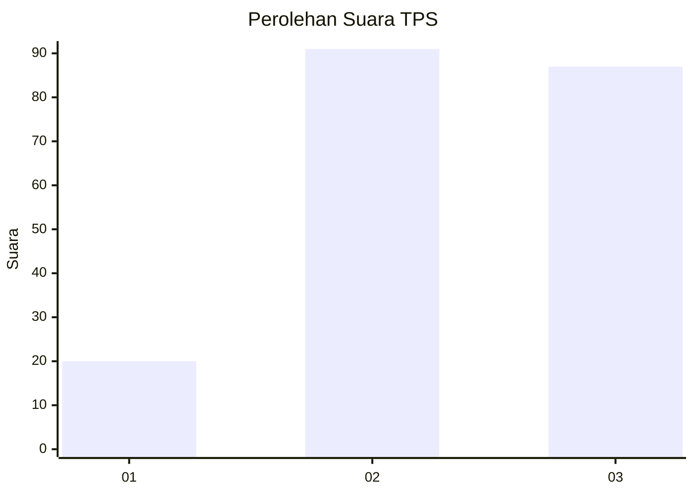
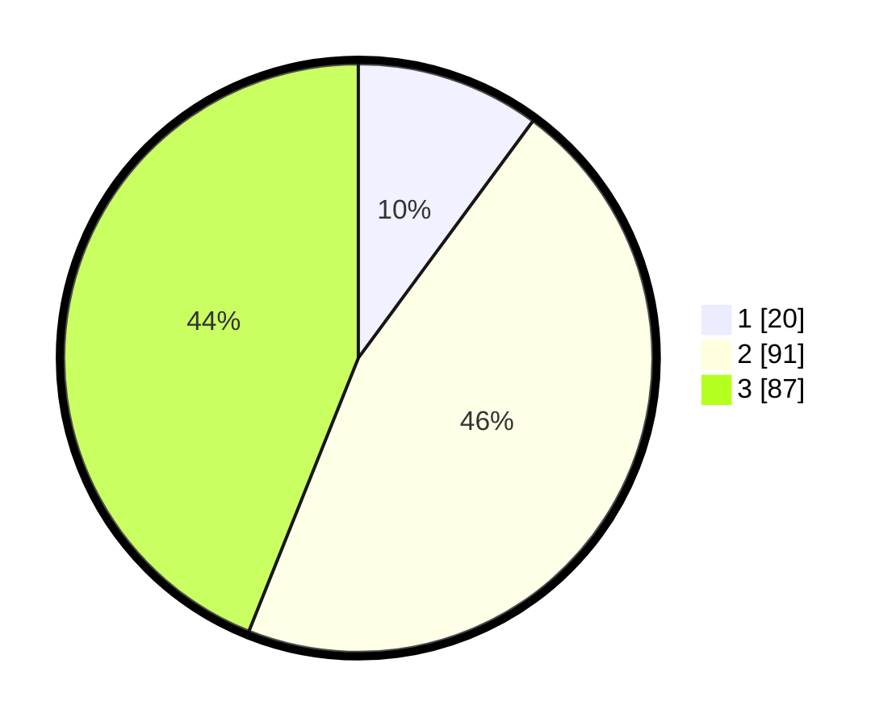

# Hasil

## Grafik

## Tabel

| No. | Nama Paslon    | Suara | Suara (raw) | Persentase |
|:--- |:-------------- | -----:| -----------:| ----------:|
| 1   | ANIES MUHAIMIN | 20    | [20][p-1]   | 10,10      |
| 2   | PRABOWO GIBRAN | 91    | [91][p-2]   | 45,96      |
| 3   | GANJAR MAHFUD  | 87    | [87][p-3]   | 43,94      |

[p-1]: https://github.com/gigit-pemilu/pemilu-2024/blob/main/pilpres/hitung-suara/sub/33-jawa-tengah/sub/09-boyolali/sub/18-wonosegoro/sub/2002-karangjati/sub/001-tps/sub/paslon-1.txt
[p-2]: https://github.com/gigit-pemilu/pemilu-2024/blob/main/pilpres/hitung-suara/sub/33-jawa-tengah/sub/09-boyolali/sub/18-wonosegoro/sub/2002-karangjati/sub/001-tps/sub/paslon-2.txt
[p-3]: https://github.com/gigit-pemilu/pemilu-2024/blob/main/pilpres/hitung-suara/sub/33-jawa-tengah/sub/09-boyolali/sub/18-wonosegoro/sub/2002-karangjati/sub/001-tps/sub/paslon-3.txt

## Foto C Plano

https://sirekap-obj-formc.kpu.go.id/fb67/pemilu/ppwp/33/09/18/20/02/3309182002001-20240228-234551--e2e66cb8-588a-464a-931a-91b4145d3ad0.jpg

https://sirekap-obj-formc.kpu.go.id/fb67/pemilu/ppwp/33/09/18/20/02/3309182002001-20240214-204713--fa342006-3ffd-43d0-a683-69f711732f59.jpg

https://sirekap-obj-formc.kpu.go.id/fb67/pemilu/ppwp/33/09/18/20/02/3309182002001-20240214-204604--9ddb2ece-323e-46a7-901c-facebe48bfde.jpg

## Metadata

| Key        | Value               |
| ---------- | ------------------- |
| Time Stamp | 2024-02-29 00:00:00 |

