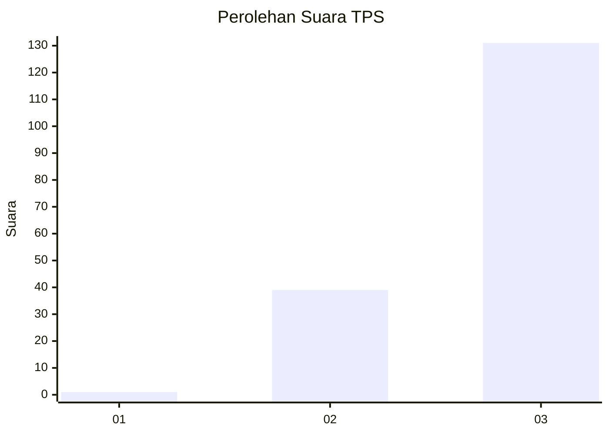
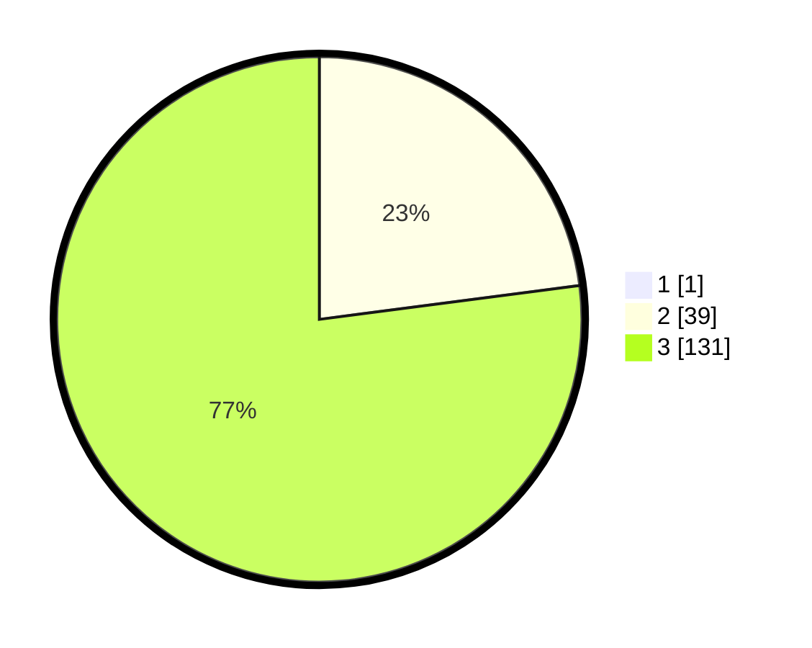

# Hasil

## Grafik

## Tabel

| No. | Nama Paslon    | Suara | Suara (raw) | Persentase |
|:--- |:-------------- | -----:| -----------:| ----------:|
| 1   | ANIES MUHAIMIN | 1     | [1][p-1]    | 0,58       |
| 2   | PRABOWO GIBRAN | 39    | [39][p-2]   | 22,81      |
| 3   | GANJAR MAHFUD  | 131   | [131][p-3]  | 76,61      |

[p-1]: https://github.com/gigit-pemilu/pemilu-2024-33-jawa-tengah/blob/main/pilpres/hitung-suara/sub/33-jawa-tengah/sub/09-boyolali/sub/18-wonosegoro/sub/2006-gosono/sub/001-tps/sub/paslon-1.txt
[p-2]: https://github.com/gigit-pemilu/pemilu-2024-33-jawa-tengah/blob/main/pilpres/hitung-suara/sub/33-jawa-tengah/sub/09-boyolali/sub/18-wonosegoro/sub/2006-gosono/sub/001-tps/sub/paslon-2.txt
[p-3]: https://github.com/gigit-pemilu/pemilu-2024-33-jawa-tengah/blob/main/pilpres/hitung-suara/sub/33-jawa-tengah/sub/09-boyolali/sub/18-wonosegoro/sub/2006-gosono/sub/001-tps/sub/paslon-3.txt

## Foto C Plano

https://sirekap-obj-formc.kpu.go.id/cea8/pemilu/ppwp/33/09/18/20/06/3309182006001-20240214-235804--b6fe1397-4326-44c1-aee1-2125fb44fb7d.jpg

https://sirekap-obj-formc.kpu.go.id/cea8/pemilu/ppwp/33/09/18/20/06/3309182006001-20240214-235951--1cac657f-ef26-4829-832a-5f461140185d.jpg

https://sirekap-obj-formc.kpu.go.id/cea8/pemilu/ppwp/33/09/18/20/06/3309182006001-20240215-000103--ed1eceb8-5e42-482e-9673-4f565d0aed28.jpg

## Metadata

| Key        | Value               |
| ---------- | ------------------- |
| Time Stamp | 2024-02-25 13:00:00 |

