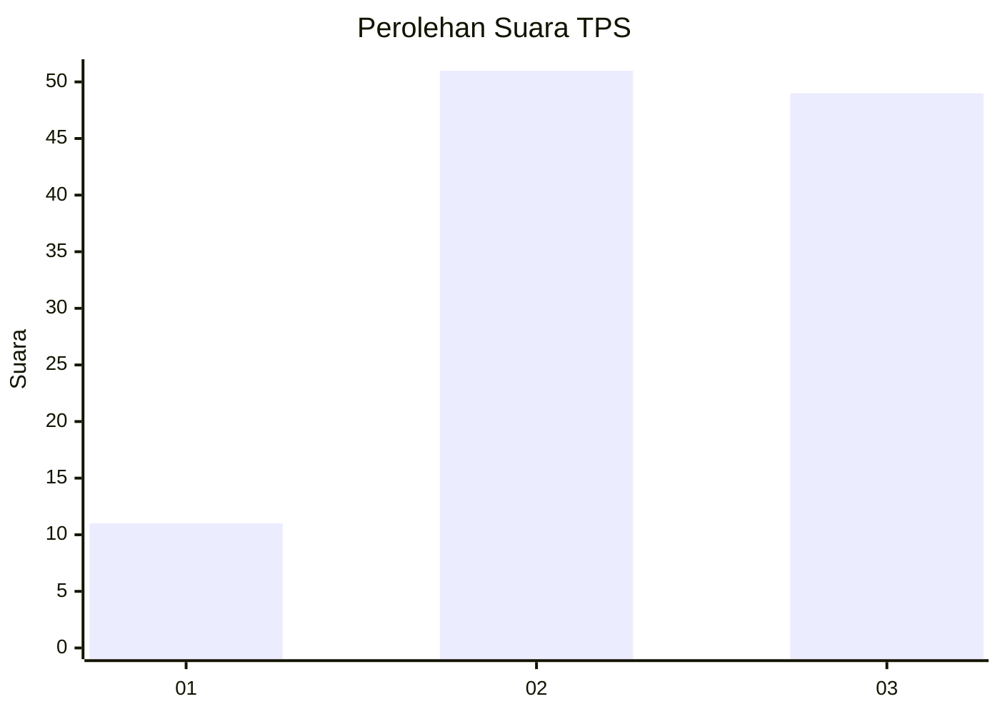
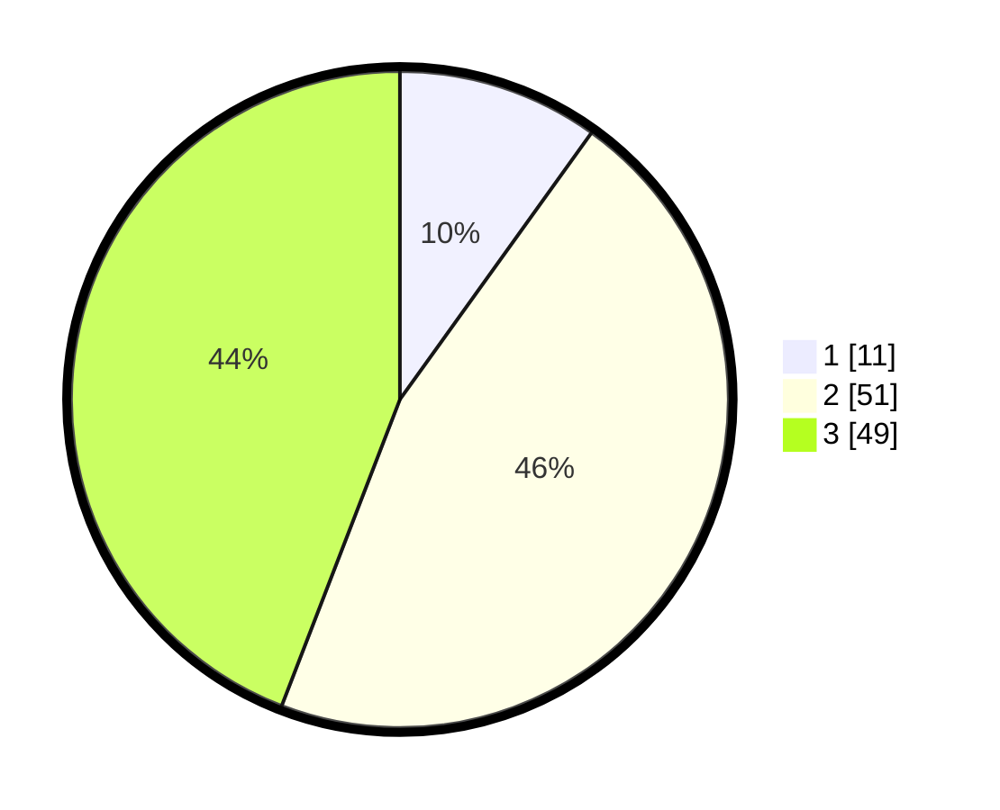

# Hasil

## Grafik

## Tabel

| No. | Nama Paslon    | Suara | Suara (raw) | Persentase |
|:--- |:-------------- | -----:| -----------:| ----------:|
| 1   | ANIES MUHAIMIN | 11    | [11][p-1]   | 9,91       |
| 2   | PRABOWO GIBRAN | 51    | [51][p-2]   | 45,95      |
| 3   | GANJAR MAHFUD  | 49    | [49][p-3]   | 44,14      |

[p-1]: https://github.com/gigit-pemilu/pemilu-2024-33-jawa-tengah/blob/main/pilpres/hitung-suara/sub/33-jawa-tengah/sub/09-boyolali/sub/18-wonosegoro/sub/2006-gosono/sub/006-tps/sub/paslon-1.txt
[p-2]: https://github.com/gigit-pemilu/pemilu-2024-33-jawa-tengah/blob/main/pilpres/hitung-suara/sub/33-jawa-tengah/sub/09-boyolali/sub/18-wonosegoro/sub/2006-gosono/sub/006-tps/sub/paslon-2.txt
[p-3]: https://github.com/gigit-pemilu/pemilu-2024-33-jawa-tengah/blob/main/pilpres/hitung-suara/sub/33-jawa-tengah/sub/09-boyolali/sub/18-wonosegoro/sub/2006-gosono/sub/006-tps/sub/paslon-3.txt

## Foto C Plano

https://sirekap-obj-formc.kpu.go.id/7582/pemilu/ppwp/33/09/18/20/06/3309182006006-20240214-223909--429ed645-c858-4831-bb71-695a1641a120.jpg

https://sirekap-obj-formc.kpu.go.id/7582/pemilu/ppwp/33/09/18/20/06/3309182006006-20240214-224003--393f7134-4a3e-4a9d-ac13-51bdb58e919a.jpg

https://sirekap-obj-formc.kpu.go.id/7582/pemilu/ppwp/33/09/18/20/06/3309182006006-20240214-224234--22b14321-46f2-41b8-95d1-41c8b1baab64.jpg

## Metadata

| Key        | Value               |
| ---------- | ------------------- |
| Time Stamp | 2024-02-15 20:00:44 |

