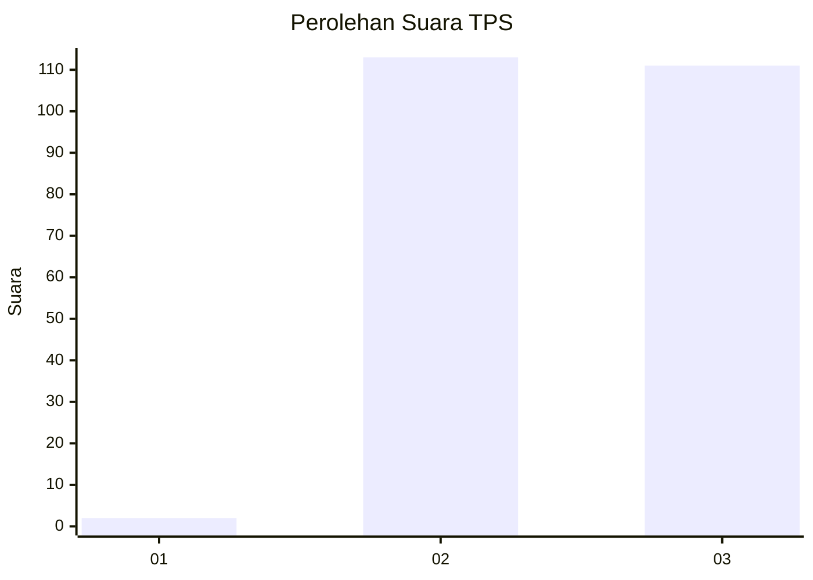
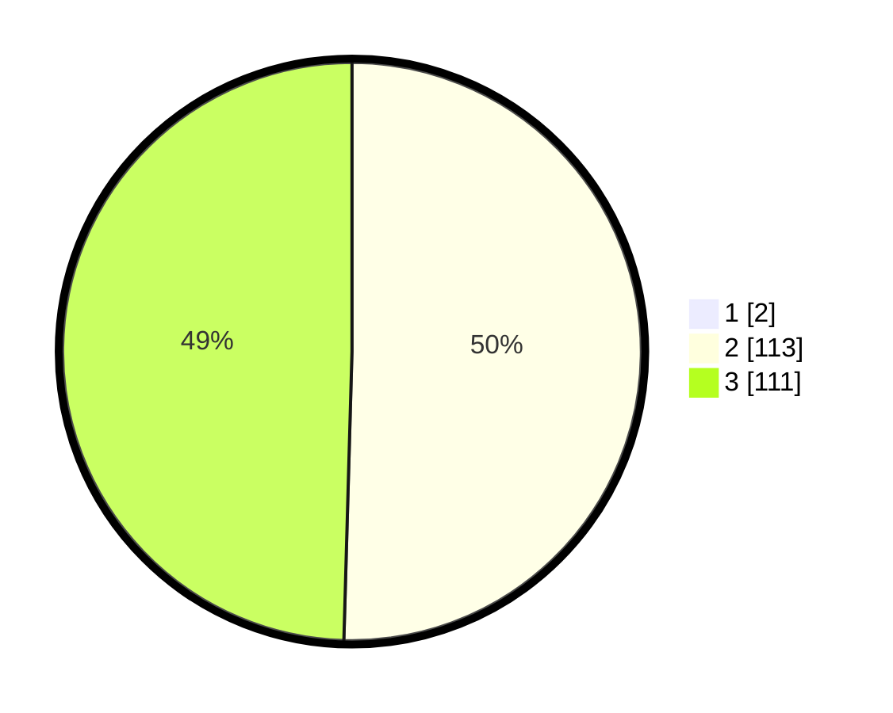

# Hasil

## Grafik

## Tabel

| No. | Nama Paslon    | Suara | Suara (raw) | Persentase |
|:--- |:-------------- | -----:| -----------:| ----------:|
| 1   | ANIES MUHAIMIN | 2     | [2][p-1]    | 0,88       |
| 2   | PRABOWO GIBRAN | 113   | [113][p-2]  | 50,00      |
| 3   | GANJAR MAHFUD  | 111   | [111][p-3]  | 49,12      |

[p-1]: https://github.com/gigit-pemilu/pemilu-2024/blob/main/pilpres/hitung-suara/sub/33-jawa-tengah/sub/09-boyolali/sub/18-wonosegoro/sub/2014-bojong/sub/002-tps/sub/paslon-1.txt
[p-2]: https://github.com/gigit-pemilu/pemilu-2024/blob/main/pilpres/hitung-suara/sub/33-jawa-tengah/sub/09-boyolali/sub/18-wonosegoro/sub/2014-bojong/sub/002-tps/sub/paslon-2.txt
[p-3]: https://github.com/gigit-pemilu/pemilu-2024/blob/main/pilpres/hitung-suara/sub/33-jawa-tengah/sub/09-boyolali/sub/18-wonosegoro/sub/2014-bojong/sub/002-tps/sub/paslon-3.txt

## Foto C Plano

https://sirekap-obj-formc.kpu.go.id/f38d/pemilu/ppwp/33/09/18/20/14/3309182014002-20240215-021704--617c6178-3a52-492a-897e-3dfdff8b02f6.jpg

https://sirekap-obj-formc.kpu.go.id/f38d/pemilu/ppwp/33/09/18/20/14/3309182014002-20240215-021849--69b81bbb-a80d-4d24-8c0b-61e636143b43.jpg

https://sirekap-obj-formc.kpu.go.id/f38d/pemilu/ppwp/33/09/18/20/14/3309182014002-20240215-021959--5dcc3eb3-49d9-4105-a4a2-c9d599a05c04.jpg

## Metadata

| Key        | Value               |
| ---------- | ------------------- |
| Time Stamp | 2024-02-15 21:01:18 |

