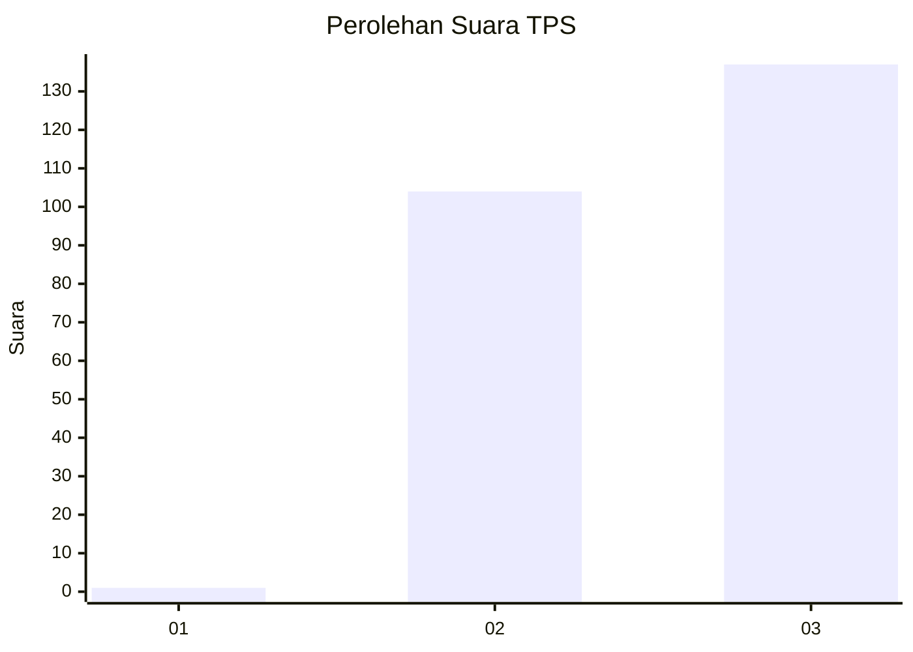
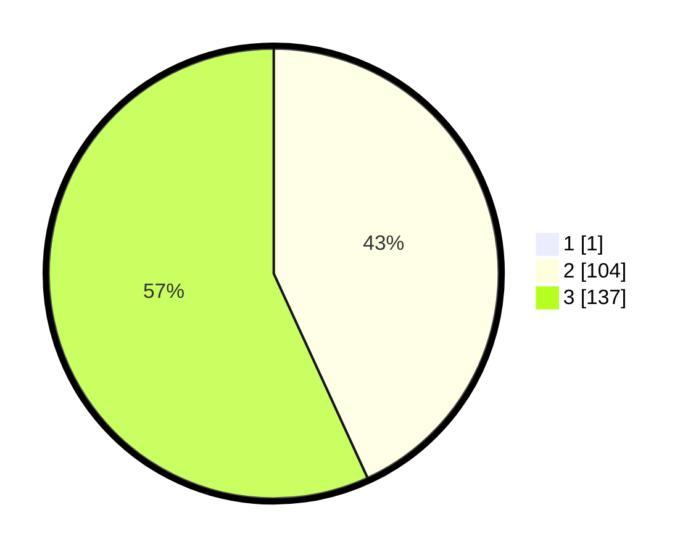

# Hasil

## Grafik

## Tabel

| No. | Nama Paslon    | Suara | Suara (raw) | Persentase |
|:--- |:-------------- | -----:| -----------:| ----------:|
| 1   | ANIES MUHAIMIN | 1     | [1][p-1]    | 0,41       |
| 2   | PRABOWO GIBRAN | 104   | [104][p-2]  | 42,98      |
| 3   | GANJAR MAHFUD  | 137   | [137][p-3]  | 56,61      |

[p-1]: https://github.com/gigit-pemilu/pemilu-2024/blob/main/pilpres/hitung-suara/sub/33-jawa-tengah/sub/09-boyolali/sub/18-wonosegoro/sub/2014-bojong/sub/005-tps/sub/paslon-1.txt
[p-2]: https://github.com/gigit-pemilu/pemilu-2024/blob/main/pilpres/hitung-suara/sub/33-jawa-tengah/sub/09-boyolali/sub/18-wonosegoro/sub/2014-bojong/sub/005-tps/sub/paslon-2.txt
[p-3]: https://github.com/gigit-pemilu/pemilu-2024/blob/main/pilpres/hitung-suara/sub/33-jawa-tengah/sub/09-boyolali/sub/18-wonosegoro/sub/2014-bojong/sub/005-tps/sub/paslon-3.txt

## Foto C Plano

https://sirekap-obj-formc.kpu.go.id/271e/pemilu/ppwp/33/09/18/20/14/3309182014005-20240214-191840--71e2b895-4f7a-46e5-b5c7-39f02e926a3f.jpg

https://sirekap-obj-formc.kpu.go.id/271e/pemilu/ppwp/33/09/18/20/14/3309182014005-20240214-213507--339268d6-c905-48bf-afaa-eca7acfca123.jpg

https://sirekap-obj-formc.kpu.go.id/271e/pemilu/ppwp/33/09/18/20/14/3309182014005-20240214-213519--700101c8-d32d-47b0-aad6-08b4ae0feacd.jpg

## Metadata

| Key        | Value               |
| ---------- | ------------------- |
| Time Stamp | 2024-02-15 21:01:18 |

