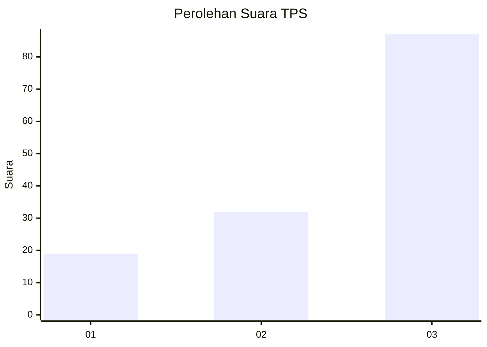
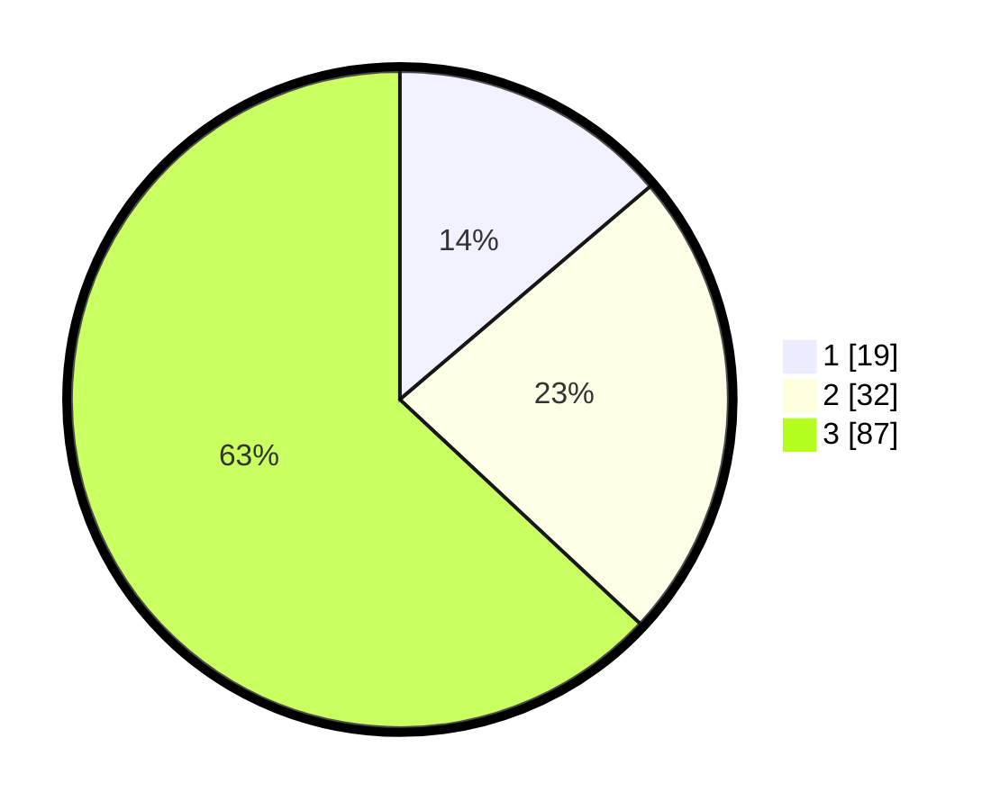

# Hasil

## Grafik

## Tabel

| No. | Nama Paslon    | Suara | Suara (raw) | Persentase |
|:--- |:-------------- | -----:| -----------:| ----------:|
| 1   | ANIES MUHAIMIN | 19    | [19][p-1]   | 13,77      |
| 2   | PRABOWO GIBRAN | 32    | [32][p-2]   | 23,19      |
| 3   | GANJAR MAHFUD  | 87    | [87][p-3]   | 63,04      |

[p-1]: https://github.com/gigit-pemilu/pemilu-2024-33-jawa-tengah/blob/main/pilpres/hitung-suara/sub/33-jawa-tengah/sub/09-boyolali/sub/18-wonosegoro/sub/2019-kauman/sub/001-tps/sub/paslon-1.txt
[p-2]: https://github.com/gigit-pemilu/pemilu-2024-33-jawa-tengah/blob/main/pilpres/hitung-suara/sub/33-jawa-tengah/sub/09-boyolali/sub/18-wonosegoro/sub/2019-kauman/sub/001-tps/sub/paslon-2.txt
[p-3]: https://github.com/gigit-pemilu/pemilu-2024-33-jawa-tengah/blob/main/pilpres/hitung-suara/sub/33-jawa-tengah/sub/09-boyolali/sub/18-wonosegoro/sub/2019-kauman/sub/001-tps/sub/paslon-3.txt

## Foto C Plano

https://sirekap-obj-formc.kpu.go.id/88bb/pemilu/ppwp/33/09/18/20/19/3309182019001-20240214-212115--fa0239c1-408d-4d57-a8f2-6741627b1a1e.jpg

https://sirekap-obj-formc.kpu.go.id/88bb/pemilu/ppwp/33/09/18/20/19/3309182019001-20240214-213848--be793e8b-028d-4a50-8cd1-06cd66bb8124.jpg

https://sirekap-obj-formc.kpu.go.id/88bb/pemilu/ppwp/33/09/18/20/19/3309182019001-20240214-212217--0c65c414-5d11-4ede-9f8f-5ffc32257f6f.jpg

## Metadata

| Key        | Value               |
| ---------- | ------------------- |
| Time Stamp | 2024-02-15 21:30:27 |

