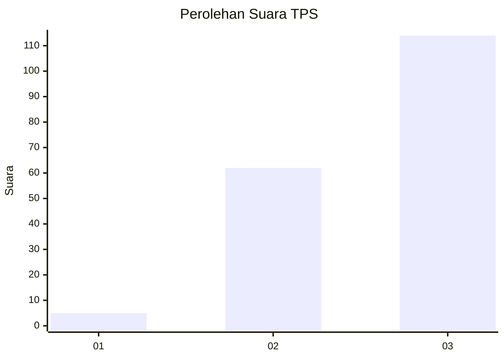
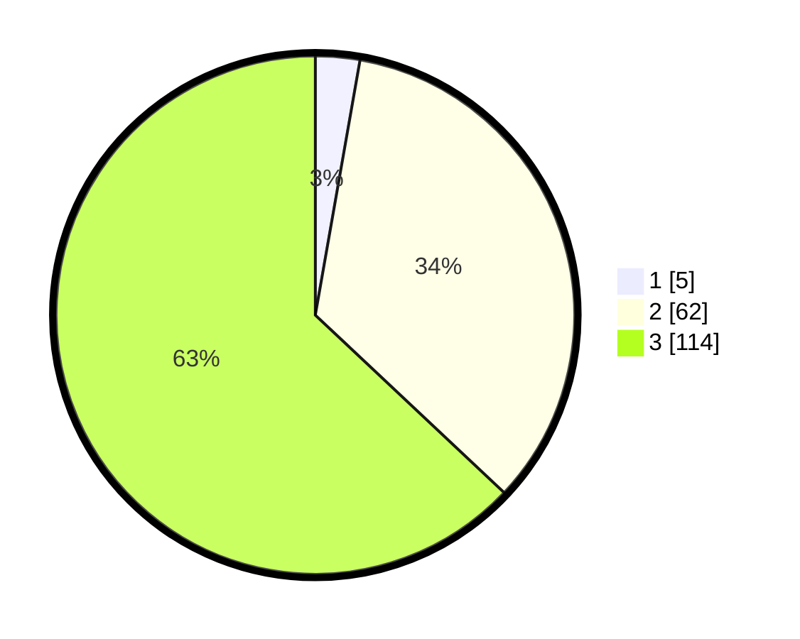

# Hasil

## Grafik

## Tabel

| No. | Nama Paslon    | Suara | Suara (raw) | Persentase |
|:--- |:-------------- | -----:| -----------:| ----------:|
| 1   | ANIES MUHAIMIN | 5     | [5][p-1]    | 2,76       |
| 2   | PRABOWO GIBRAN | 62    | [62][p-2]   | 34,25      |
| 3   | GANJAR MAHFUD  | 114   | [114][p-3]  | 62,98      |

[p-1]: https://github.com/gigit-pemilu/pemilu-2024-33-jawa-tengah/blob/main/pilpres/hitung-suara/sub/33-jawa-tengah/sub/09-boyolali/sub/18-wonosegoro/sub/2019-kauman/sub/005-tps/sub/paslon-1.txt
[p-2]: https://github.com/gigit-pemilu/pemilu-2024-33-jawa-tengah/blob/main/pilpres/hitung-suara/sub/33-jawa-tengah/sub/09-boyolali/sub/18-wonosegoro/sub/2019-kauman/sub/005-tps/sub/paslon-2.txt
[p-3]: https://github.com/gigit-pemilu/pemilu-2024-33-jawa-tengah/blob/main/pilpres/hitung-suara/sub/33-jawa-tengah/sub/09-boyolali/sub/18-wonosegoro/sub/2019-kauman/sub/005-tps/sub/paslon-3.txt

## Foto C Plano

https://sirekap-obj-formc.kpu.go.id/cf1c/pemilu/ppwp/33/09/18/20/19/3309182019005-20240214-185342--e3922fbc-0a52-4368-90f0-ceb1ce4a9283.jpg

https://sirekap-obj-formc.kpu.go.id/cf1c/pemilu/ppwp/33/09/18/20/19/3309182019005-20240214-185710--4f1f0397-f3c0-47fc-9589-c9bb5eca2742.jpg

https://sirekap-obj-formc.kpu.go.id/cf1c/pemilu/ppwp/33/09/18/20/19/3309182019005-20240214-185839--6b6ad4b5-b259-43dc-90c8-476f9ef8c5a5.jpg

## Metadata

| Key        | Value               |
| ---------- | ------------------- |
| Time Stamp | 2024-02-15 21:30:27 |

