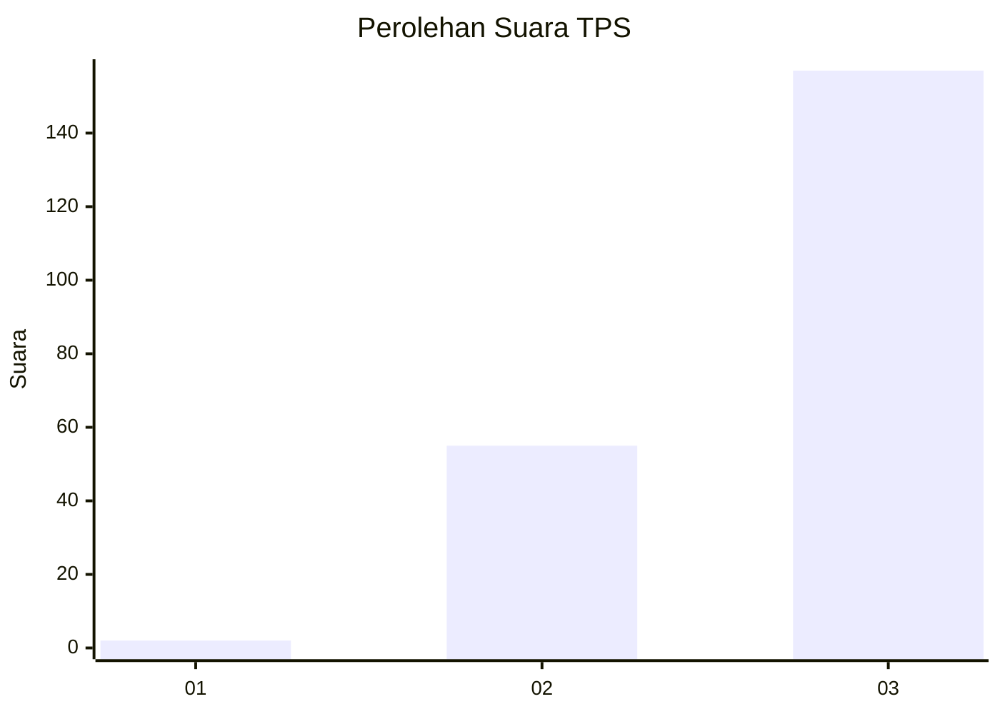
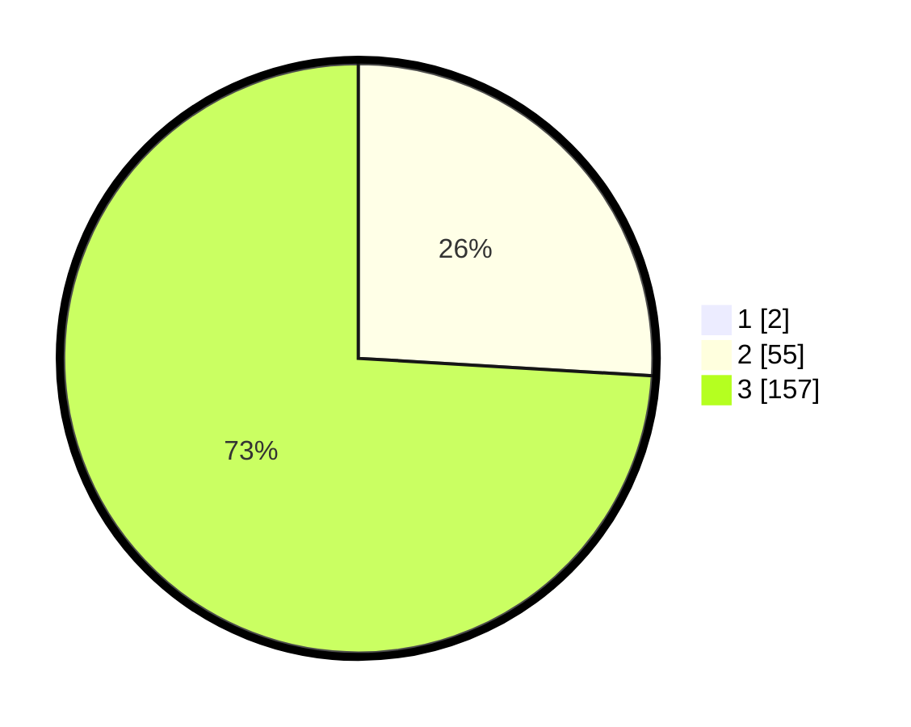

# Hasil

## Grafik

## Tabel

| No. | Nama Paslon    | Suara | Suara (raw) | Persentase |
|:--- |:-------------- | -----:| -----------:| ----------:|
| 1   | ANIES MUHAIMIN | 2     | [2][p-1]    | 0,93       |
| 2   | PRABOWO GIBRAN | 55    | [55][p-2]   | 25,70      |
| 3   | GANJAR MAHFUD  | 157   | [157][p-3]  | 73,36      |

[p-1]: https://github.com/gigit-pemilu/pemilu-2024/blob/main/pilpres/hitung-suara/sub/33-jawa-tengah/sub/09-boyolali/sub/18-wonosegoro/sub/2019-kauman/sub/006-tps/sub/paslon-1.txt
[p-2]: https://github.com/gigit-pemilu/pemilu-2024/blob/main/pilpres/hitung-suara/sub/33-jawa-tengah/sub/09-boyolali/sub/18-wonosegoro/sub/2019-kauman/sub/006-tps/sub/paslon-2.txt
[p-3]: https://github.com/gigit-pemilu/pemilu-2024/blob/main/pilpres/hitung-suara/sub/33-jawa-tengah/sub/09-boyolali/sub/18-wonosegoro/sub/2019-kauman/sub/006-tps/sub/paslon-3.txt

## Foto C Plano

https://sirekap-obj-formc.kpu.go.id/a411/pemilu/ppwp/33/09/18/20/19/3309182019006-20240214-204601--86d07287-ba8a-457b-9e9a-9d9f0761f10d.jpg

https://sirekap-obj-formc.kpu.go.id/a411/pemilu/ppwp/33/09/18/20/19/3309182019006-20240214-204727--431c3b08-f712-4e52-9bee-f2dfa482eedf.jpg

https://sirekap-obj-formc.kpu.go.id/a411/pemilu/ppwp/33/09/18/20/19/3309182019006-20240214-204935--0130c587-cad6-422e-b013-2a8a40a5c4ad.jpg

## Metadata

| Key        | Value               |
| ---------- | ------------------- |
| Time Stamp | 2024-02-15 15:00:29 |

