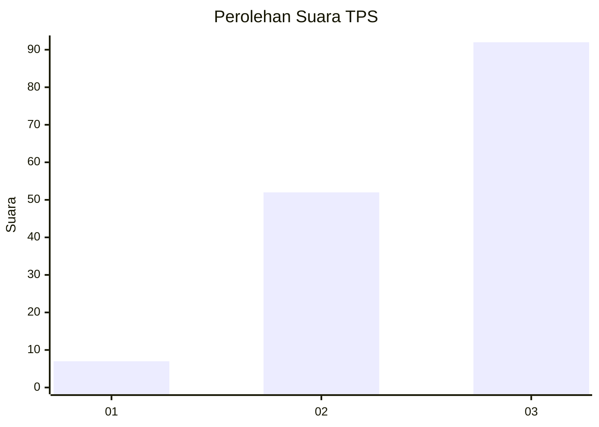
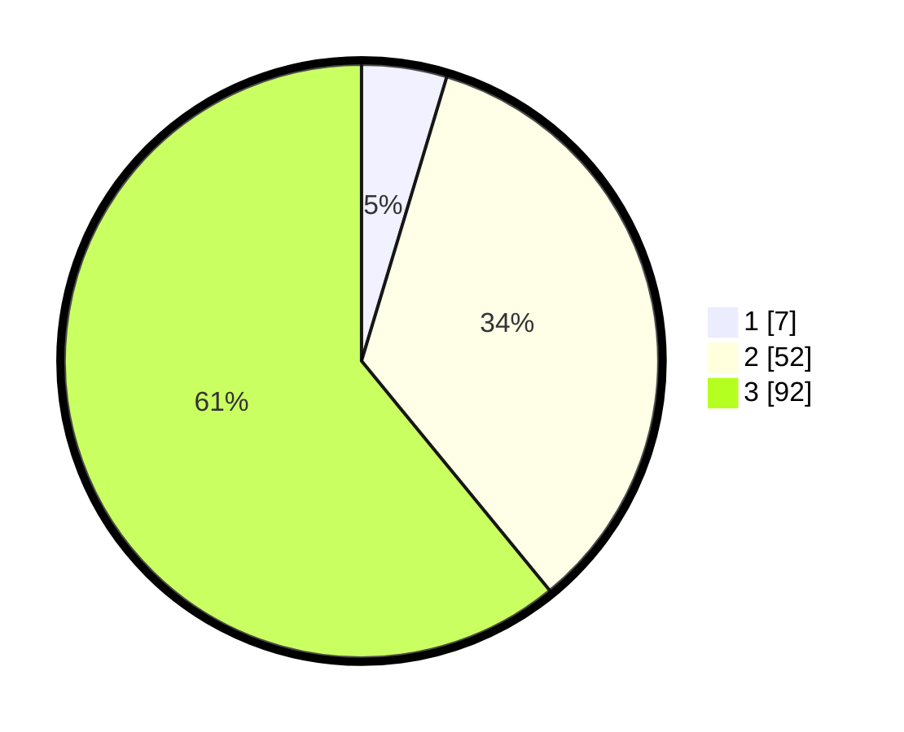

# Hasil

## Grafik

## Tabel

| No. | Nama Paslon    | Suara | Suara (raw) | Persentase |
|:--- |:-------------- | -----:| -----------:| ----------:|
| 1   | ANIES MUHAIMIN | 7     | [7][p-1]    | 4,64       |
| 2   | PRABOWO GIBRAN | 52    | [52][p-2]   | 34,44      |
| 3   | GANJAR MAHFUD  | 92    | [92][p-3]   | 60,93      |

[p-1]: https://github.com/gigit-pemilu/pemilu-2024/blob/main/pilpres/hitung-suara/sub/33-jawa-tengah/sub/09-boyolali/sub/18-wonosegoro/sub/2021-guwo/sub/001-tps/sub/paslon-1.txt
[p-2]: https://github.com/gigit-pemilu/pemilu-2024/blob/main/pilpres/hitung-suara/sub/33-jawa-tengah/sub/09-boyolali/sub/18-wonosegoro/sub/2021-guwo/sub/001-tps/sub/paslon-2.txt
[p-3]: https://github.com/gigit-pemilu/pemilu-2024/blob/main/pilpres/hitung-suara/sub/33-jawa-tengah/sub/09-boyolali/sub/18-wonosegoro/sub/2021-guwo/sub/001-tps/sub/paslon-3.txt

## Foto C Plano

https://sirekap-obj-formc.kpu.go.id/fcbe/pemilu/ppwp/33/09/18/20/21/3309182021001-20240215-012853--6433f427-ad15-4e09-9c06-b427b08449f8.jpg

https://sirekap-obj-formc.kpu.go.id/fcbe/pemilu/ppwp/33/09/18/20/21/3309182021001-20240215-011621--63eb4a80-cf11-4dcb-9883-fe24ffea3ac3.jpg

https://sirekap-obj-formc.kpu.go.id/fcbe/pemilu/ppwp/33/09/18/20/21/3309182021001-20240215-033039--b04c4950-276c-4cf8-ba82-e28246b8c51b.jpg

## Metadata

| Key        | Value               |
| ---------- | ------------------- |
| Time Stamp | 2024-02-15 21:01:18 |

