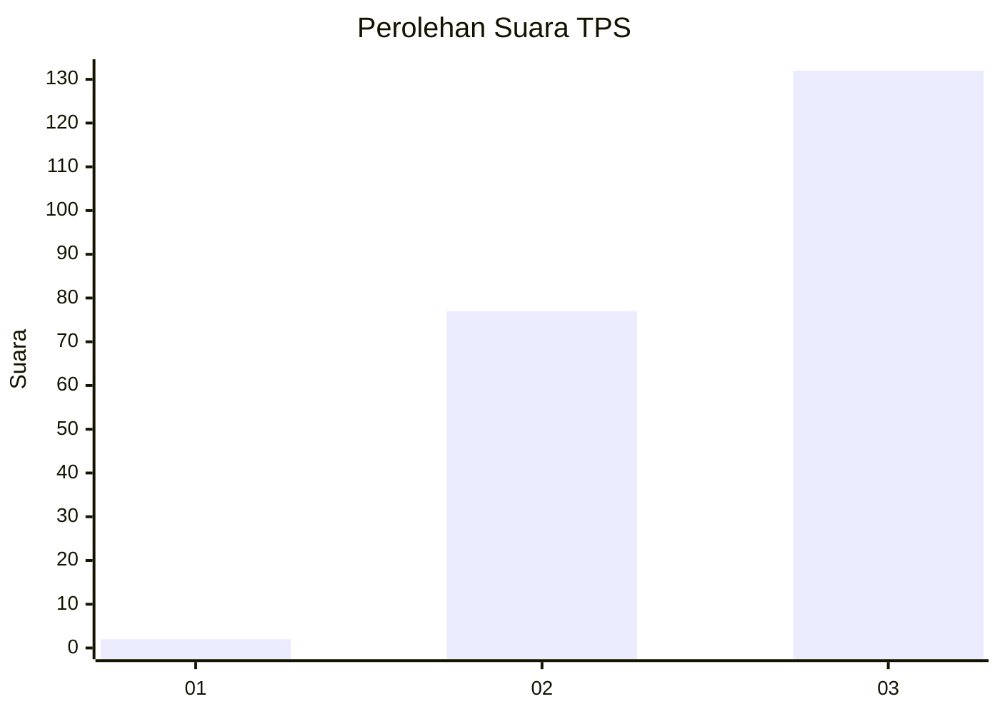
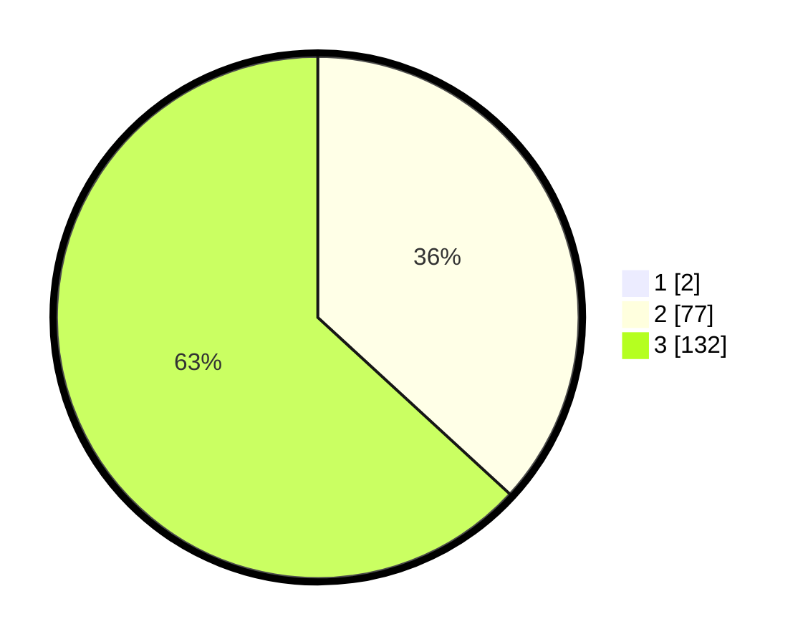

# Hasil

## Grafik

## Tabel

| No. | Nama Paslon    | Suara | Suara (raw) | Persentase |
|:--- |:-------------- | -----:| -----------:| ----------:|
| 1   | ANIES MUHAIMIN | 2     | [2][p-1]    | 0,95       |
| 2   | PRABOWO GIBRAN | 77    | [77][p-2]   | 36,49      |
| 3   | GANJAR MAHFUD  | 132   | [132][p-3]  | 62,56      |

[p-1]: https://github.com/gigit-pemilu/pemilu-2024/blob/main/pilpres/hitung-suara/sub/33-jawa-tengah/sub/09-boyolali/sub/19-juwangi/sub/2001-krobokan/sub/004-tps/sub/paslon-1.txt
[p-2]: https://github.com/gigit-pemilu/pemilu-2024/blob/main/pilpres/hitung-suara/sub/33-jawa-tengah/sub/09-boyolali/sub/19-juwangi/sub/2001-krobokan/sub/004-tps/sub/paslon-2.txt
[p-3]: https://github.com/gigit-pemilu/pemilu-2024/blob/main/pilpres/hitung-suara/sub/33-jawa-tengah/sub/09-boyolali/sub/19-juwangi/sub/2001-krobokan/sub/004-tps/sub/paslon-3.txt

## Foto C Plano

https://sirekap-obj-formc.kpu.go.id/3304/pemilu/ppwp/33/09/19/20/01/3309192001004-20240215-084058--077faba3-e66d-491e-ba29-7d4c71ada0e3.jpg

https://sirekap-obj-formc.kpu.go.id/3304/pemilu/ppwp/33/09/19/20/01/3309192001004-20240214-232725--3a53ad92-ddfc-479e-b7fa-e8817bf1f390.jpg

https://sirekap-obj-formc.kpu.go.id/3304/pemilu/ppwp/33/09/19/20/01/3309192001004-20240214-232601--07501710-8538-4f53-b85d-959d055aa25e.jpg

## Metadata

| Key        | Value               |
| ---------- | ------------------- |
| Time Stamp | 2024-02-15 20:00:44 |

