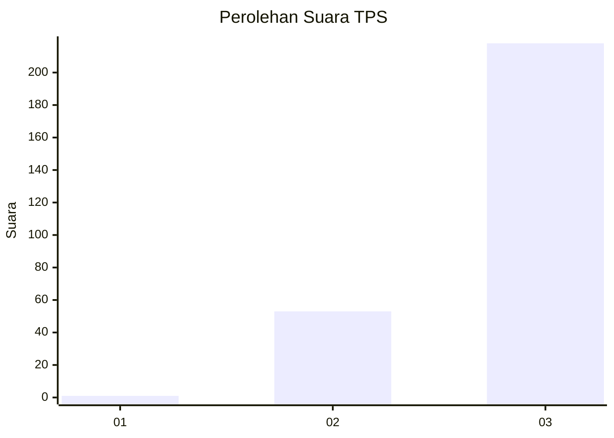
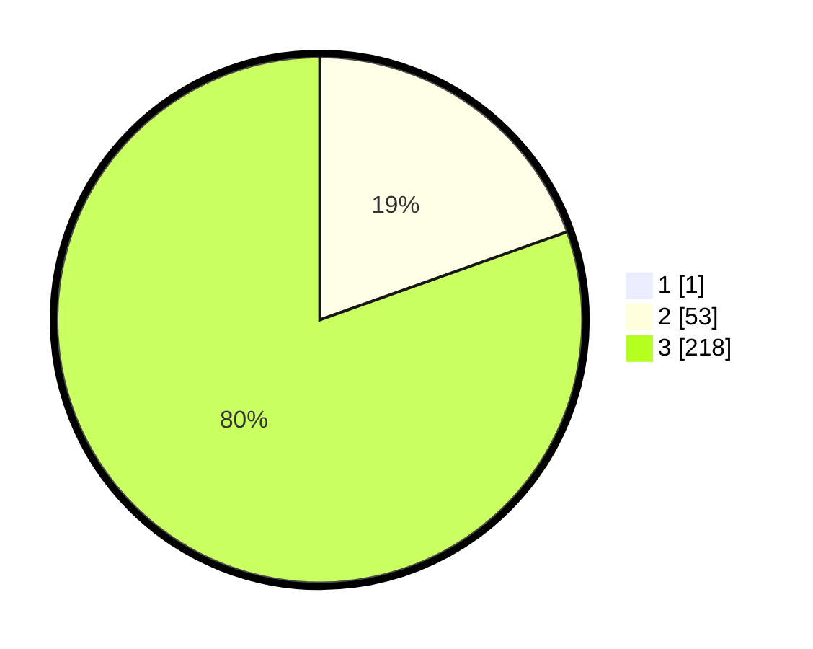

# Hasil

## Grafik

## Tabel

| No. | Nama Paslon    | Suara | Suara (raw) | Persentase |
|:--- |:-------------- | -----:| -----------:| ----------:|
| 1   | ANIES MUHAIMIN | 1     | [1][p-1]    | 0,37       |
| 2   | PRABOWO GIBRAN | 53    | [53][p-2]   | 19,49      |
| 3   | GANJAR MAHFUD  | 218   | [218][p-3]  | 80,15      |

[p-1]: https://github.com/gigit-pemilu/pemilu-2024-33-jawa-tengah/blob/main/pilpres/hitung-suara/sub/33-jawa-tengah/sub/09-boyolali/sub/20-gladagsari/sub/2002-kaligentong/sub/011-tps/sub/paslon-1.txt
[p-2]: https://github.com/gigit-pemilu/pemilu-2024-33-jawa-tengah/blob/main/pilpres/hitung-suara/sub/33-jawa-tengah/sub/09-boyolali/sub/20-gladagsari/sub/2002-kaligentong/sub/011-tps/sub/paslon-2.txt
[p-3]: https://github.com/gigit-pemilu/pemilu-2024-33-jawa-tengah/blob/main/pilpres/hitung-suara/sub/33-jawa-tengah/sub/09-boyolali/sub/20-gladagsari/sub/2002-kaligentong/sub/011-tps/sub/paslon-3.txt

## Foto C Plano

https://sirekap-obj-formc.kpu.go.id/f79e/pemilu/ppwp/33/09/20/20/02/3309202002011-20240214-225057--e4aa6073-534e-4f8c-9a7c-f0c4f9700847.jpg

https://sirekap-obj-formc.kpu.go.id/f79e/pemilu/ppwp/33/09/20/20/02/3309202002011-20240217-083918--f4f0eeaa-bc12-462c-91c5-5469b81528d8.jpg

https://sirekap-obj-formc.kpu.go.id/f79e/pemilu/ppwp/33/09/20/20/02/3309202002011-20240215-023718--af23d931-5e33-4a28-98a1-78ccdb1ec55f.jpg

## Metadata

| Key        | Value               |
| ---------- | ------------------- |
| Time Stamp | 2024-02-22 11:00:00 |

