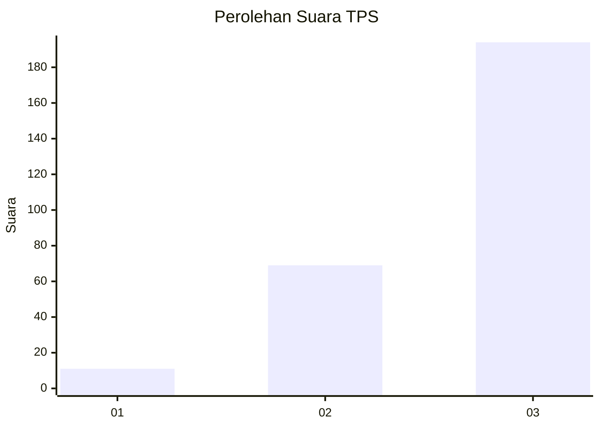
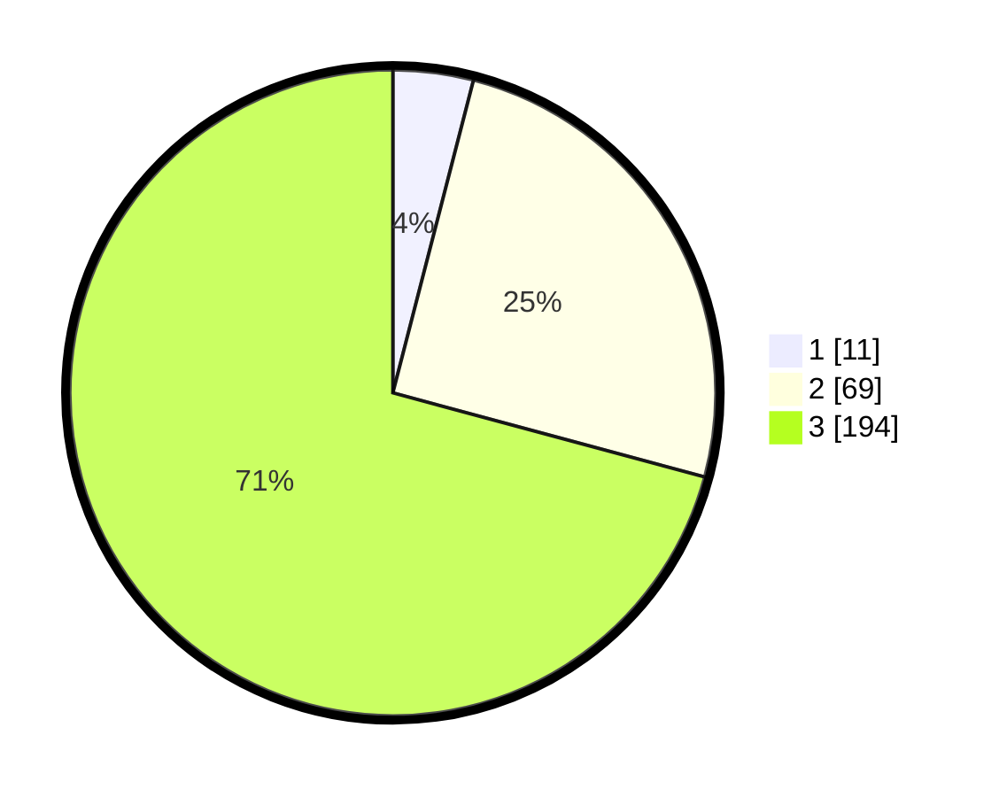

# Hasil

## Grafik

## Tabel

| No. | Nama Paslon    | Suara | Suara (raw) | Persentase |
|:--- |:-------------- | -----:| -----------:| ----------:|
| 1   | ANIES MUHAIMIN | 11    | [11][p-1]   | 4,01       |
| 2   | PRABOWO GIBRAN | 69    | [69][p-2]   | 25,18      |
| 3   | GANJAR MAHFUD  | 194   | [194][p-3]  | 70,80      |

[p-1]: https://github.com/gigit-pemilu/pemilu-2024/blob/main/pilpres/hitung-suara/sub/33-jawa-tengah/sub/09-boyolali/sub/20-gladagsari/sub/2004-kembang/sub/005-tps/sub/paslon-1.txt
[p-2]: https://github.com/gigit-pemilu/pemilu-2024/blob/main/pilpres/hitung-suara/sub/33-jawa-tengah/sub/09-boyolali/sub/20-gladagsari/sub/2004-kembang/sub/005-tps/sub/paslon-2.txt
[p-3]: https://github.com/gigit-pemilu/pemilu-2024/blob/main/pilpres/hitung-suara/sub/33-jawa-tengah/sub/09-boyolali/sub/20-gladagsari/sub/2004-kembang/sub/005-tps/sub/paslon-3.txt

## Foto C Plano

https://sirekap-obj-formc.kpu.go.id/6da6/pemilu/ppwp/33/09/20/20/04/3309202004005-20240214-220309--2d5b1042-40d0-462c-a092-991353512e82.jpg

https://sirekap-obj-formc.kpu.go.id/6da6/pemilu/ppwp/33/09/20/20/04/3309202004005-20240214-210543--0fc8fed8-ec73-4f0e-9113-9aa0cf0f5ef1.jpg

https://sirekap-obj-formc.kpu.go.id/6da6/pemilu/ppwp/33/09/20/20/04/3309202004005-20240214-215334--8b2cba85-c729-417b-8e28-dcefe2e71abe.jpg

## Metadata

| Key        | Value               |
| ---------- | ------------------- |
| Time Stamp | 2024-02-15 16:30:25 |

