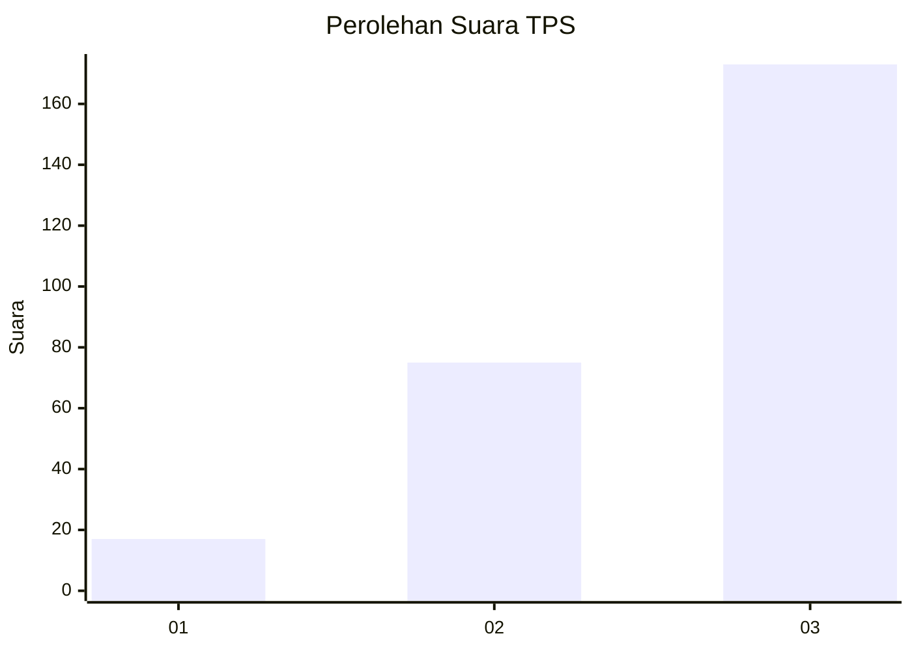
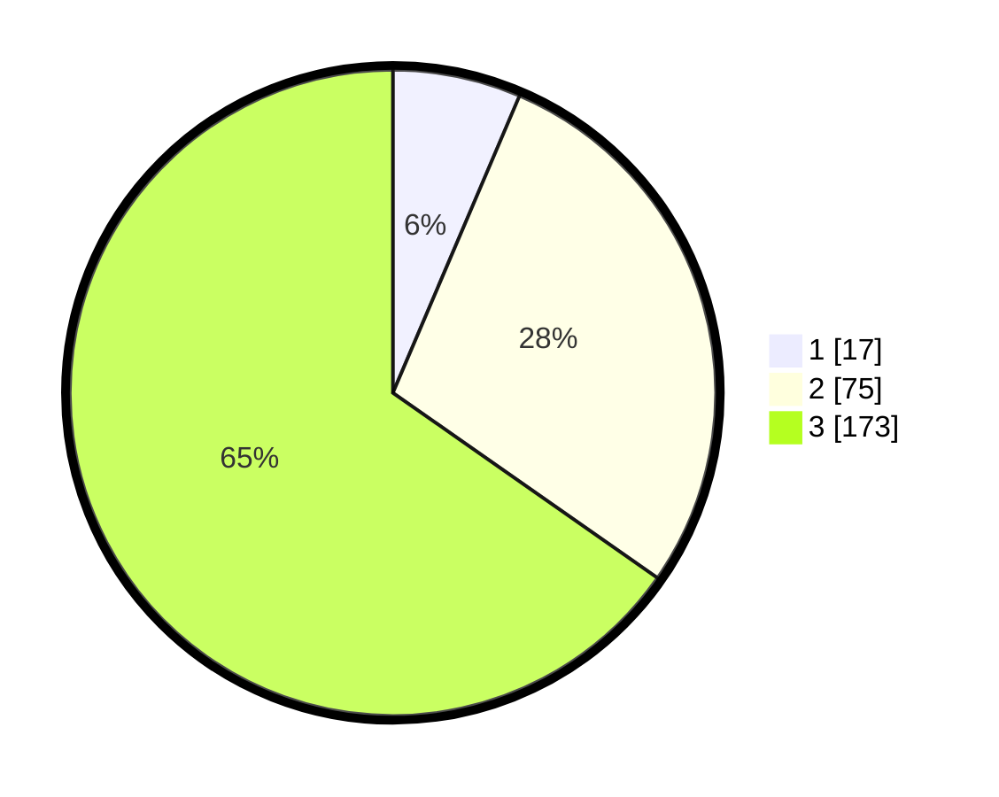

# Hasil

## Grafik

## Tabel

| No. | Nama Paslon    | Suara | Suara (raw) | Persentase |
|:--- |:-------------- | -----:| -----------:| ----------:|
| 1   | ANIES MUHAIMIN | 17    | [17][p-1]   | 6,42       |
| 2   | PRABOWO GIBRAN | 75    | [75][p-2]   | 28,30      |
| 3   | GANJAR MAHFUD  | 173   | [173][p-3]  | 65,28      |

[p-1]: https://github.com/gigit-pemilu/pemilu-2024/blob/main/pilpres/hitung-suara/sub/33-jawa-tengah/sub/09-boyolali/sub/20-gladagsari/sub/2004-kembang/sub/010-tps/sub/paslon-1.txt
[p-2]: https://github.com/gigit-pemilu/pemilu-2024/blob/main/pilpres/hitung-suara/sub/33-jawa-tengah/sub/09-boyolali/sub/20-gladagsari/sub/2004-kembang/sub/010-tps/sub/paslon-2.txt
[p-3]: https://github.com/gigit-pemilu/pemilu-2024/blob/main/pilpres/hitung-suara/sub/33-jawa-tengah/sub/09-boyolali/sub/20-gladagsari/sub/2004-kembang/sub/010-tps/sub/paslon-3.txt

## Foto C Plano

https://sirekap-obj-formc.kpu.go.id/5978/pemilu/ppwp/33/09/20/20/04/3309202004010-20240215-001230--135deddc-d44c-4763-9028-7d3ac8c8d1ed.jpg

https://sirekap-obj-formc.kpu.go.id/5978/pemilu/ppwp/33/09/20/20/04/3309202004010-20240215-001338--8d25693e-870e-4a49-990c-2a68663e1cde.jpg

https://sirekap-obj-formc.kpu.go.id/5978/pemilu/ppwp/33/09/20/20/04/3309202004010-20240215-001355--15d4b2e2-86ac-40d3-8781-77e23eabeb3a.jpg

## Metadata

| Key        | Value               |
| ---------- | ------------------- |
| Time Stamp | 2024-02-15 15:00:29 |

