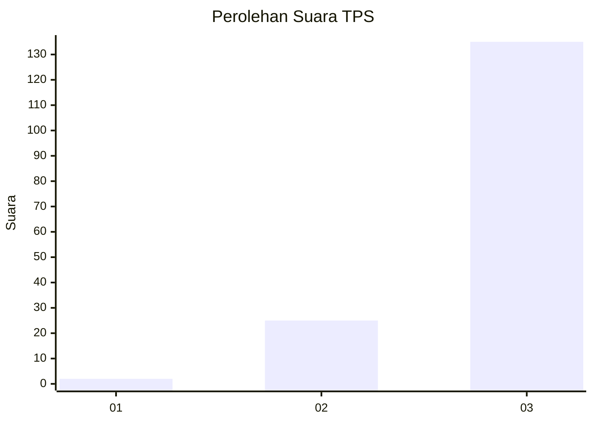
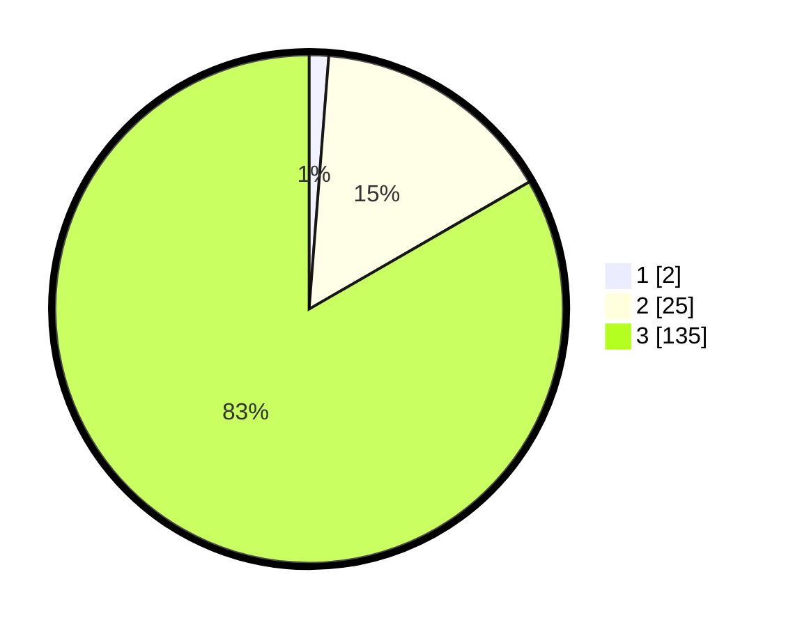

# Hasil

## Grafik

## Tabel

| No. | Nama Paslon    | Suara | Suara (raw) | Persentase |
|:--- |:-------------- | -----:| -----------:| ----------:|
| 1   | ANIES MUHAIMIN | 2     | [2][p-1]    | 1,23       |
| 2   | PRABOWO GIBRAN | 25    | [25][p-2]   | 15,43      |
| 3   | GANJAR MAHFUD  | 135   | [135][p-3]  | 83,33      |

[p-1]: https://github.com/gigit-pemilu/pemilu-2024-33-jawa-tengah/blob/main/pilpres/hitung-suara/sub/33-jawa-tengah/sub/09-boyolali/sub/20-gladagsari/sub/2004-kembang/sub/017-tps/sub/paslon-1.txt
[p-2]: https://github.com/gigit-pemilu/pemilu-2024-33-jawa-tengah/blob/main/pilpres/hitung-suara/sub/33-jawa-tengah/sub/09-boyolali/sub/20-gladagsari/sub/2004-kembang/sub/017-tps/sub/paslon-2.txt
[p-3]: https://github.com/gigit-pemilu/pemilu-2024-33-jawa-tengah/blob/main/pilpres/hitung-suara/sub/33-jawa-tengah/sub/09-boyolali/sub/20-gladagsari/sub/2004-kembang/sub/017-tps/sub/paslon-3.txt

## Foto C Plano

https://sirekap-obj-formc.kpu.go.id/0c13/pemilu/ppwp/33/09/20/20/04/3309202004017-20240214-200832--4dc66ae7-0e9a-4bb2-9e9c-2c248f12b0ff.jpg

https://sirekap-obj-formc.kpu.go.id/0c13/pemilu/ppwp/33/09/20/20/04/3309202004017-20240214-200849--2671818b-cf70-4558-b0da-9d1dcf82df3d.jpg

https://sirekap-obj-formc.kpu.go.id/0c13/pemilu/ppwp/33/09/20/20/04/3309202004017-20240214-214656--10683ce5-0c3b-463b-a008-9412a652a9c7.jpg

## Metadata

| Key        | Value               |
| ---------- | ------------------- |
| Time Stamp | 2024-02-15 15:00:29 |

