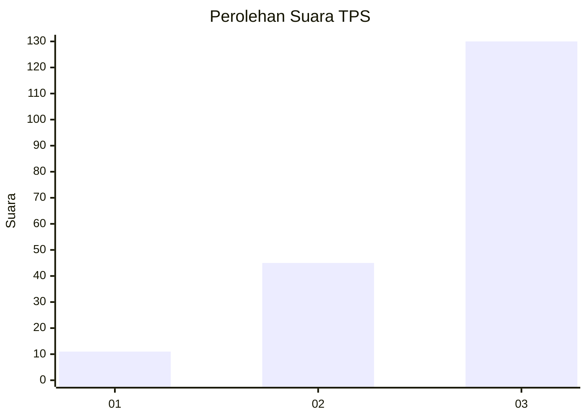
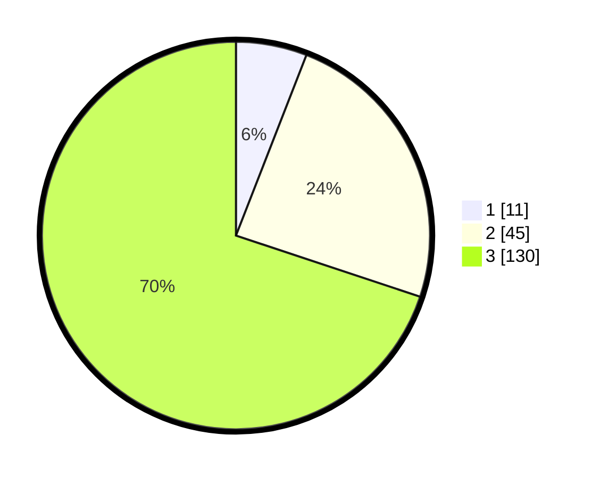

# Hasil

## Grafik

## Tabel

| No. | Nama Paslon    | Suara | Suara (raw) | Persentase |
|:--- |:-------------- | -----:| -----------:| ----------:|
| 1   | ANIES MUHAIMIN | 11    | [11][p-1]   | 5,91       |
| 2   | PRABOWO GIBRAN | 45    | [45][p-2]   | 24,19      |
| 3   | GANJAR MAHFUD  | 130   | [130][p-3]  | 69,89      |

[p-1]: https://github.com/gigit-pemilu/pemilu-2024/blob/main/pilpres/hitung-suara/sub/33-jawa-tengah/sub/09-boyolali/sub/20-gladagsari/sub/2008-sampetan/sub/010-tps/sub/paslon-1.txt
[p-2]: https://github.com/gigit-pemilu/pemilu-2024/blob/main/pilpres/hitung-suara/sub/33-jawa-tengah/sub/09-boyolali/sub/20-gladagsari/sub/2008-sampetan/sub/010-tps/sub/paslon-2.txt
[p-3]: https://github.com/gigit-pemilu/pemilu-2024/blob/main/pilpres/hitung-suara/sub/33-jawa-tengah/sub/09-boyolali/sub/20-gladagsari/sub/2008-sampetan/sub/010-tps/sub/paslon-3.txt

## Foto C Plano

https://sirekap-obj-formc.kpu.go.id/6138/pemilu/ppwp/33/09/20/20/08/3309202008010-20240214-215804--347a6aa5-aceb-4479-a726-e0a49987d6c3.jpg

https://sirekap-obj-formc.kpu.go.id/6138/pemilu/ppwp/33/09/20/20/08/3309202008010-20240214-220756--2ecb48c1-5825-4484-a293-9eaa08378040.jpg

https://sirekap-obj-formc.kpu.go.id/6138/pemilu/ppwp/33/09/20/20/08/3309202008010-20240214-220938--d3eb8e37-2d6c-41bd-8dd5-673f75582751.jpg

## Metadata

| Key        | Value               |
| ---------- | ------------------- |
| Time Stamp | 2024-02-15 21:30:27 |

