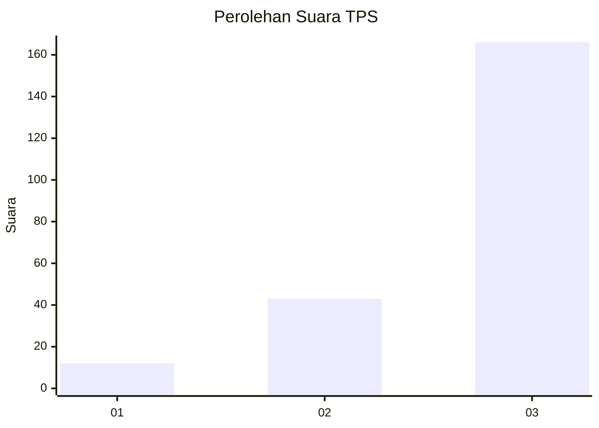
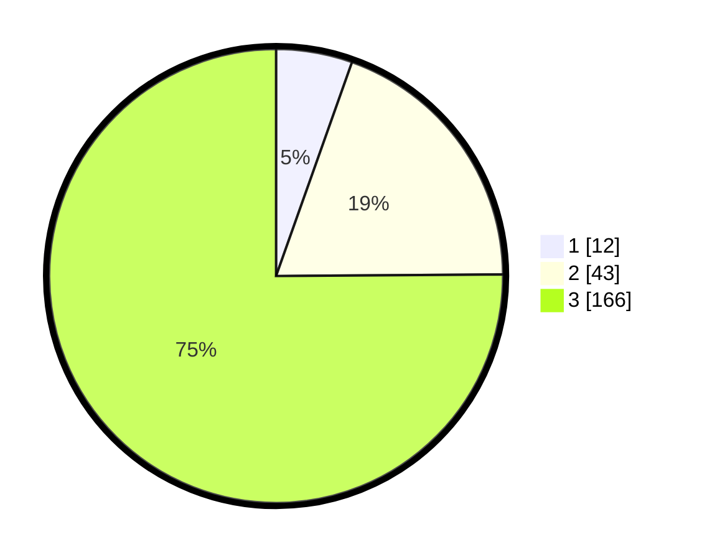

# Hasil

## Grafik

## Tabel

| No. | Nama Paslon    | Suara | Suara (raw) | Persentase |
|:--- |:-------------- | -----:| -----------:| ----------:|
| 1   | ANIES MUHAIMIN | 12    | [12][p-1]   | 5,43       |
| 2   | PRABOWO GIBRAN | 43    | [43][p-2]   | 19,46      |
| 3   | GANJAR MAHFUD  | 166   | [166][p-3]  | 75,11      |

[p-1]: https://github.com/gigit-pemilu/pemilu-2024/blob/main/pilpres/hitung-suara/sub/33-jawa-tengah/sub/09-boyolali/sub/20-gladagsari/sub/2008-sampetan/sub/015-tps/sub/paslon-1.txt
[p-2]: https://github.com/gigit-pemilu/pemilu-2024/blob/main/pilpres/hitung-suara/sub/33-jawa-tengah/sub/09-boyolali/sub/20-gladagsari/sub/2008-sampetan/sub/015-tps/sub/paslon-2.txt
[p-3]: https://github.com/gigit-pemilu/pemilu-2024/blob/main/pilpres/hitung-suara/sub/33-jawa-tengah/sub/09-boyolali/sub/20-gladagsari/sub/2008-sampetan/sub/015-tps/sub/paslon-3.txt

## Foto C Plano

https://sirekap-obj-formc.kpu.go.id/13cb/pemilu/ppwp/33/09/20/20/08/3309202008015-20240214-220345--e869ac1a-ad4d-4369-b11c-0bf163f32ae8.jpg

https://sirekap-obj-formc.kpu.go.id/13cb/pemilu/ppwp/33/09/20/20/08/3309202008015-20240214-220530--e71ca0ca-0f21-472e-b65f-95f20c91c196.jpg

https://sirekap-obj-formc.kpu.go.id/13cb/pemilu/ppwp/33/09/20/20/08/3309202008015-20240214-220622--253f36d5-bf8b-4a74-8edf-b852b88cfba8.jpg

## Metadata

| Key        | Value               |
| ---------- | ------------------- |
| Time Stamp | 2024-02-15 21:30:27 |

