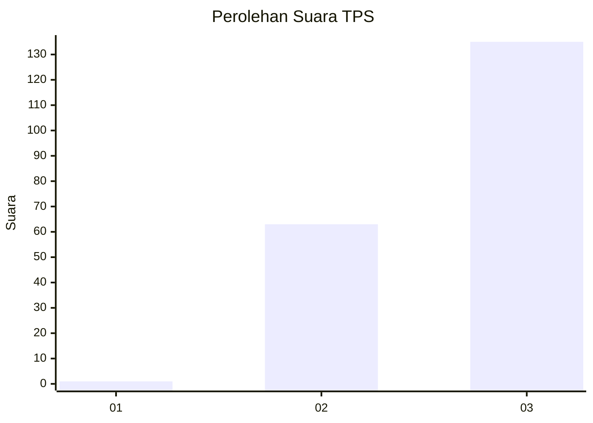
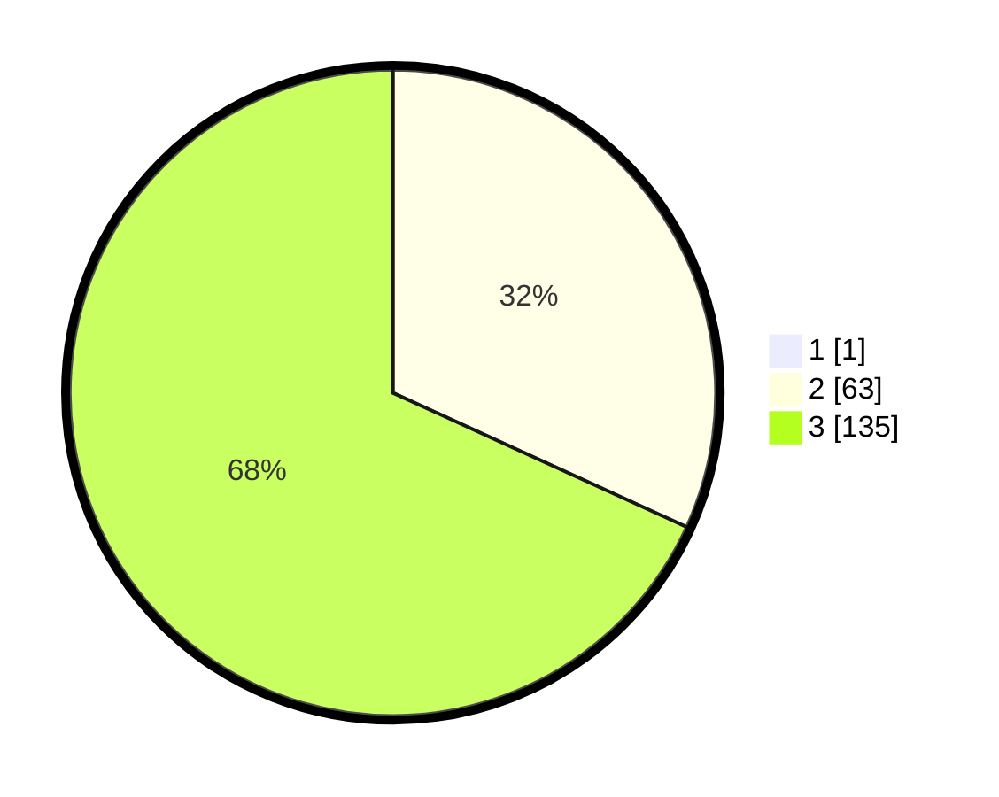

# Hasil

## Grafik

## Tabel

| No. | Nama Paslon    | Suara | Suara (raw) | Persentase |
|:--- |:-------------- | -----:| -----------:| ----------:|
| 1   | ANIES MUHAIMIN | 1     | [1][p-1]    | 0,50       |
| 2   | PRABOWO GIBRAN | 63    | [63][p-2]   | 31,66      |
| 3   | GANJAR MAHFUD  | 135   | [135][p-3]  | 67,84      |

[p-1]: https://github.com/gigit-pemilu/pemilu-2024-33-jawa-tengah/blob/main/pilpres/hitung-suara/sub/33-jawa-tengah/sub/09-boyolali/sub/20-gladagsari/sub/2008-sampetan/sub/017-tps/sub/paslon-1.txt
[p-2]: https://github.com/gigit-pemilu/pemilu-2024-33-jawa-tengah/blob/main/pilpres/hitung-suara/sub/33-jawa-tengah/sub/09-boyolali/sub/20-gladagsari/sub/2008-sampetan/sub/017-tps/sub/paslon-2.txt
[p-3]: https://github.com/gigit-pemilu/pemilu-2024-33-jawa-tengah/blob/main/pilpres/hitung-suara/sub/33-jawa-tengah/sub/09-boyolali/sub/20-gladagsari/sub/2008-sampetan/sub/017-tps/sub/paslon-3.txt

## Foto C Plano

https://sirekap-obj-formc.kpu.go.id/6369/pemilu/ppwp/33/09/20/20/08/3309202008017-20240215-003207--e2029a0a-a34d-42fc-b03d-c9e0dde50dc3.jpg

https://sirekap-obj-formc.kpu.go.id/6369/pemilu/ppwp/33/09/20/20/08/3309202008017-20240214-205904--dc35d212-639b-4c98-b4f9-938a63a61eba.jpg

https://sirekap-obj-formc.kpu.go.id/6369/pemilu/ppwp/33/09/20/20/08/3309202008017-20240214-212748--d2004da0-ccab-4dcc-8114-a763c784226a.jpg

## Metadata

| Key        | Value               |
| ---------- | ------------------- |
| Time Stamp | 2024-02-15 12:00:28 |

