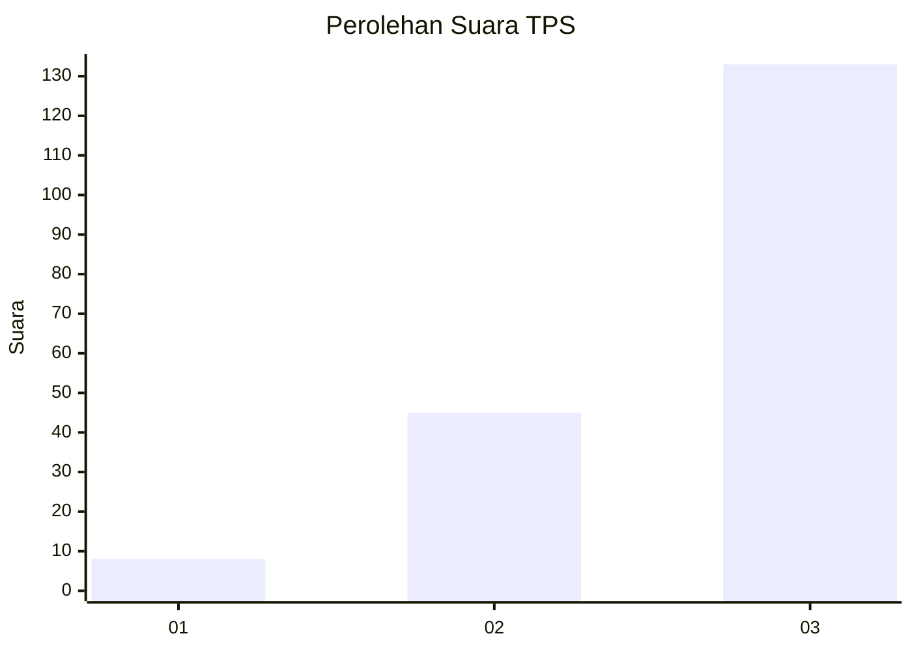
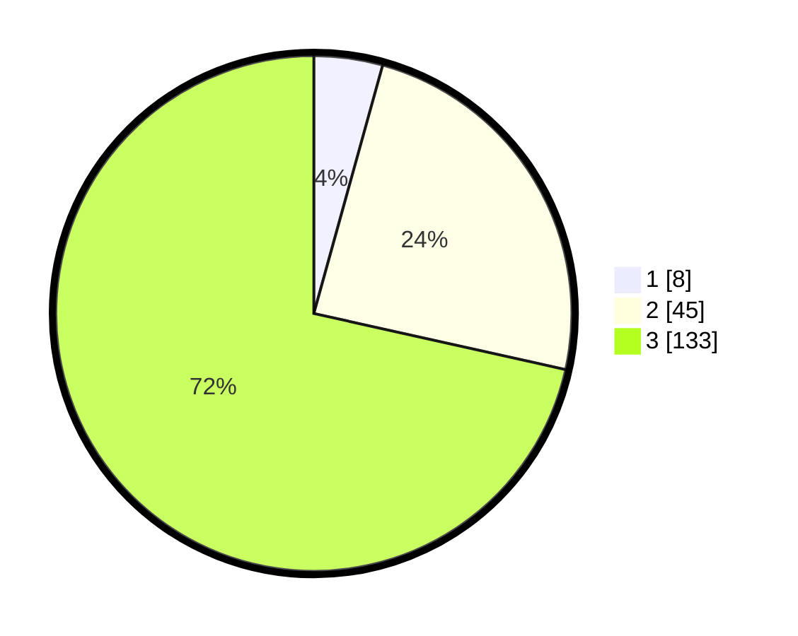

# Hasil

## Grafik

## Tabel

| No. | Nama Paslon    | Suara | Suara (raw) | Persentase |
|:--- |:-------------- | -----:| -----------:| ----------:|
| 1   | ANIES MUHAIMIN | 8     | [8][p-1]    | 4,30       |
| 2   | PRABOWO GIBRAN | 45    | [45][p-2]   | 24,19      |
| 3   | GANJAR MAHFUD  | 133   | [133][p-3]  | 71,51      |

[p-1]: https://github.com/gigit-pemilu/pemilu-2024-33-jawa-tengah/blob/main/pilpres/hitung-suara/sub/33-jawa-tengah/sub/09-boyolali/sub/20-gladagsari/sub/2009-ngadirojo/sub/003-tps/sub/paslon-1.txt
[p-2]: https://github.com/gigit-pemilu/pemilu-2024-33-jawa-tengah/blob/main/pilpres/hitung-suara/sub/33-jawa-tengah/sub/09-boyolali/sub/20-gladagsari/sub/2009-ngadirojo/sub/003-tps/sub/paslon-2.txt
[p-3]: https://github.com/gigit-pemilu/pemilu-2024-33-jawa-tengah/blob/main/pilpres/hitung-suara/sub/33-jawa-tengah/sub/09-boyolali/sub/20-gladagsari/sub/2009-ngadirojo/sub/003-tps/sub/paslon-3.txt

## Foto C Plano

https://sirekap-obj-formc.kpu.go.id/3e19/pemilu/ppwp/33/09/20/20/09/3309202009003-20240214-214659--ef5e12d5-032d-4b0f-ae1d-07d0695a2954.jpg

https://sirekap-obj-formc.kpu.go.id/3e19/pemilu/ppwp/33/09/20/20/09/3309202009003-20240217-100923--7395b8e9-1f04-41df-9ba1-6fa55cbff067.jpg

https://sirekap-obj-formc.kpu.go.id/3e19/pemilu/ppwp/33/09/20/20/09/3309202009003-20240215-001850--180fd3d3-9f26-4a09-957b-3cbdd835e11a.jpg

## Metadata

| Key        | Value               |
| ---------- | ------------------- |
| Time Stamp | 2024-02-19 06:16:00 |

