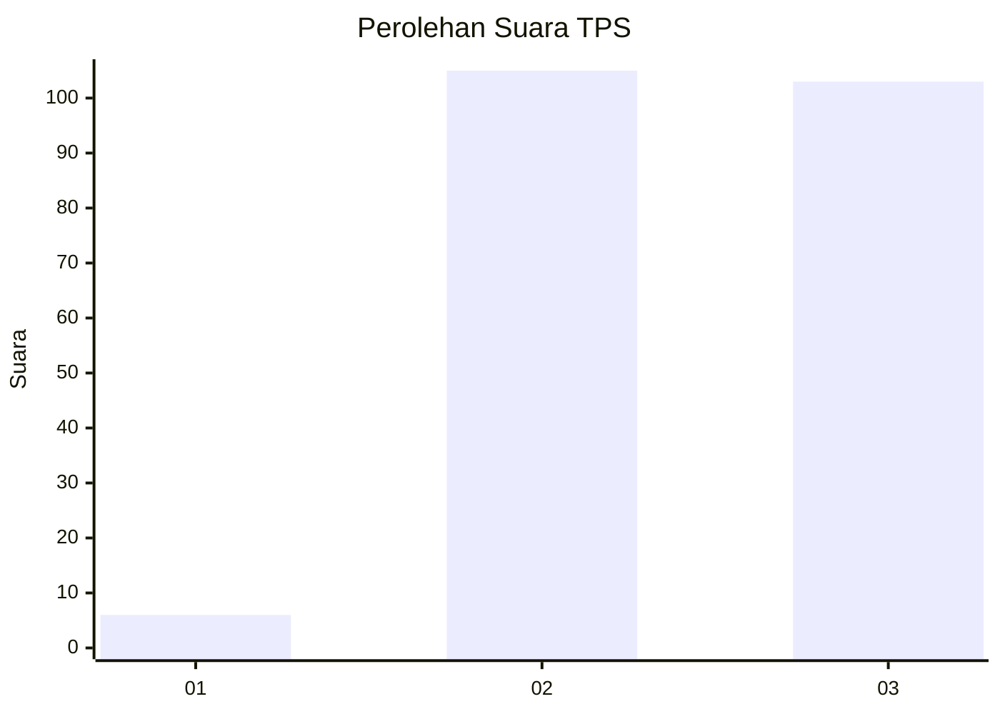
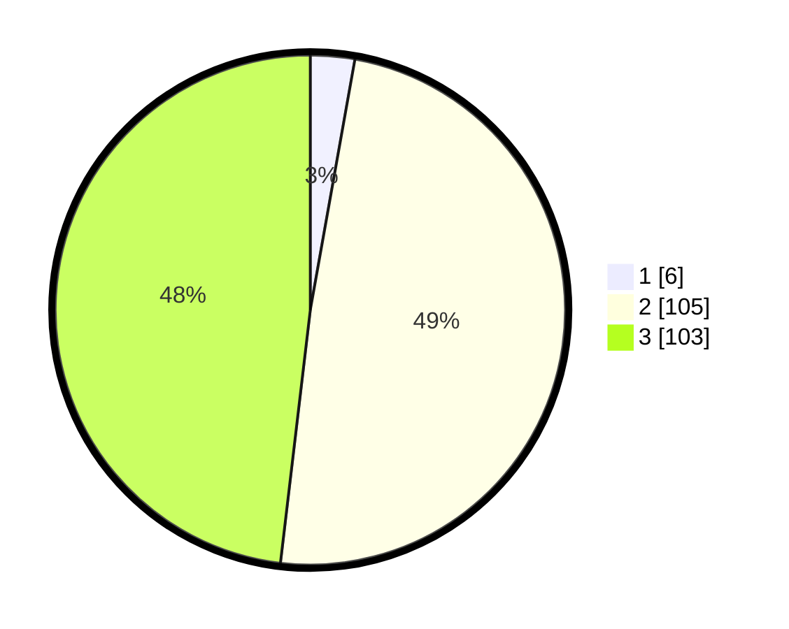

# Hasil

## Grafik

## Tabel

| No. | Nama Paslon    | Suara | Suara (raw) | Persentase |
|:--- |:-------------- | -----:| -----------:| ----------:|
| 1   | ANIES MUHAIMIN | 6     | [6][p-1]    | 2,80       |
| 2   | PRABOWO GIBRAN | 105   | [105][p-2]  | 49,07      |
| 3   | GANJAR MAHFUD  | 103   | [103][p-3]  | 48,13      |

[p-1]: https://github.com/gigit-pemilu/pemilu-2024/blob/main/pilpres/hitung-suara/sub/33-jawa-tengah/sub/09-boyolali/sub/20-gladagsari/sub/2009-ngadirojo/sub/005-tps/sub/paslon-1.txt
[p-2]: https://github.com/gigit-pemilu/pemilu-2024/blob/main/pilpres/hitung-suara/sub/33-jawa-tengah/sub/09-boyolali/sub/20-gladagsari/sub/2009-ngadirojo/sub/005-tps/sub/paslon-2.txt
[p-3]: https://github.com/gigit-pemilu/pemilu-2024/blob/main/pilpres/hitung-suara/sub/33-jawa-tengah/sub/09-boyolali/sub/20-gladagsari/sub/2009-ngadirojo/sub/005-tps/sub/paslon-3.txt

## Foto C Plano

https://sirekap-obj-formc.kpu.go.id/b45b/pemilu/ppwp/33/09/20/20/09/3309202009005-20240215-192051--a5865187-c0c7-4aa0-8588-e9b9057f4301.jpg

https://sirekap-obj-formc.kpu.go.id/b45b/pemilu/ppwp/33/09/20/20/09/3309202009005-20240217-074344--2748044b-6a95-46e6-b15d-e07049bcc42d.jpg

https://sirekap-obj-formc.kpu.go.id/b45b/pemilu/ppwp/33/09/20/20/09/3309202009005-20240217-074344--b14738d5-0a44-4b98-b03b-f55bb48808d3.jpg

## Metadata

| Key        | Value               |
| ---------- | ------------------- |
| Time Stamp | 2024-02-17 10:30:03 |

