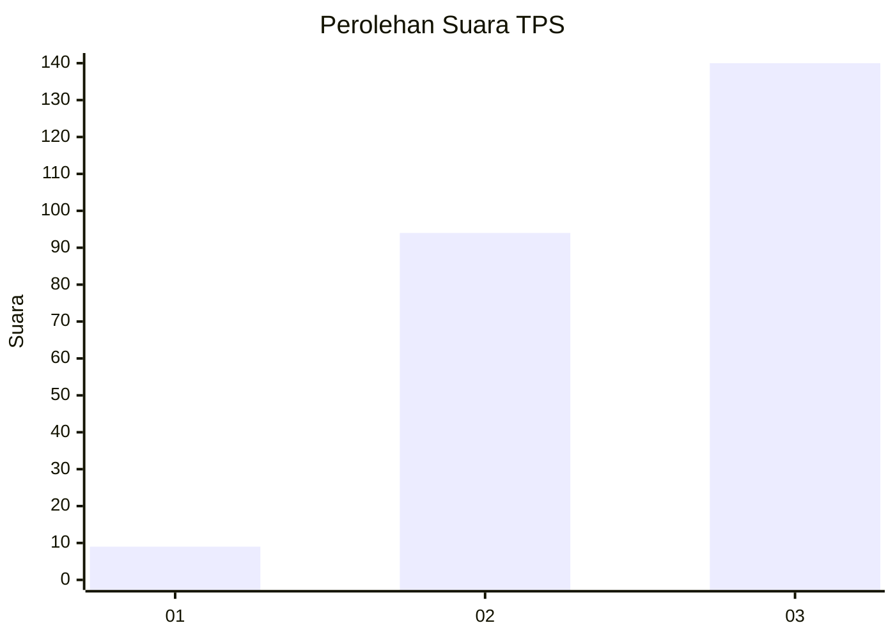
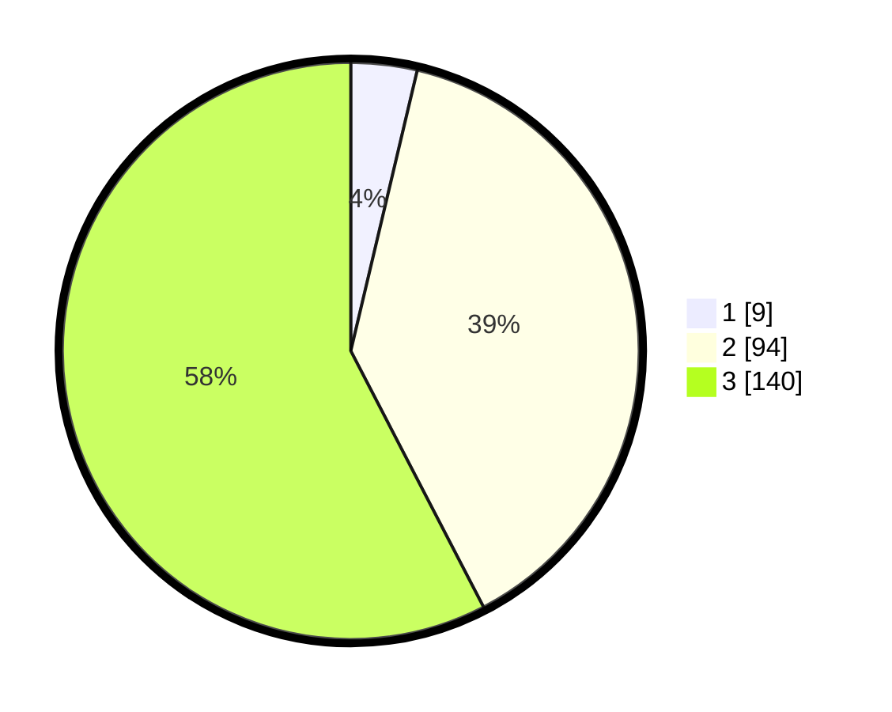

# Hasil

## Grafik

## Tabel

| No. | Nama Paslon    | Suara | Suara (raw) | Persentase |
|:--- |:-------------- | -----:| -----------:| ----------:|
| 1   | ANIES MUHAIMIN | 9     | [9][p-1]    | 3,70       |
| 2   | PRABOWO GIBRAN | 94    | [94][p-2]   | 38,68      |
| 3   | GANJAR MAHFUD  | 140   | [140][p-3]  | 57,61      |

[p-1]: https://github.com/gigit-pemilu/pemilu-2024/blob/main/pilpres/hitung-suara/sub/33-jawa-tengah/sub/09-boyolali/sub/20-gladagsari/sub/2009-ngadirojo/sub/011-tps/sub/paslon-1.txt
[p-2]: https://github.com/gigit-pemilu/pemilu-2024/blob/main/pilpres/hitung-suara/sub/33-jawa-tengah/sub/09-boyolali/sub/20-gladagsari/sub/2009-ngadirojo/sub/011-tps/sub/paslon-2.txt
[p-3]: https://github.com/gigit-pemilu/pemilu-2024/blob/main/pilpres/hitung-suara/sub/33-jawa-tengah/sub/09-boyolali/sub/20-gladagsari/sub/2009-ngadirojo/sub/011-tps/sub/paslon-3.txt

## Foto C Plano

https://sirekap-obj-formc.kpu.go.id/6388/pemilu/ppwp/33/09/20/20/09/3309202009011-20240214-211218--e83d956b-c32e-4e49-b403-81b05d014fa7.jpg

https://sirekap-obj-formc.kpu.go.id/6388/pemilu/ppwp/33/09/20/20/09/3309202009011-20240217-123000--0c60695d-3778-48a4-bacd-4dd0df78c138.jpg

https://sirekap-obj-formc.kpu.go.id/6388/pemilu/ppwp/33/09/20/20/09/3309202009011-20240214-203635--5d447dd9-a208-446f-9e9f-b03bb1c7778b.jpg

## Metadata

| Key        | Value               |
| ---------- | ------------------- |
| Time Stamp | 2024-02-24 22:31:28 |

