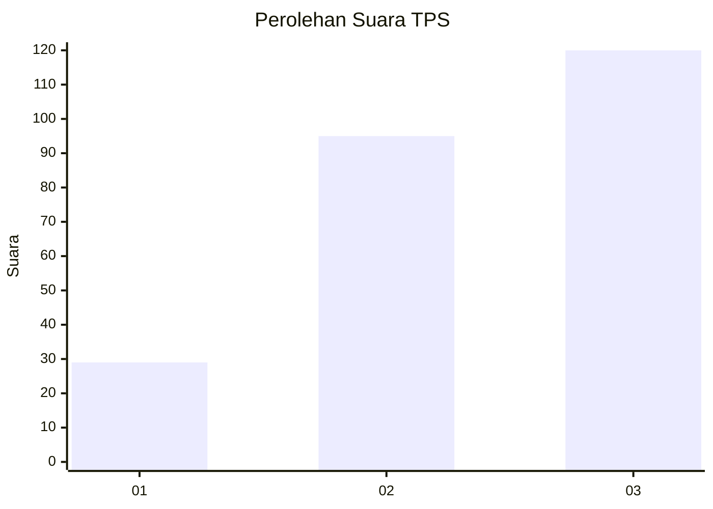
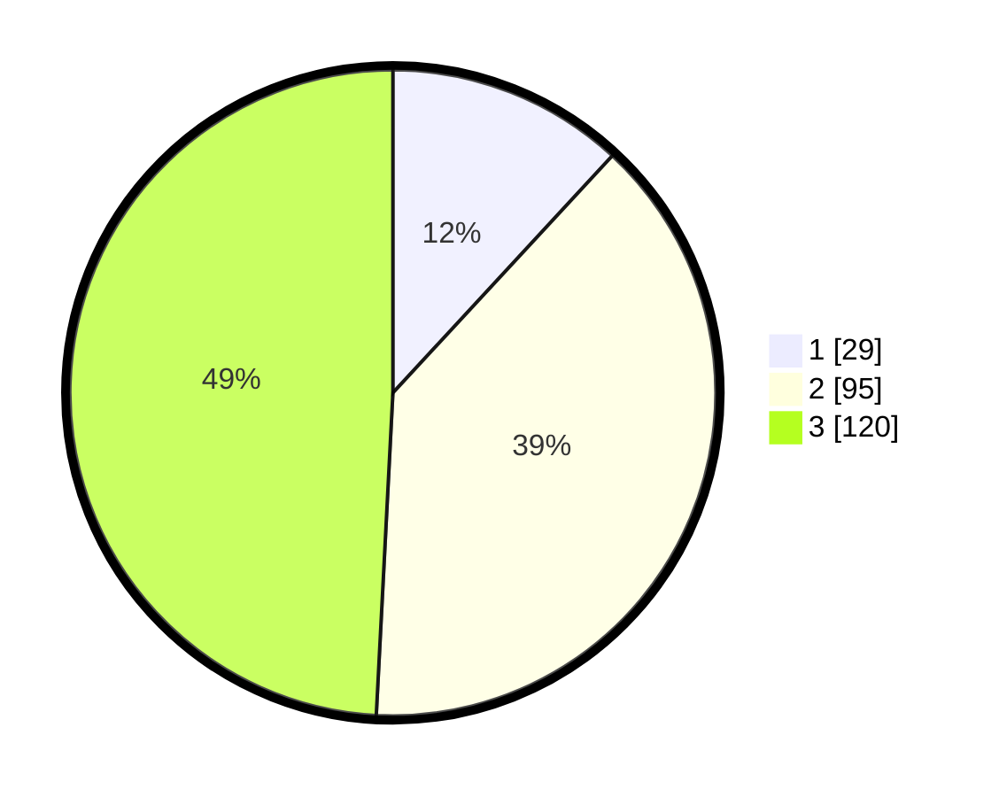

# Hasil

## Grafik

## Tabel

| No. | Nama Paslon    | Suara | Suara (raw) | Persentase |
|:--- |:-------------- | -----:| -----------:| ----------:|
| 1   | ANIES MUHAIMIN | 29    | [29][p-1]   | 11,89      |
| 2   | PRABOWO GIBRAN | 95    | [95][p-2]   | 38,93      |
| 3   | GANJAR MAHFUD  | 120   | [120][p-3]  | 49,18      |

[p-1]: https://github.com/gigit-pemilu/pemilu-2024-33-jawa-tengah/blob/main/pilpres/hitung-suara/sub/33-jawa-tengah/sub/09-boyolali/sub/20-gladagsari/sub/2010-jlarem/sub/005-tps/sub/paslon-1.txt
[p-2]: https://github.com/gigit-pemilu/pemilu-2024-33-jawa-tengah/blob/main/pilpres/hitung-suara/sub/33-jawa-tengah/sub/09-boyolali/sub/20-gladagsari/sub/2010-jlarem/sub/005-tps/sub/paslon-2.txt
[p-3]: https://github.com/gigit-pemilu/pemilu-2024-33-jawa-tengah/blob/main/pilpres/hitung-suara/sub/33-jawa-tengah/sub/09-boyolali/sub/20-gladagsari/sub/2010-jlarem/sub/005-tps/sub/paslon-3.txt

## Foto C Plano

https://sirekap-obj-formc.kpu.go.id/762b/pemilu/ppwp/33/09/20/20/10/3309202010005-20240215-034700--27dc781f-3471-4afd-8465-5d2332b082df.jpg

https://sirekap-obj-formc.kpu.go.id/762b/pemilu/ppwp/33/09/20/20/10/3309202010005-20240215-040105--517277c5-a8be-4f64-83fd-a044de41be0a.jpg

https://sirekap-obj-formc.kpu.go.id/762b/pemilu/ppwp/33/09/20/20/10/3309202010005-20240215-035126--8a7e47c7-8a0a-4459-a572-4544e46c8c99.jpg

## Metadata

| Key        | Value               |
| ---------- | ------------------- |
| Time Stamp | 2024-02-15 18:00:26 |

