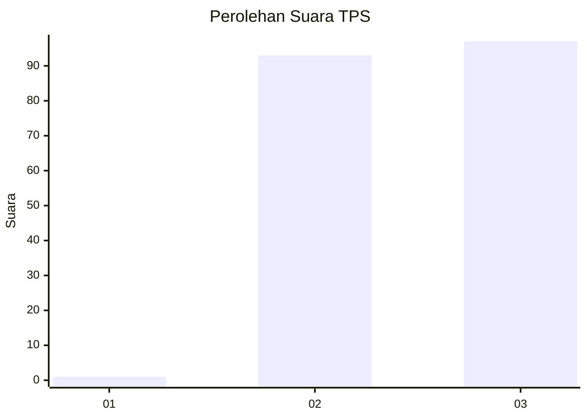
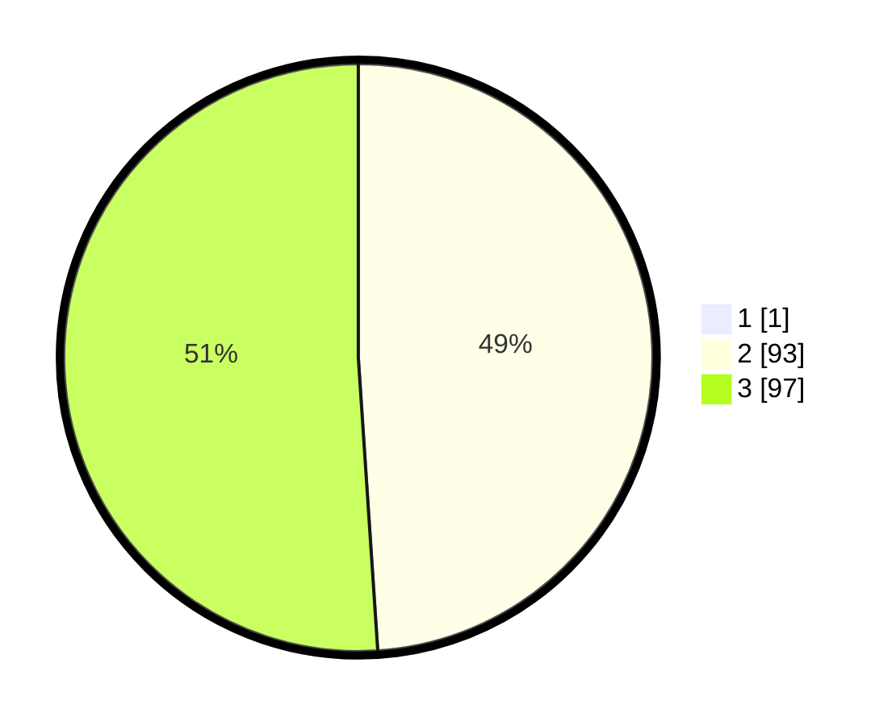

# Hasil

## Grafik

## Tabel

| No. | Nama Paslon    | Suara | Suara (raw) | Persentase |
|:--- |:-------------- | -----:| -----------:| ----------:|
| 1   | ANIES MUHAIMIN | 1     | [1][p-1]    | 0,52       |
| 2   | PRABOWO GIBRAN | 93    | [93][p-2]   | 48,69      |
| 3   | GANJAR MAHFUD  | 97    | [97][p-3]   | 50,79      |

[p-1]: https://github.com/gigit-pemilu/pemilu-2024-33-jawa-tengah/blob/main/pilpres/hitung-suara/sub/33-jawa-tengah/sub/09-boyolali/sub/21-tamansari/sub/2001-lampar/sub/003-tps/sub/paslon-1.txt
[p-2]: https://github.com/gigit-pemilu/pemilu-2024-33-jawa-tengah/blob/main/pilpres/hitung-suara/sub/33-jawa-tengah/sub/09-boyolali/sub/21-tamansari/sub/2001-lampar/sub/003-tps/sub/paslon-2.txt
[p-3]: https://github.com/gigit-pemilu/pemilu-2024-33-jawa-tengah/blob/main/pilpres/hitung-suara/sub/33-jawa-tengah/sub/09-boyolali/sub/21-tamansari/sub/2001-lampar/sub/003-tps/sub/paslon-3.txt

## Foto C Plano

https://sirekap-obj-formc.kpu.go.id/ddb2/pemilu/ppwp/33/09/21/20/01/3309212001003-20240215-052255--8cc83294-abfc-45fb-90ce-7db667f21a45.jpg

https://sirekap-obj-formc.kpu.go.id/ddb2/pemilu/ppwp/33/09/21/20/01/3309212001003-20240215-052225--5fb60626-19f6-45ac-93e8-43ac65aa36b5.jpg

https://sirekap-obj-formc.kpu.go.id/ddb2/pemilu/ppwp/33/09/21/20/01/3309212001003-20240215-052156--46f76ebb-7ac2-4424-8c5a-d485fd9dc18d.jpg

## Metadata

| Key        | Value               |
| ---------- | ------------------- |
| Time Stamp | 2024-02-15 21:01:18 |

