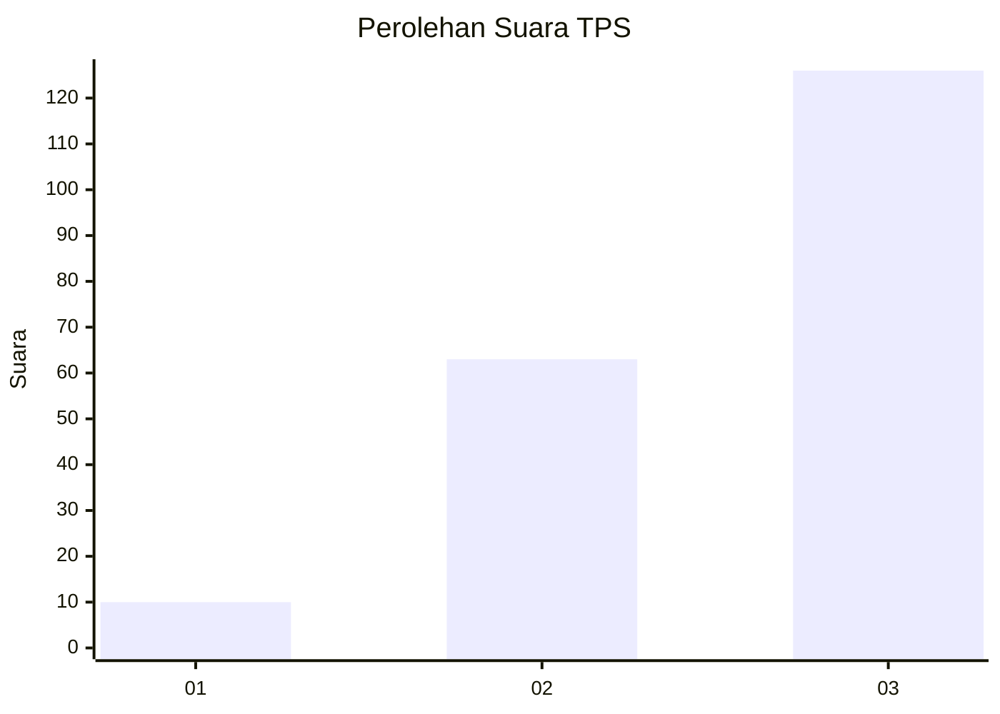
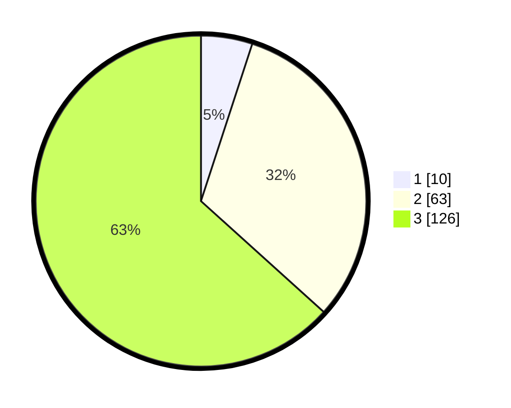

# Hasil

## Grafik

## Tabel

| No. | Nama Paslon    | Suara | Suara (raw) | Persentase |
|:--- |:-------------- | -----:| -----------:| ----------:|
| 1   | ANIES MUHAIMIN | 10    | [10][p-1]   | 5,03       |
| 2   | PRABOWO GIBRAN | 63    | [63][p-2]   | 31,66      |
| 3   | GANJAR MAHFUD  | 126   | [126][p-3]  | 63,32      |

[p-1]: https://github.com/gigit-pemilu/pemilu-2024-33-jawa-tengah/blob/main/pilpres/hitung-suara/sub/33-jawa-tengah/sub/09-boyolali/sub/21-tamansari/sub/2001-lampar/sub/005-tps/sub/paslon-1.txt
[p-2]: https://github.com/gigit-pemilu/pemilu-2024-33-jawa-tengah/blob/main/pilpres/hitung-suara/sub/33-jawa-tengah/sub/09-boyolali/sub/21-tamansari/sub/2001-lampar/sub/005-tps/sub/paslon-2.txt
[p-3]: https://github.com/gigit-pemilu/pemilu-2024-33-jawa-tengah/blob/main/pilpres/hitung-suara/sub/33-jawa-tengah/sub/09-boyolali/sub/21-tamansari/sub/2001-lampar/sub/005-tps/sub/paslon-3.txt

## Foto C Plano

https://sirekap-obj-formc.kpu.go.id/cbf6/pemilu/ppwp/33/09/21/20/01/3309212001005-20240215-071003--2746427a-df8f-4e71-a1bf-c4f39161d560.jpg

https://sirekap-obj-formc.kpu.go.id/cbf6/pemilu/ppwp/33/09/21/20/01/3309212001005-20240215-071025--5116271e-de23-481c-afcb-f8a2e80c3c2e.jpg

https://sirekap-obj-formc.kpu.go.id/cbf6/pemilu/ppwp/33/09/21/20/01/3309212001005-20240215-071055--909becd6-0966-4ea7-9eed-f10db4209e07.jpg

## Metadata

| Key        | Value               |
| ---------- | ------------------- |
| Time Stamp | 2024-02-15 20:00:44 |

