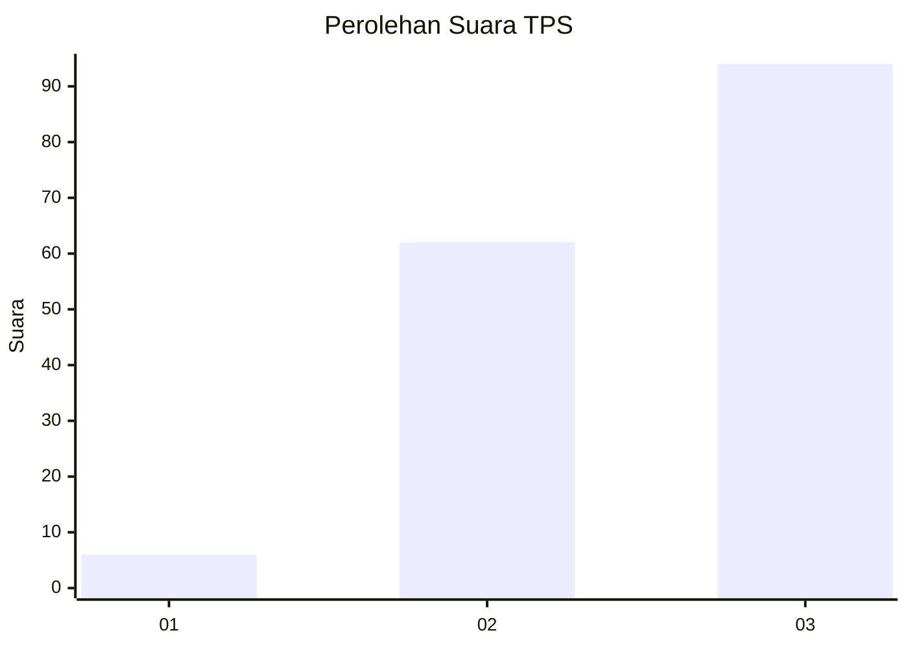
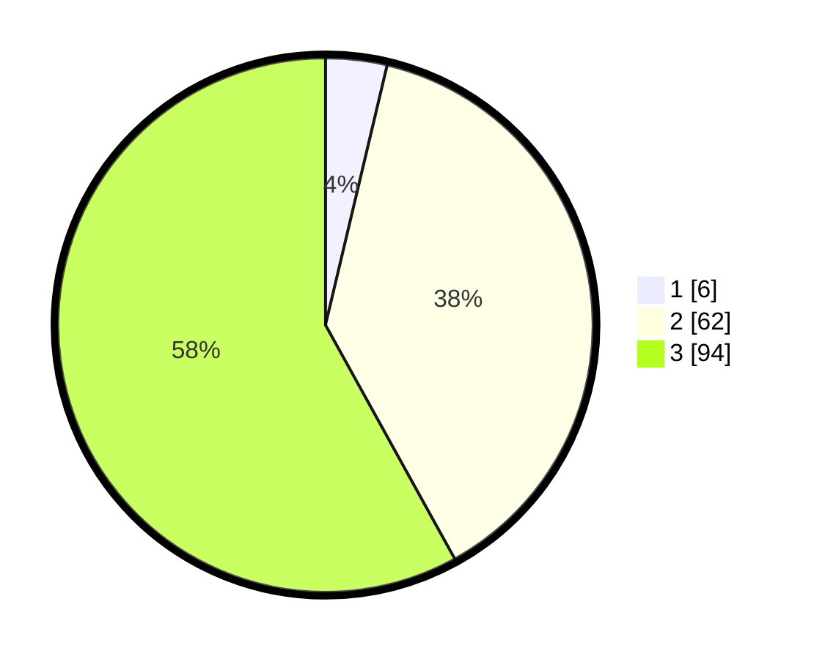

# Hasil

## Grafik

## Tabel

| No. | Nama Paslon    | Suara | Suara (raw) | Persentase |
|:--- |:-------------- | -----:| -----------:| ----------:|
| 1   | ANIES MUHAIMIN | 6     | [6][p-1]    | 3,70       |
| 2   | PRABOWO GIBRAN | 62    | [62][p-2]   | 38,27      |
| 3   | GANJAR MAHFUD  | 94    | [94][p-3]   | 58,02      |

[p-1]: https://github.com/gigit-pemilu/pemilu-2024/blob/main/pilpres/hitung-suara/sub/33-jawa-tengah/sub/09-boyolali/sub/21-tamansari/sub/2004-jemowo/sub/019-tps/sub/paslon-1.txt
[p-2]: https://github.com/gigit-pemilu/pemilu-2024/blob/main/pilpres/hitung-suara/sub/33-jawa-tengah/sub/09-boyolali/sub/21-tamansari/sub/2004-jemowo/sub/019-tps/sub/paslon-2.txt
[p-3]: https://github.com/gigit-pemilu/pemilu-2024/blob/main/pilpres/hitung-suara/sub/33-jawa-tengah/sub/09-boyolali/sub/21-tamansari/sub/2004-jemowo/sub/019-tps/sub/paslon-3.txt

## Foto C Plano

https://sirekap-obj-formc.kpu.go.id/9363/pemilu/ppwp/33/09/21/20/04/3309212004019-20240219-071945--92a8ccff-245d-4479-98fd-6c8beffcc0c3.jpg

https://sirekap-obj-formc.kpu.go.id/9363/pemilu/ppwp/33/09/21/20/04/3309212004019-20240215-013358--1675da20-b93a-4891-8f37-30c363f31c2a.jpg

https://sirekap-obj-formc.kpu.go.id/9363/pemilu/ppwp/33/09/21/20/04/3309212004019-20240215-013441--f2dfef97-965e-43d5-91b7-d14cbb2db847.jpg

## Metadata

| Key        | Value               |
| ---------- | ------------------- |
| Time Stamp | 2024-02-25 13:00:00 |

