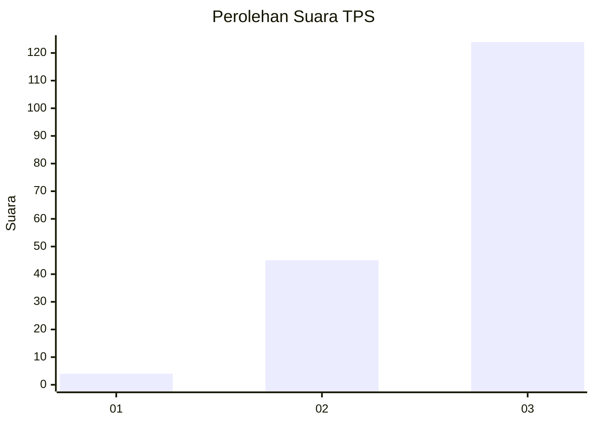
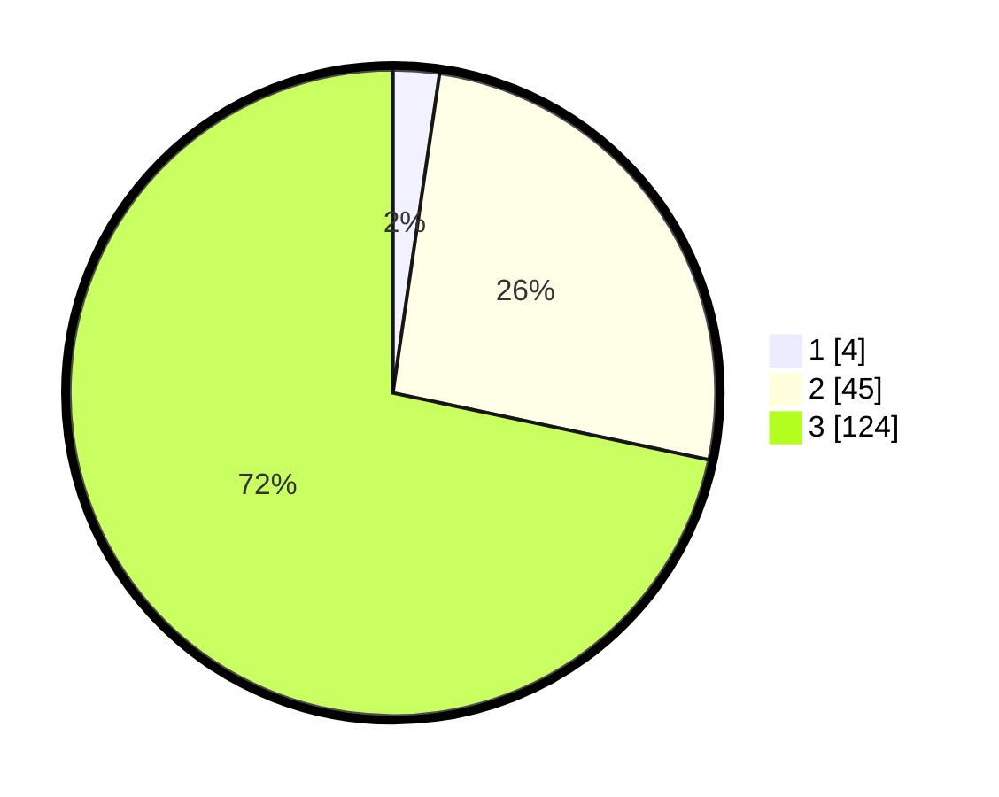

# Hasil

## Grafik

## Tabel

| No. | Nama Paslon    | Suara | Suara (raw) | Persentase |
|:--- |:-------------- | -----:| -----------:| ----------:|
| 1   | ANIES MUHAIMIN | 4     | [4][p-1]    | 2,31       |
| 2   | PRABOWO GIBRAN | 45    | [45][p-2]   | 26,01      |
| 3   | GANJAR MAHFUD  | 124   | [124][p-3]  | 71,68      |

[p-1]: https://github.com/gigit-pemilu/pemilu-2024-33-jawa-tengah/blob/main/pilpres/hitung-suara/sub/33-jawa-tengah/sub/09-boyolali/sub/21-tamansari/sub/2005-sumur/sub/002-tps/sub/paslon-1.txt
[p-2]: https://github.com/gigit-pemilu/pemilu-2024-33-jawa-tengah/blob/main/pilpres/hitung-suara/sub/33-jawa-tengah/sub/09-boyolali/sub/21-tamansari/sub/2005-sumur/sub/002-tps/sub/paslon-2.txt
[p-3]: https://github.com/gigit-pemilu/pemilu-2024-33-jawa-tengah/blob/main/pilpres/hitung-suara/sub/33-jawa-tengah/sub/09-boyolali/sub/21-tamansari/sub/2005-sumur/sub/002-tps/sub/paslon-3.txt

## Foto C Plano

https://sirekap-obj-formc.kpu.go.id/19af/pemilu/ppwp/33/09/21/20/05/3309212005002-20240214-231231--6a2b8715-db73-4100-b4a2-eaed52f8934d.jpg

https://sirekap-obj-formc.kpu.go.id/19af/pemilu/ppwp/33/09/21/20/05/3309212005002-20240215-015429--ab690723-4f40-46ef-a01c-c4652a38f6c8.jpg

https://sirekap-obj-formc.kpu.go.id/19af/pemilu/ppwp/33/09/21/20/05/3309212005002-20240214-231123--a317b665-cd3f-4a24-bc1c-cb96219d655b.jpg

## Metadata

| Key        | Value               |
| ---------- | ------------------- |
| Time Stamp | 2024-02-15 20:00:44 |

