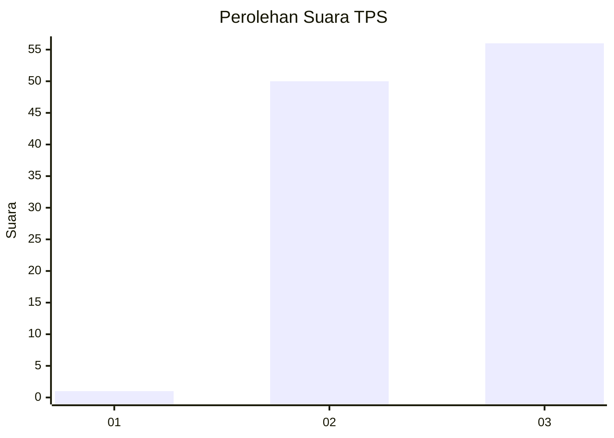
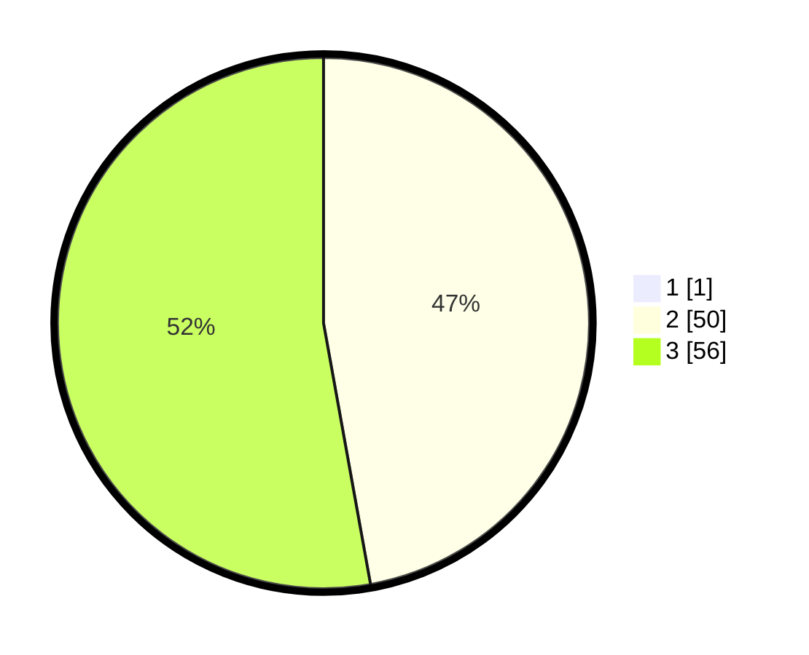

# Hasil

## Grafik

## Tabel

| No. | Nama Paslon    | Suara | Suara (raw) | Persentase |
|:--- |:-------------- | -----:| -----------:| ----------:|
| 1   | ANIES MUHAIMIN | 1     | [1][p-1]    | 0,93       |
| 2   | PRABOWO GIBRAN | 50    | [50][p-2]   | 46,73      |
| 3   | GANJAR MAHFUD  | 56    | [56][p-3]   | 52,34      |

[p-1]: https://github.com/gigit-pemilu/pemilu-2024-33-jawa-tengah/blob/main/pilpres/hitung-suara/sub/33-jawa-tengah/sub/09-boyolali/sub/21-tamansari/sub/2006-sangup/sub/005-tps/sub/paslon-1.txt
[p-2]: https://github.com/gigit-pemilu/pemilu-2024-33-jawa-tengah/blob/main/pilpres/hitung-suara/sub/33-jawa-tengah/sub/09-boyolali/sub/21-tamansari/sub/2006-sangup/sub/005-tps/sub/paslon-2.txt
[p-3]: https://github.com/gigit-pemilu/pemilu-2024-33-jawa-tengah/blob/main/pilpres/hitung-suara/sub/33-jawa-tengah/sub/09-boyolali/sub/21-tamansari/sub/2006-sangup/sub/005-tps/sub/paslon-3.txt

## Foto C Plano

https://sirekap-obj-formc.kpu.go.id/bbe1/pemilu/ppwp/33/09/21/20/06/3309212006005-20240214-205007--4087ead8-2a80-4d5a-ac87-379f39626d88.jpg

https://sirekap-obj-formc.kpu.go.id/bbe1/pemilu/ppwp/33/09/21/20/06/3309212006005-20240215-155953--8e4777f5-8263-475f-9703-3c9851341d3b.jpg

https://sirekap-obj-formc.kpu.go.id/bbe1/pemilu/ppwp/33/09/21/20/06/3309212006005-20240215-160601--a8971cef-84fa-40b1-8ce1-68141ab443de.jpg

## Metadata

| Key        | Value               |
| ---------- | ------------------- |
| Time Stamp | 2024-02-15 20:00:44 |

