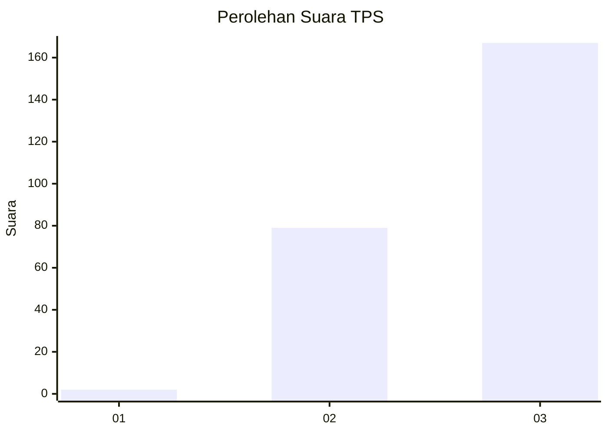
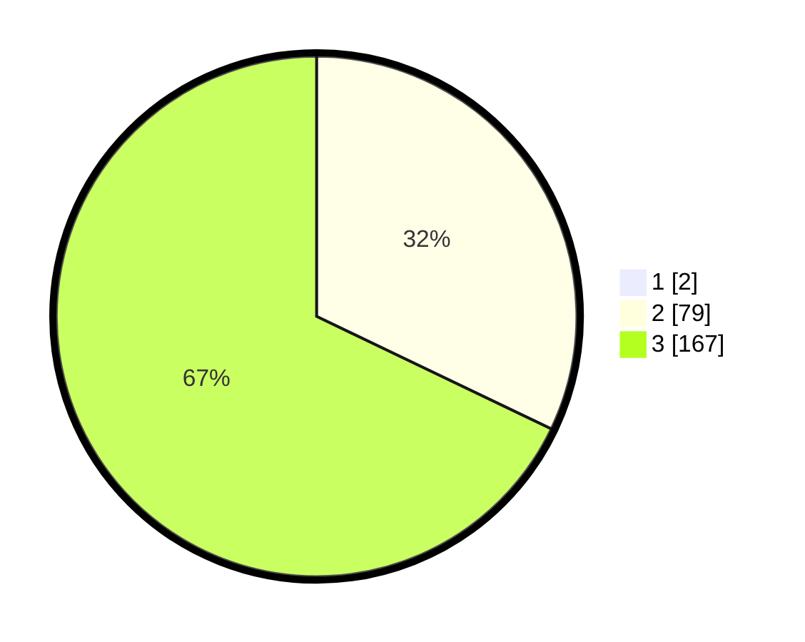

# Hasil

## Grafik

## Tabel

| No. | Nama Paslon    | Suara | Suara (raw) | Persentase |
|:--- |:-------------- | -----:| -----------:| ----------:|
| 1   | ANIES MUHAIMIN | 2     | [2][p-1]    | 0,81       |
| 2   | PRABOWO GIBRAN | 79    | [79][p-2]   | 31,85      |
| 3   | GANJAR MAHFUD  | 167   | [167][p-3]  | 67,34      |

[p-1]: https://github.com/gigit-pemilu/pemilu-2024/blob/main/pilpres/hitung-suara/sub/33-jawa-tengah/sub/09-boyolali/sub/21-tamansari/sub/2008-lanjaran/sub/003-tps/sub/paslon-1.txt
[p-2]: https://github.com/gigit-pemilu/pemilu-2024/blob/main/pilpres/hitung-suara/sub/33-jawa-tengah/sub/09-boyolali/sub/21-tamansari/sub/2008-lanjaran/sub/003-tps/sub/paslon-2.txt
[p-3]: https://github.com/gigit-pemilu/pemilu-2024/blob/main/pilpres/hitung-suara/sub/33-jawa-tengah/sub/09-boyolali/sub/21-tamansari/sub/2008-lanjaran/sub/003-tps/sub/paslon-3.txt

## Foto C Plano

https://sirekap-obj-formc.kpu.go.id/db7a/pemilu/ppwp/33/09/21/20/08/3309212008003-20240214-221529--72ee11a3-482f-4aba-962f-f6f6dc6f0b99.jpg

https://sirekap-obj-formc.kpu.go.id/db7a/pemilu/ppwp/33/09/21/20/08/3309212008003-20240214-212955--93d5d620-cb99-4595-8201-4f4a03ed882f.jpg

https://sirekap-obj-formc.kpu.go.id/db7a/pemilu/ppwp/33/09/21/20/08/3309212008003-20240214-213310--b489c9e4-0ee6-4e1d-a67f-164ad53e4df0.jpg

## Metadata

| Key        | Value               |
| ---------- | ------------------- |
| Time Stamp | 2024-02-15 21:01:18 |

