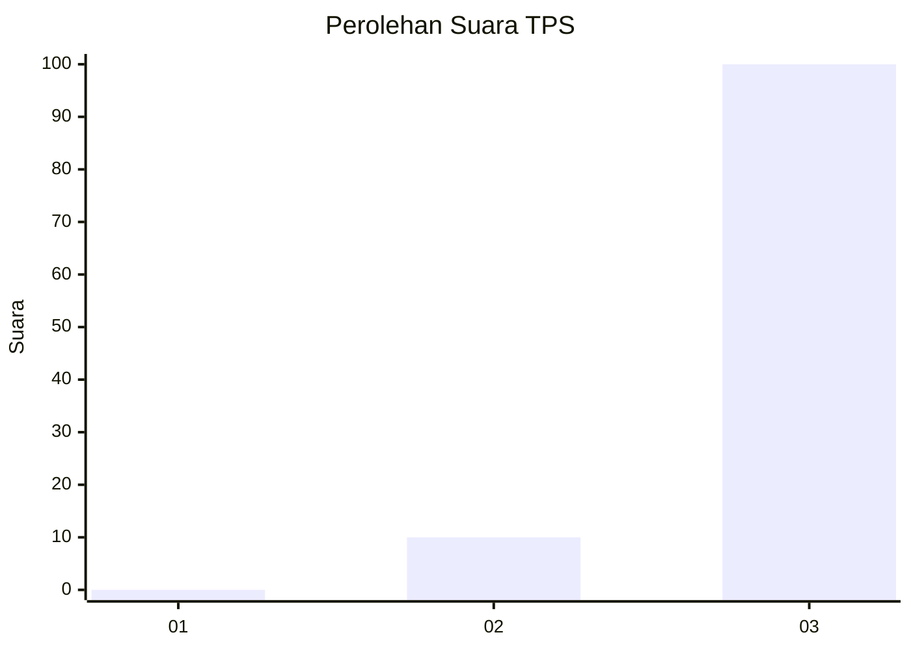
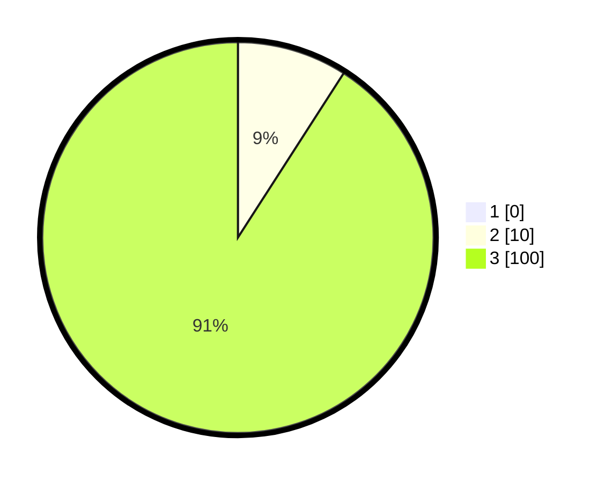

# Hasil

## Grafik

## Tabel

| No. | Nama Paslon    | Suara | Suara (raw) | Persentase |
|:--- |:-------------- | -----:| -----------:| ----------:|
| 1   | ANIES MUHAIMIN | 0     | [0][p-1]    | 0,00       |
| 2   | PRABOWO GIBRAN | 10    | [10][p-2]   | 9,09       |
| 3   | GANJAR MAHFUD  | 100   | [100][p-3]  | 90,91      |

[p-1]: https://github.com/gigit-pemilu/pemilu-2024-33-jawa-tengah/blob/main/pilpres/hitung-suara/sub/33-jawa-tengah/sub/09-boyolali/sub/21-tamansari/sub/2008-lanjaran/sub/005-tps/sub/paslon-1.txt
[p-2]: https://github.com/gigit-pemilu/pemilu-2024-33-jawa-tengah/blob/main/pilpres/hitung-suara/sub/33-jawa-tengah/sub/09-boyolali/sub/21-tamansari/sub/2008-lanjaran/sub/005-tps/sub/paslon-2.txt
[p-3]: https://github.com/gigit-pemilu/pemilu-2024-33-jawa-tengah/blob/main/pilpres/hitung-suara/sub/33-jawa-tengah/sub/09-boyolali/sub/21-tamansari/sub/2008-lanjaran/sub/005-tps/sub/paslon-3.txt

## Foto C Plano

https://sirekap-obj-formc.kpu.go.id/fe39/pemilu/ppwp/33/09/21/20/08/3309212008005-20240214-200550--cc9482b2-87e9-43c0-a451-43ae39fb33a5.jpg

https://sirekap-obj-formc.kpu.go.id/fe39/pemilu/ppwp/33/09/21/20/08/3309212008005-20240216-154944--df41430f-477c-4a95-b47c-a32094047063.jpg

https://sirekap-obj-formc.kpu.go.id/fe39/pemilu/ppwp/33/09/21/20/08/3309212008005-20240216-154944--36d937e8-472f-4320-96d2-34df4a185184.jpg

## Metadata

| Key        | Value               |
| ---------- | ------------------- |
| Time Stamp | 2024-02-16 21:01:00 |

