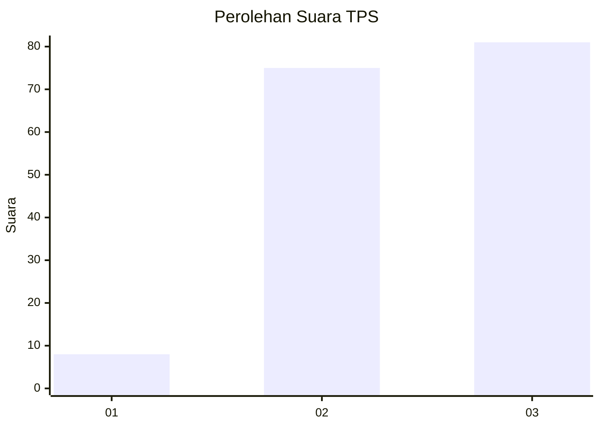
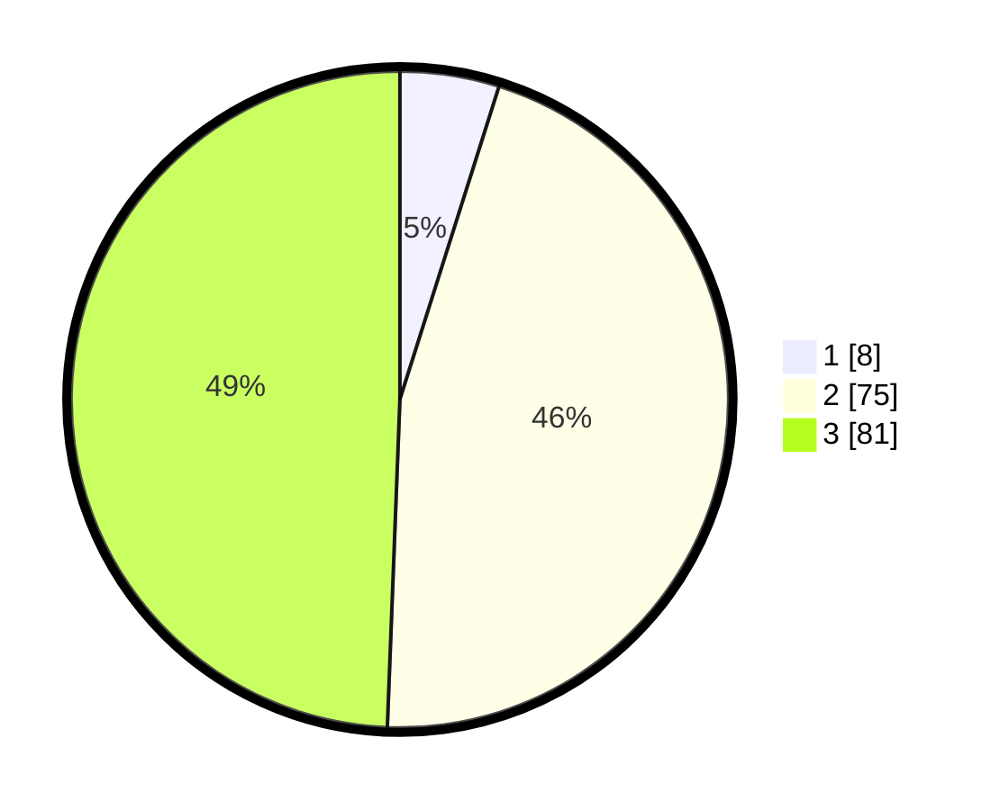

# Hasil

## Grafik

## Tabel

| No. | Nama Paslon    | Suara | Suara (raw) | Persentase |
|:--- |:-------------- | -----:| -----------:| ----------:|
| 1   | ANIES MUHAIMIN | 8     | [8][p-1]    | 4,88       |
| 2   | PRABOWO GIBRAN | 75    | [75][p-2]   | 45,73      |
| 3   | GANJAR MAHFUD  | 81    | [81][p-3]   | 49,39      |

[p-1]: https://github.com/gigit-pemilu/pemilu-2024/blob/main/pilpres/hitung-suara/sub/33-jawa-tengah/sub/09-boyolali/sub/22-wonosamodro/sub/2001-ngablak/sub/005-tps/sub/paslon-1.txt
[p-2]: https://github.com/gigit-pemilu/pemilu-2024/blob/main/pilpres/hitung-suara/sub/33-jawa-tengah/sub/09-boyolali/sub/22-wonosamodro/sub/2001-ngablak/sub/005-tps/sub/paslon-2.txt
[p-3]: https://github.com/gigit-pemilu/pemilu-2024/blob/main/pilpres/hitung-suara/sub/33-jawa-tengah/sub/09-boyolali/sub/22-wonosamodro/sub/2001-ngablak/sub/005-tps/sub/paslon-3.txt

## Foto C Plano

https://sirekap-obj-formc.kpu.go.id/4adf/pemilu/ppwp/33/09/22/20/01/3309222001005-20240215-025851--42c07aeb-21f8-4a34-9e3c-ba35c3f7984a.jpg

https://sirekap-obj-formc.kpu.go.id/4adf/pemilu/ppwp/33/09/22/20/01/3309222001005-20240215-083147--bb61db66-703b-4904-8fdc-002a571402dd.jpg

https://sirekap-obj-formc.kpu.go.id/4adf/pemilu/ppwp/33/09/22/20/01/3309222001005-20240215-025327--cba87a75-c865-46d0-872b-90bb37123afd.jpg

## Metadata

| Key        | Value               |
| ---------- | ------------------- |
| Time Stamp | 2024-02-15 21:01:18 |

