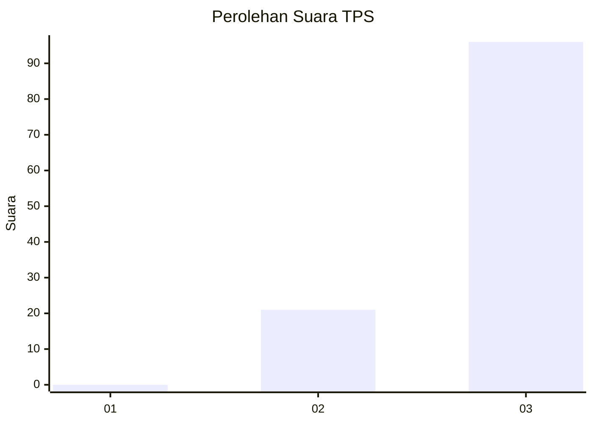
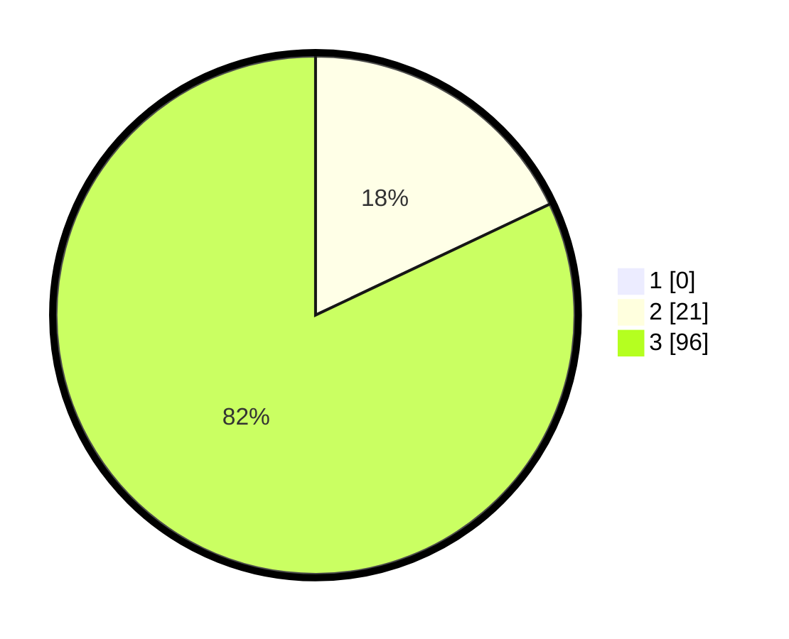

# Hasil

## Grafik

## Tabel

| No. | Nama Paslon    | Suara | Suara (raw) | Persentase |
|:--- |:-------------- | -----:| -----------:| ----------:|
| 1   | ANIES MUHAIMIN | 0     | [0][p-1]    | 0,00       |
| 2   | PRABOWO GIBRAN | 21    | [21][p-2]   | 17,95      |
| 3   | GANJAR MAHFUD  | 96    | [96][p-3]   | 82,05      |

[p-1]: https://github.com/gigit-pemilu/pemilu-2024-33-jawa-tengah/blob/main/pilpres/hitung-suara/sub/33-jawa-tengah/sub/09-boyolali/sub/22-wonosamodro/sub/2003-kalinanas/sub/002-tps/sub/paslon-1.txt
[p-2]: https://github.com/gigit-pemilu/pemilu-2024-33-jawa-tengah/blob/main/pilpres/hitung-suara/sub/33-jawa-tengah/sub/09-boyolali/sub/22-wonosamodro/sub/2003-kalinanas/sub/002-tps/sub/paslon-2.txt
[p-3]: https://github.com/gigit-pemilu/pemilu-2024-33-jawa-tengah/blob/main/pilpres/hitung-suara/sub/33-jawa-tengah/sub/09-boyolali/sub/22-wonosamodro/sub/2003-kalinanas/sub/002-tps/sub/paslon-3.txt

## Foto C Plano

https://sirekap-obj-formc.kpu.go.id/b735/pemilu/ppwp/33/09/22/20/03/3309222003002-20240215-030347--71c88c9f-fdd8-412b-9967-cdee314ecbba.jpg

https://sirekap-obj-formc.kpu.go.id/b735/pemilu/ppwp/33/09/22/20/03/3309222003002-20240214-214956--e49cd023-c7ab-4ac2-9828-534a10406840.jpg

https://sirekap-obj-formc.kpu.go.id/b735/pemilu/ppwp/33/09/22/20/03/3309222003002-20240215-030524--0723625a-2bc8-49c7-ab5a-4c2dd56f4f6a.jpg

## Metadata

| Key        | Value               |
| ---------- | ------------------- |
| Time Stamp | 2024-02-15 21:30:27 |

