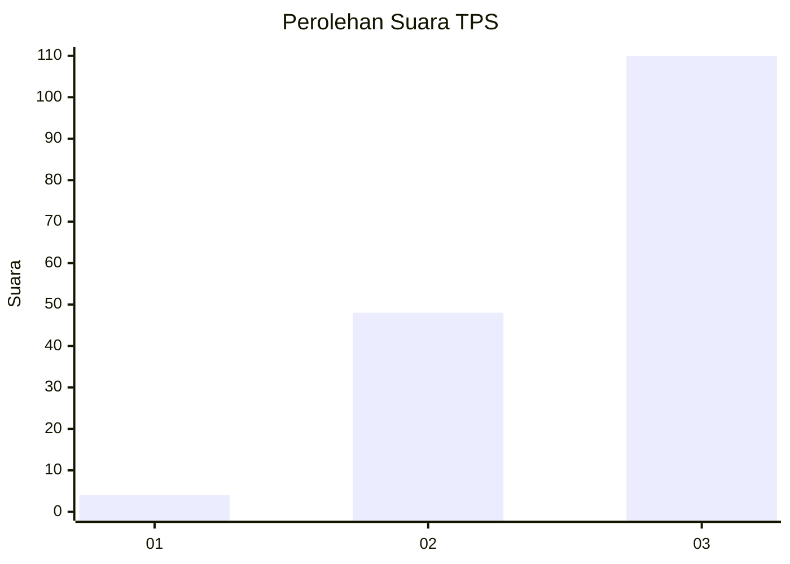
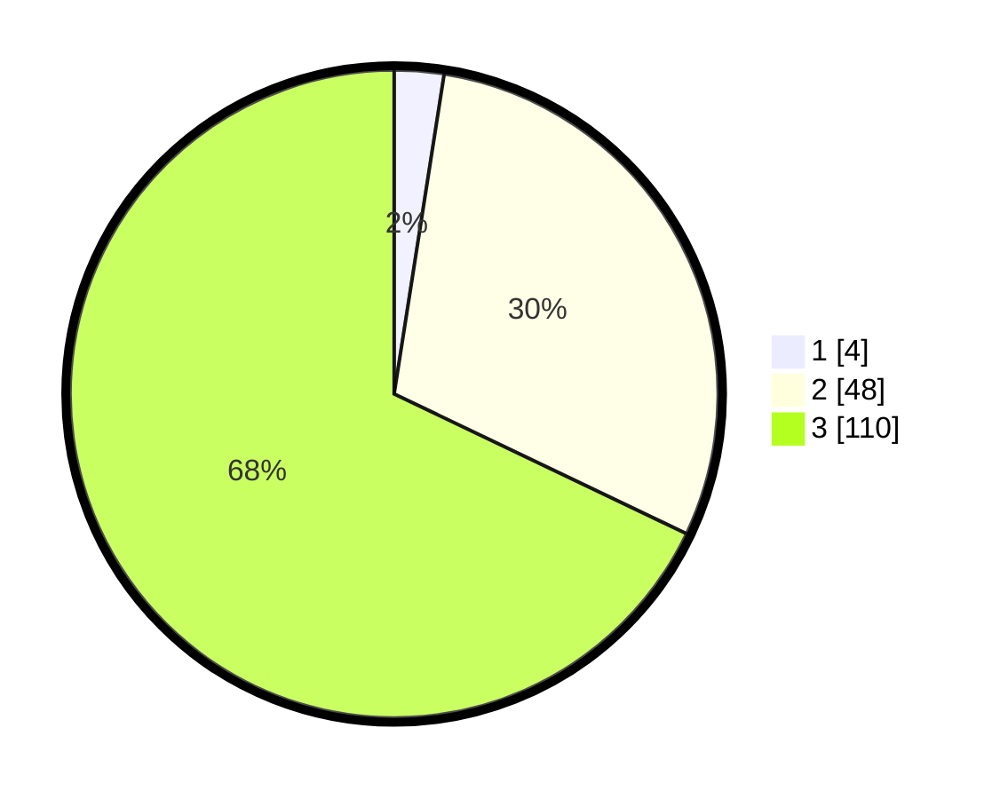

# Hasil

## Grafik

## Tabel

| No. | Nama Paslon    | Suara | Suara (raw) | Persentase |
|:--- |:-------------- | -----:| -----------:| ----------:|
| 1   | ANIES MUHAIMIN | 4     | [4][p-1]    | 2,47       |
| 2   | PRABOWO GIBRAN | 48    | [48][p-2]   | 29,63      |
| 3   | GANJAR MAHFUD  | 110   | [110][p-3]  | 67,90      |

[p-1]: https://github.com/gigit-pemilu/pemilu-2024-33-jawa-tengah/blob/main/pilpres/hitung-suara/sub/33-jawa-tengah/sub/09-boyolali/sub/22-wonosamodro/sub/2004-gilirejo/sub/003-tps/sub/paslon-1.txt
[p-2]: https://github.com/gigit-pemilu/pemilu-2024-33-jawa-tengah/blob/main/pilpres/hitung-suara/sub/33-jawa-tengah/sub/09-boyolali/sub/22-wonosamodro/sub/2004-gilirejo/sub/003-tps/sub/paslon-2.txt
[p-3]: https://github.com/gigit-pemilu/pemilu-2024-33-jawa-tengah/blob/main/pilpres/hitung-suara/sub/33-jawa-tengah/sub/09-boyolali/sub/22-wonosamodro/sub/2004-gilirejo/sub/003-tps/sub/paslon-3.txt

## Foto C Plano

https://sirekap-obj-formc.kpu.go.id/f5e4/pemilu/ppwp/33/09/22/20/04/3309222004003-20240214-222432--940863a2-57be-4c4f-a165-13c678e59413.jpg

https://sirekap-obj-formc.kpu.go.id/f5e4/pemilu/ppwp/33/09/22/20/04/3309222004003-20240215-110532--53106322-1f75-46de-adf2-275ae226d10f.jpg

https://sirekap-obj-formc.kpu.go.id/f5e4/pemilu/ppwp/33/09/22/20/04/3309222004003-20240215-003606--6bcc9286-6fbb-4556-8b46-1d25a625659b.jpg

## Metadata

| Key        | Value               |
| ---------- | ------------------- |
| Time Stamp | 2024-02-15 22:00:27 |

