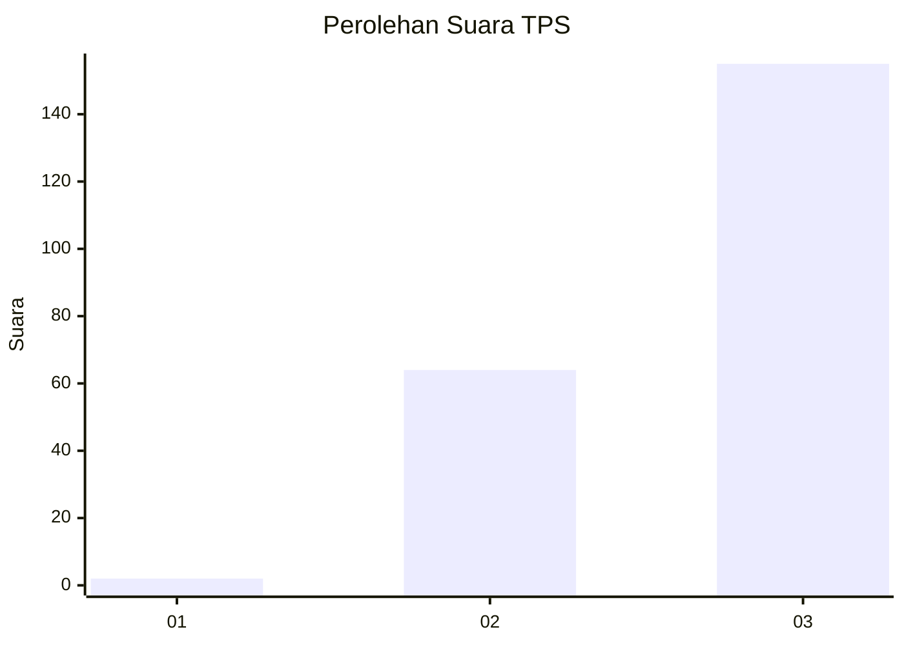
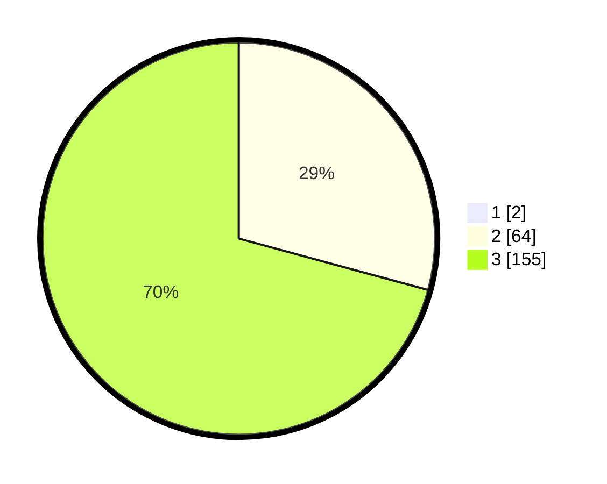

# Hasil

## Grafik

## Tabel

| No. | Nama Paslon    | Suara | Suara (raw) | Persentase |
|:--- |:-------------- | -----:| -----------:| ----------:|
| 1   | ANIES MUHAIMIN | 2     | [2][p-1]    | 0,90       |
| 2   | PRABOWO GIBRAN | 64    | [64][p-2]   | 28,96      |
| 3   | GANJAR MAHFUD  | 155   | [155][p-3]  | 70,14      |

[p-1]: https://github.com/gigit-pemilu/pemilu-2024-33-jawa-tengah/blob/main/pilpres/hitung-suara/sub/33-jawa-tengah/sub/09-boyolali/sub/22-wonosamodro/sub/2004-gilirejo/sub/007-tps/sub/paslon-1.txt
[p-2]: https://github.com/gigit-pemilu/pemilu-2024-33-jawa-tengah/blob/main/pilpres/hitung-suara/sub/33-jawa-tengah/sub/09-boyolali/sub/22-wonosamodro/sub/2004-gilirejo/sub/007-tps/sub/paslon-2.txt
[p-3]: https://github.com/gigit-pemilu/pemilu-2024-33-jawa-tengah/blob/main/pilpres/hitung-suara/sub/33-jawa-tengah/sub/09-boyolali/sub/22-wonosamodro/sub/2004-gilirejo/sub/007-tps/sub/paslon-3.txt

## Foto C Plano

https://sirekap-obj-formc.kpu.go.id/3d95/pemilu/ppwp/33/09/22/20/04/3309222004007-20240215-081657--3913327a-0406-49d6-bdcd-3be44f3c3d4a.jpg

https://sirekap-obj-formc.kpu.go.id/3d95/pemilu/ppwp/33/09/22/20/04/3309222004007-20240215-103804--eb839b62-2550-445d-8d61-64c4a603405e.jpg

https://sirekap-obj-formc.kpu.go.id/3d95/pemilu/ppwp/33/09/22/20/04/3309222004007-20240215-025813--240120ec-347f-4bc2-b4a4-e47203523a59.jpg

## Metadata

| Key        | Value               |
| ---------- | ------------------- |
| Time Stamp | 2024-02-15 22:00:27 |

