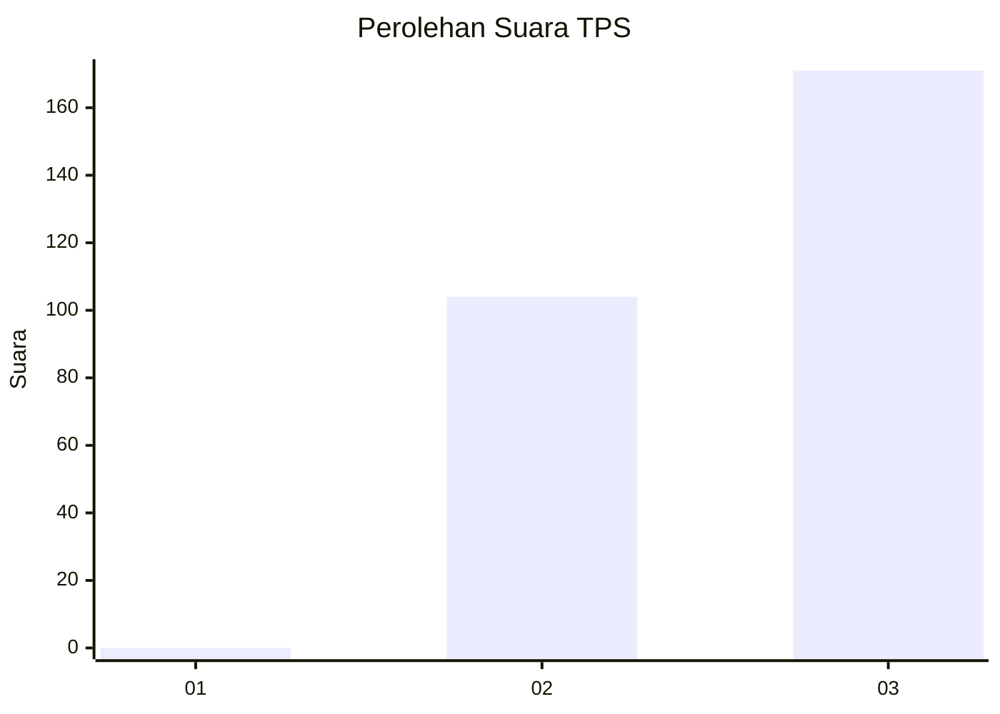
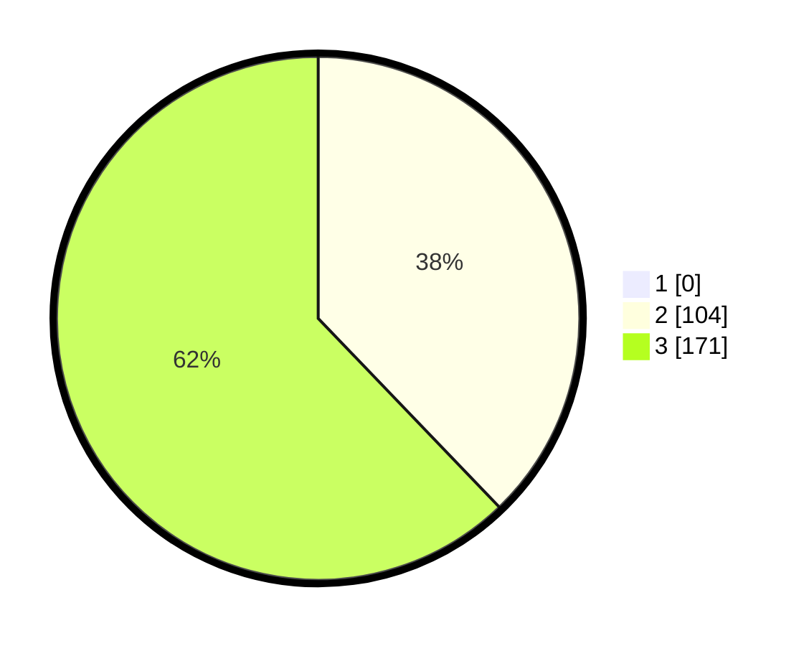

# Hasil

## Grafik

## Tabel

| No. | Nama Paslon    | Suara | Suara (raw) | Persentase |
|:--- |:-------------- | -----:| -----------:| ----------:|
| 1   | ANIES MUHAIMIN | 0     | [0][p-1]    | 0,00       |
| 2   | PRABOWO GIBRAN | 104   | [104][p-2]  | 37,82      |
| 3   | GANJAR MAHFUD  | 171   | [171][p-3]  | 62,18      |

[p-1]: https://github.com/gigit-pemilu/pemilu-2024-33-jawa-tengah/blob/main/pilpres/hitung-suara/sub/33-jawa-tengah/sub/09-boyolali/sub/22-wonosamodro/sub/2005-jatilawang/sub/006-tps/sub/paslon-1.txt
[p-2]: https://github.com/gigit-pemilu/pemilu-2024-33-jawa-tengah/blob/main/pilpres/hitung-suara/sub/33-jawa-tengah/sub/09-boyolali/sub/22-wonosamodro/sub/2005-jatilawang/sub/006-tps/sub/paslon-2.txt
[p-3]: https://github.com/gigit-pemilu/pemilu-2024-33-jawa-tengah/blob/main/pilpres/hitung-suara/sub/33-jawa-tengah/sub/09-boyolali/sub/22-wonosamodro/sub/2005-jatilawang/sub/006-tps/sub/paslon-3.txt

## Foto C Plano

https://sirekap-obj-formc.kpu.go.id/87e2/pemilu/ppwp/33/09/22/20/05/3309222005006-20240215-111741--6163af22-17bb-4307-b8f1-f537ee26cecd.jpg

https://sirekap-obj-formc.kpu.go.id/87e2/pemilu/ppwp/33/09/22/20/05/3309222005006-20240215-111911--08635515-5e9d-4090-a136-558e35f28e8a.jpg

https://sirekap-obj-formc.kpu.go.id/87e2/pemilu/ppwp/33/09/22/20/05/3309222005006-20240215-111953--71a5097e-ba8a-4c7e-8ea0-5f57002af4b1.jpg

## Metadata

| Key        | Value               |
| ---------- | ------------------- |
| Time Stamp | 2024-02-15 22:00:27 |

