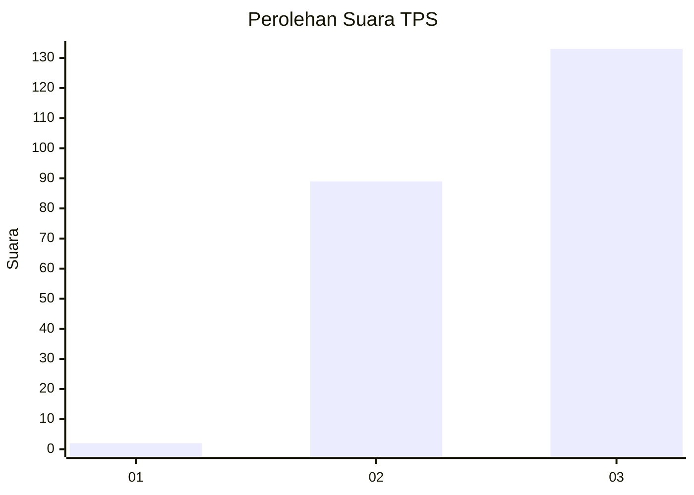
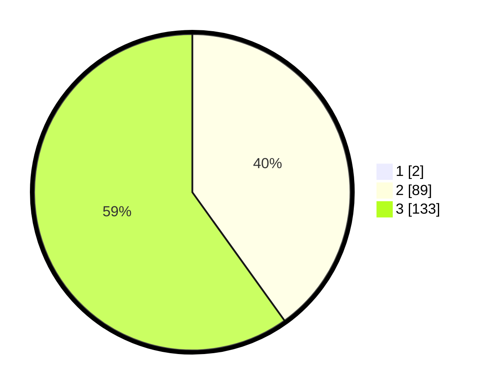

# Hasil

## Grafik

## Tabel

| No. | Nama Paslon    | Suara | Suara (raw) | Persentase |
|:--- |:-------------- | -----:| -----------:| ----------:|
| 1   | ANIES MUHAIMIN | 2     | [2][p-1]    | 0,89       |
| 2   | PRABOWO GIBRAN | 89    | [89][p-2]   | 39,73      |
| 3   | GANJAR MAHFUD  | 133   | [133][p-3]  | 59,38      |

[p-1]: https://github.com/gigit-pemilu/pemilu-2024-33-jawa-tengah/blob/main/pilpres/hitung-suara/sub/33-jawa-tengah/sub/09-boyolali/sub/22-wonosamodro/sub/2005-jatilawang/sub/008-tps/sub/paslon-1.txt
[p-2]: https://github.com/gigit-pemilu/pemilu-2024-33-jawa-tengah/blob/main/pilpres/hitung-suara/sub/33-jawa-tengah/sub/09-boyolali/sub/22-wonosamodro/sub/2005-jatilawang/sub/008-tps/sub/paslon-2.txt
[p-3]: https://github.com/gigit-pemilu/pemilu-2024-33-jawa-tengah/blob/main/pilpres/hitung-suara/sub/33-jawa-tengah/sub/09-boyolali/sub/22-wonosamodro/sub/2005-jatilawang/sub/008-tps/sub/paslon-3.txt

## Foto C Plano

https://sirekap-obj-formc.kpu.go.id/9d05/pemilu/ppwp/33/09/22/20/05/3309222005008-20240215-091401--6cda5e03-23a0-44c3-a13f-a154c1480da6.jpg

https://sirekap-obj-formc.kpu.go.id/9d05/pemilu/ppwp/33/09/22/20/05/3309222005008-20240215-091443--b0ec1be6-3044-4efc-89b1-8dbf84b35b68.jpg

https://sirekap-obj-formc.kpu.go.id/9d05/pemilu/ppwp/33/09/22/20/05/3309222005008-20240215-091509--fbca66ff-a616-4241-8d5e-20cb0c3b165c.jpg

## Metadata

| Key        | Value               |
| ---------- | ------------------- |
| Time Stamp | 2024-02-25 12:00:00 |

