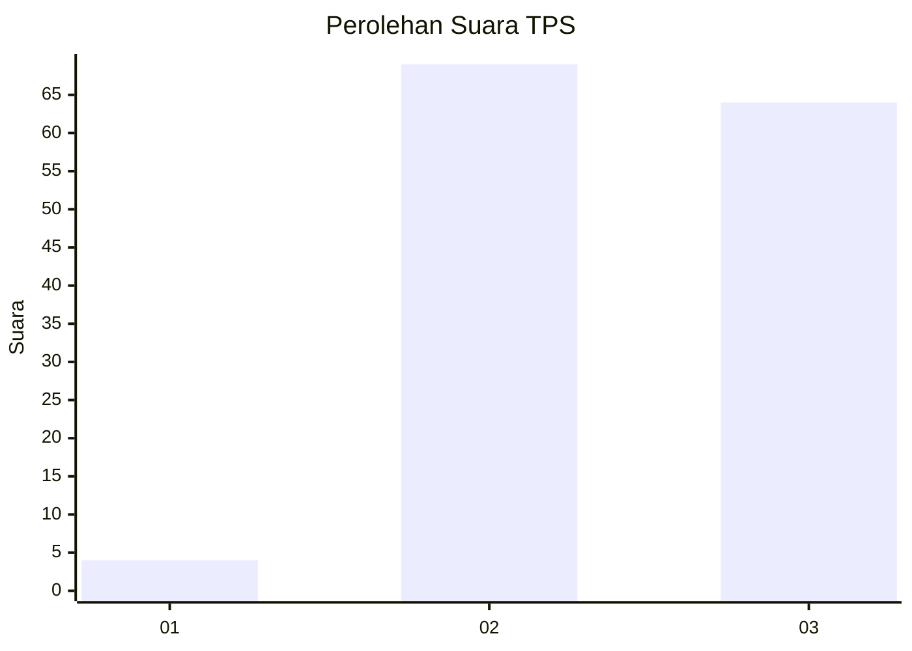
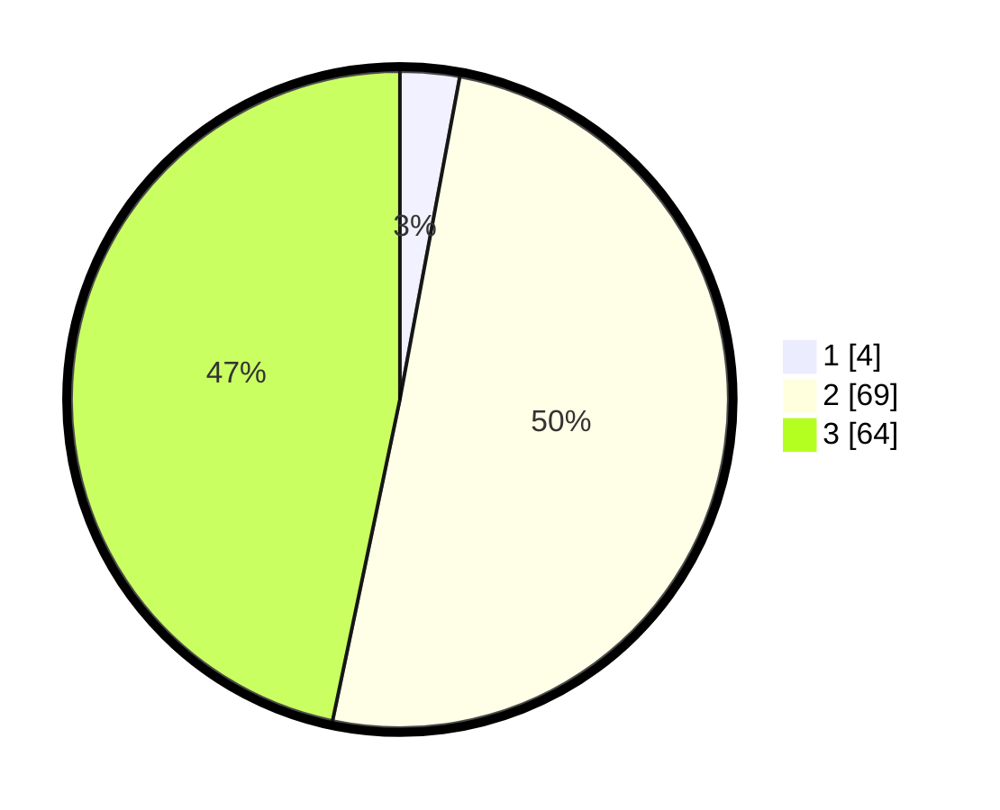

# Hasil

## Grafik

## Tabel

| No. | Nama Paslon    | Suara | Suara (raw) | Persentase |
|:--- |:-------------- | -----:| -----------:| ----------:|
| 1   | ANIES MUHAIMIN | 4     | [4][p-1]    | 2,92       |
| 2   | PRABOWO GIBRAN | 69    | [69][p-2]   | 50,36      |
| 3   | GANJAR MAHFUD  | 64    | [64][p-3]   | 46,72      |

[p-1]: https://github.com/gigit-pemilu/pemilu-2024-33-jawa-tengah/blob/main/pilpres/hitung-suara/sub/33-jawa-tengah/sub/09-boyolali/sub/22-wonosamodro/sub/2005-jatilawang/sub/009-tps/sub/paslon-1.txt
[p-2]: https://github.com/gigit-pemilu/pemilu-2024-33-jawa-tengah/blob/main/pilpres/hitung-suara/sub/33-jawa-tengah/sub/09-boyolali/sub/22-wonosamodro/sub/2005-jatilawang/sub/009-tps/sub/paslon-2.txt
[p-3]: https://github.com/gigit-pemilu/pemilu-2024-33-jawa-tengah/blob/main/pilpres/hitung-suara/sub/33-jawa-tengah/sub/09-boyolali/sub/22-wonosamodro/sub/2005-jatilawang/sub/009-tps/sub/paslon-3.txt

## Foto C Plano

https://sirekap-obj-formc.kpu.go.id/fa98/pemilu/ppwp/33/09/22/20/05/3309222005009-20240215-001101--fd2c2082-ab9c-412b-9d4c-81a1ef336b1b.jpg

https://sirekap-obj-formc.kpu.go.id/fa98/pemilu/ppwp/33/09/22/20/05/3309222005009-20240215-001226--0f08dcd1-240e-42b2-a1aa-070514130e28.jpg

https://sirekap-obj-formc.kpu.go.id/fa98/pemilu/ppwp/33/09/22/20/05/3309222005009-20240215-001326--6a3d90bd-9ddc-4afc-ae51-db7fd6c43989.jpg

## Metadata

| Key        | Value               |
| ---------- | ------------------- |
| Time Stamp | 2024-02-25 12:00:00 |

