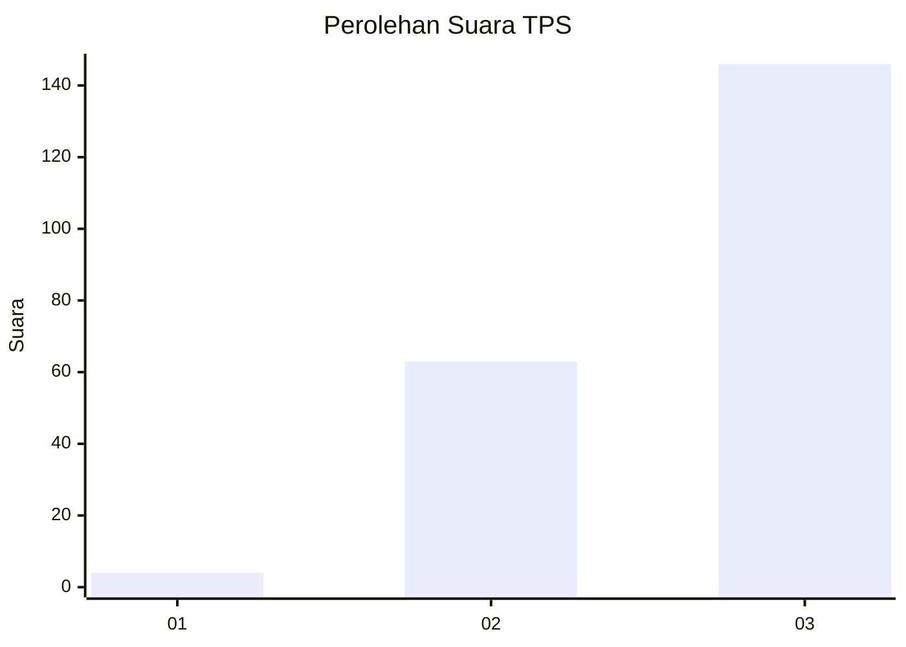
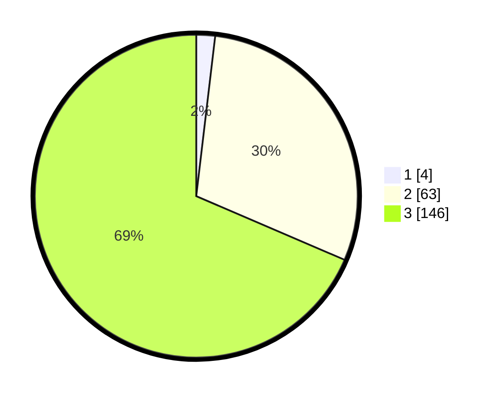

# Hasil

## Grafik

## Tabel

| No. | Nama Paslon    | Suara | Suara (raw) | Persentase |
|:--- |:-------------- | -----:| -----------:| ----------:|
| 1   | ANIES MUHAIMIN | 4     | [4][p-1]    | 1,88       |
| 2   | PRABOWO GIBRAN | 63    | [63][p-2]   | 29,58      |
| 3   | GANJAR MAHFUD  | 146   | [146][p-3]  | 68,54      |

[p-1]: https://github.com/gigit-pemilu/pemilu-2024/blob/main/pilpres/hitung-suara/sub/33-jawa-tengah/sub/09-boyolali/sub/22-wonosamodro/sub/2007-bercak/sub/005-tps/sub/paslon-1.txt
[p-2]: https://github.com/gigit-pemilu/pemilu-2024/blob/main/pilpres/hitung-suara/sub/33-jawa-tengah/sub/09-boyolali/sub/22-wonosamodro/sub/2007-bercak/sub/005-tps/sub/paslon-2.txt
[p-3]: https://github.com/gigit-pemilu/pemilu-2024/blob/main/pilpres/hitung-suara/sub/33-jawa-tengah/sub/09-boyolali/sub/22-wonosamodro/sub/2007-bercak/sub/005-tps/sub/paslon-3.txt

## Foto C Plano

https://sirekap-obj-formc.kpu.go.id/cb28/pemilu/ppwp/33/09/22/20/07/3309222007005-20240215-010324--31f720a2-42fe-41f8-9428-9407ac4f0fc7.jpg

https://sirekap-obj-formc.kpu.go.id/cb28/pemilu/ppwp/33/09/22/20/07/3309222007005-20240215-010509--b245cd73-264d-4ac3-96e1-41d1f4497119.jpg

https://sirekap-obj-formc.kpu.go.id/cb28/pemilu/ppwp/33/09/22/20/07/3309222007005-20240215-010641--8b870563-92b0-4897-9afa-e3636090ea83.jpg

## Metadata

| Key        | Value               |
| ---------- | ------------------- |
| Time Stamp | 2024-02-26 11:00:00 |

