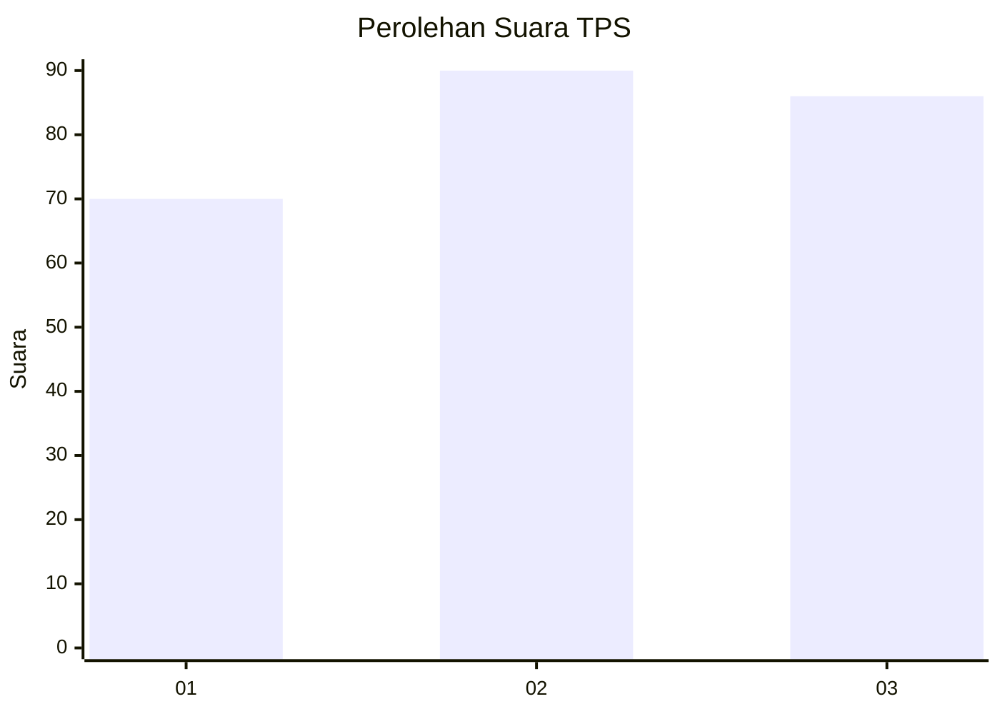
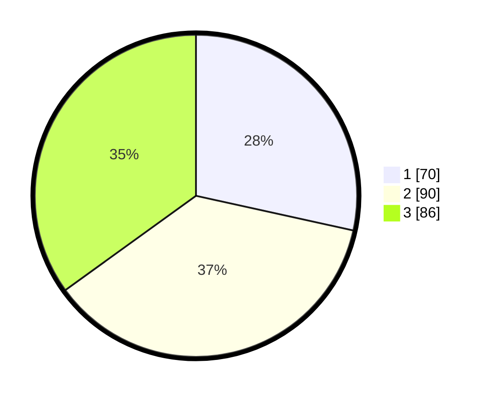

# Hasil

## Grafik

## Tabel

| No. | Nama Paslon    | Suara | Suara (raw) | Persentase |
|:--- |:-------------- | -----:| -----------:| ----------:|
| 1   | ANIES MUHAIMIN | 70    | [70][p-1]   | 28,46      |
| 2   | PRABOWO GIBRAN | 90    | [90][p-2]   | 36,59      |
| 3   | GANJAR MAHFUD  | 86    | [86][p-3]   | 34,96      |

[p-1]: https://github.com/gigit-pemilu/pemilu-2024-33-jawa-tengah/blob/main/pilpres/hitung-suara/sub/33-jawa-tengah/sub/10-klaten/sub/01-prambanan/sub/2002-cucukan/sub/006-tps/sub/paslon-1.txt
[p-2]: https://github.com/gigit-pemilu/pemilu-2024-33-jawa-tengah/blob/main/pilpres/hitung-suara/sub/33-jawa-tengah/sub/10-klaten/sub/01-prambanan/sub/2002-cucukan/sub/006-tps/sub/paslon-2.txt
[p-3]: https://github.com/gigit-pemilu/pemilu-2024-33-jawa-tengah/blob/main/pilpres/hitung-suara/sub/33-jawa-tengah/sub/10-klaten/sub/01-prambanan/sub/2002-cucukan/sub/006-tps/sub/paslon-3.txt

## Foto C Plano

https://sirekap-obj-formc.kpu.go.id/c4c0/pemilu/ppwp/33/10/01/20/02/3310012002006-20240218-201554--b3fe5170-0c3f-4610-b1df-de60c00a1f04.jpg

https://sirekap-obj-formc.kpu.go.id/c4c0/pemilu/ppwp/33/10/01/20/02/3310012002006-20240215-025035--652a8944-b8a1-476a-b5fa-f83b89fcec99.jpg

https://sirekap-obj-formc.kpu.go.id/c4c0/pemilu/ppwp/33/10/01/20/02/3310012002006-20240215-025136--334c7e90-0cb4-45d6-b2f9-6376f902e77d.jpg

## Metadata

| Key        | Value               |
| ---------- | ------------------- |
| Time Stamp | 2024-02-19 06:16:00 |

