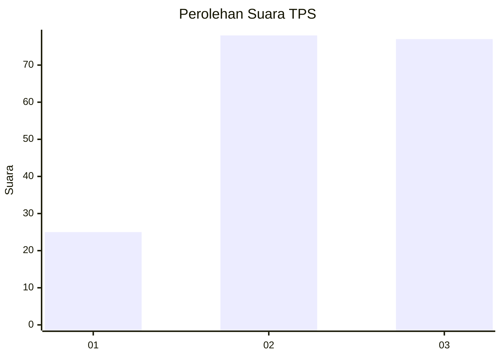
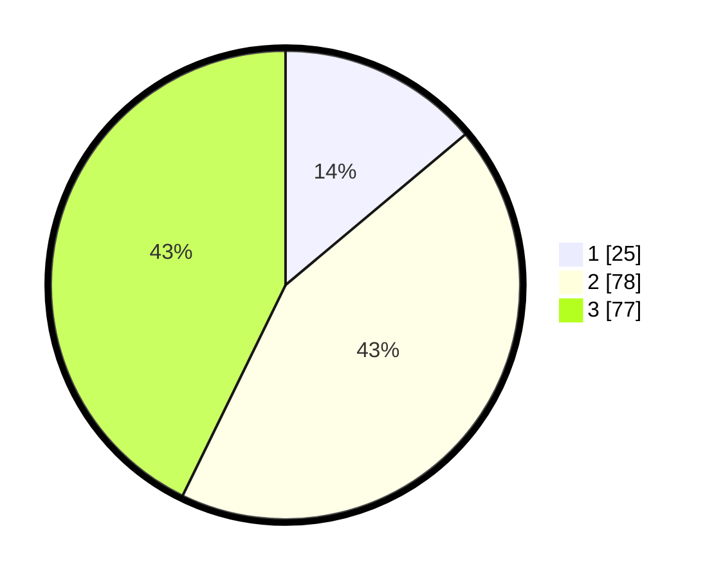

# Hasil

## Grafik

## Tabel

| No. | Nama Paslon    | Suara | Suara (raw) | Persentase |
|:--- |:-------------- | -----:| -----------:| ----------:|
| 1   | ANIES MUHAIMIN | 25    | [25][p-1]   | 13,89      |
| 2   | PRABOWO GIBRAN | 78    | [78][p-2]   | 43,33      |
| 3   | GANJAR MAHFUD  | 77    | [77][p-3]   | 42,78      |

[p-1]: https://github.com/gigit-pemilu/pemilu-2024/blob/main/pilpres/hitung-suara/sub/33-jawa-tengah/sub/10-klaten/sub/01-prambanan/sub/2006-tlogo/sub/010-tps/sub/paslon-1.txt
[p-2]: https://github.com/gigit-pemilu/pemilu-2024/blob/main/pilpres/hitung-suara/sub/33-jawa-tengah/sub/10-klaten/sub/01-prambanan/sub/2006-tlogo/sub/010-tps/sub/paslon-2.txt
[p-3]: https://github.com/gigit-pemilu/pemilu-2024/blob/main/pilpres/hitung-suara/sub/33-jawa-tengah/sub/10-klaten/sub/01-prambanan/sub/2006-tlogo/sub/010-tps/sub/paslon-3.txt

## Foto C Plano

https://sirekap-obj-formc.kpu.go.id/3b4a/pemilu/ppwp/33/10/01/20/06/3310012006010-20240214-194252--dce825b9-47c6-494a-bc33-62a9c09d2584.jpg

https://sirekap-obj-formc.kpu.go.id/3b4a/pemilu/ppwp/33/10/01/20/06/3310012006010-20240214-194158--e65fa024-088b-4c98-901f-774749605925.jpg

https://sirekap-obj-formc.kpu.go.id/3b4a/pemilu/ppwp/33/10/01/20/06/3310012006010-20240214-221036--1f800dcf-0eba-40d2-9be4-3c3365f8031c.jpg

## Metadata

| Key        | Value               |
| ---------- | ------------------- |
| Time Stamp | 2024-02-15 00:41:44 |

