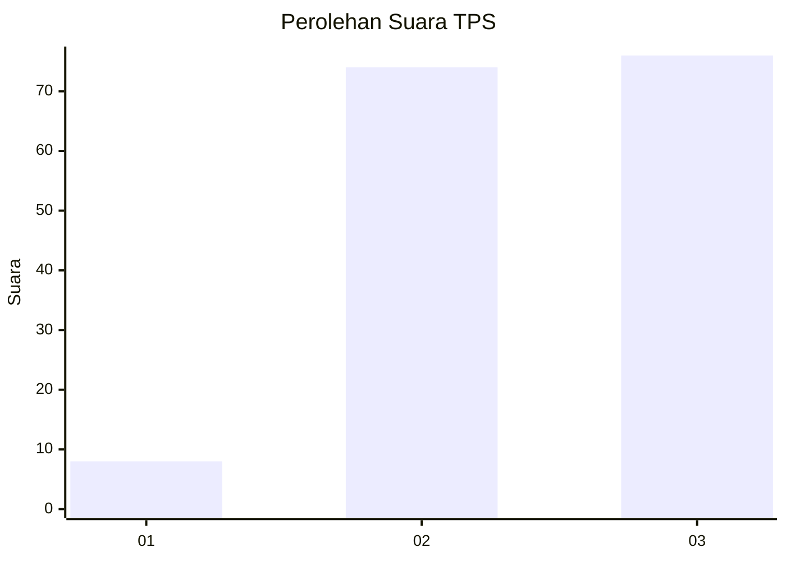
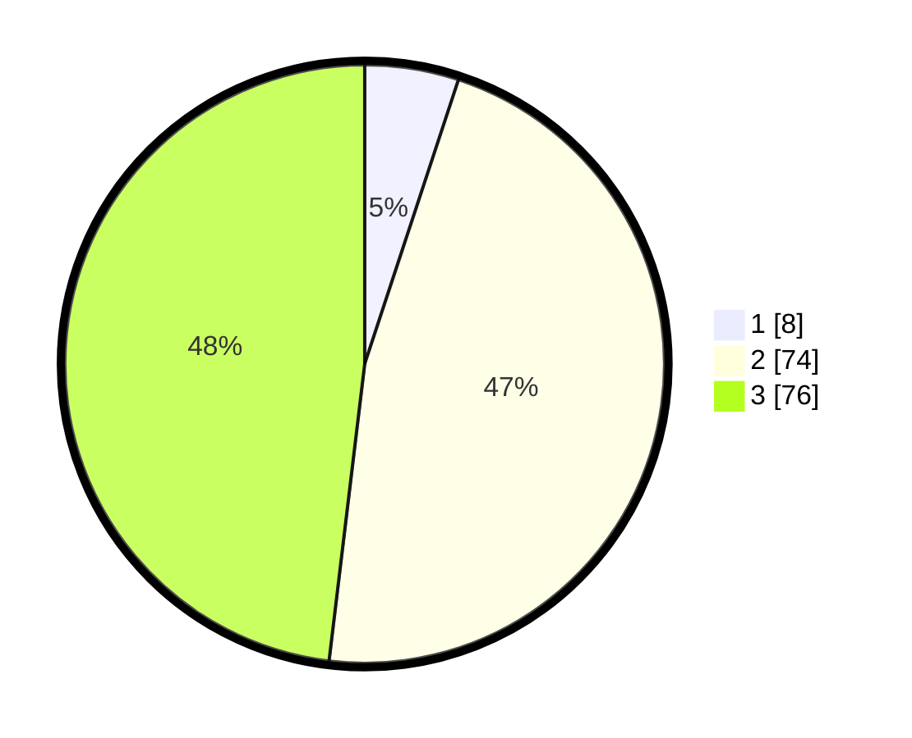

# Hasil

## Grafik

## Tabel

| No. | Nama Paslon    | Suara | Suara (raw) | Persentase |
|:--- |:-------------- | -----:| -----------:| ----------:|
| 1   | ANIES MUHAIMIN | 8     | [8][p-1]    | 5,06       |
| 2   | PRABOWO GIBRAN | 74    | [74][p-2]   | 46,84      |
| 3   | GANJAR MAHFUD  | 76    | [76][p-3]   | 48,10      |

[p-1]: https://github.com/gigit-pemilu/pemilu-2024/blob/main/pilpres/hitung-suara/sub/33-jawa-tengah/sub/10-klaten/sub/02-gantiwarno/sub/2001-gentan/sub/001-tps/sub/paslon-1.txt
[p-2]: https://github.com/gigit-pemilu/pemilu-2024/blob/main/pilpres/hitung-suara/sub/33-jawa-tengah/sub/10-klaten/sub/02-gantiwarno/sub/2001-gentan/sub/001-tps/sub/paslon-2.txt
[p-3]: https://github.com/gigit-pemilu/pemilu-2024/blob/main/pilpres/hitung-suara/sub/33-jawa-tengah/sub/10-klaten/sub/02-gantiwarno/sub/2001-gentan/sub/001-tps/sub/paslon-3.txt

## Foto C Plano

https://sirekap-obj-formc.kpu.go.id/0388/pemilu/ppwp/33/10/02/20/01/3310022001001-20240215-143220--c8f8db4c-c917-4abd-a04e-98217175322c.jpg

https://sirekap-obj-formc.kpu.go.id/0388/pemilu/ppwp/33/10/02/20/01/3310022001001-20240215-141217--eade17a1-c436-4ef1-9508-fddcb7e6437e.jpg

https://sirekap-obj-formc.kpu.go.id/0388/pemilu/ppwp/33/10/02/20/01/3310022001001-20240215-135748--11afc578-e59c-4606-88be-dad9e6a936f1.jpg

## Metadata

| Key        | Value               |
| ---------- | ------------------- |
| Time Stamp | 2024-02-16 02:00:27 |

