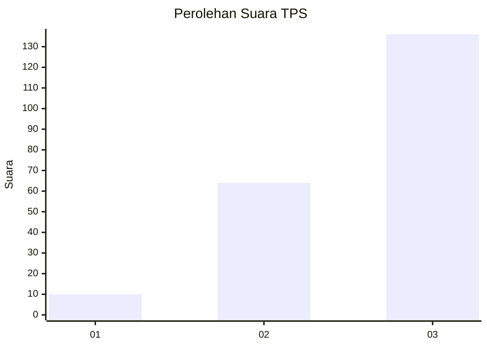
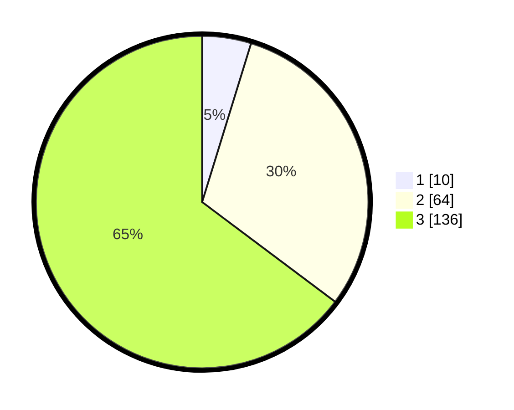

# Hasil

## Grafik

## Tabel

| No. | Nama Paslon    | Suara | Suara (raw) | Persentase |
|:--- |:-------------- | -----:| -----------:| ----------:|
| 1   | ANIES MUHAIMIN | 10    | [10][p-1]   | 4,76       |
| 2   | PRABOWO GIBRAN | 64    | [64][p-2]   | 30,48      |
| 3   | GANJAR MAHFUD  | 136   | [136][p-3]  | 64,76      |

[p-1]: https://github.com/gigit-pemilu/pemilu-2024-33-jawa-tengah/blob/main/pilpres/hitung-suara/sub/33-jawa-tengah/sub/10-klaten/sub/02-gantiwarno/sub/2005-ngandong/sub/007-tps/sub/paslon-1.txt
[p-2]: https://github.com/gigit-pemilu/pemilu-2024-33-jawa-tengah/blob/main/pilpres/hitung-suara/sub/33-jawa-tengah/sub/10-klaten/sub/02-gantiwarno/sub/2005-ngandong/sub/007-tps/sub/paslon-2.txt
[p-3]: https://github.com/gigit-pemilu/pemilu-2024-33-jawa-tengah/blob/main/pilpres/hitung-suara/sub/33-jawa-tengah/sub/10-klaten/sub/02-gantiwarno/sub/2005-ngandong/sub/007-tps/sub/paslon-3.txt

## Foto C Plano

https://sirekap-obj-formc.kpu.go.id/12a7/pemilu/ppwp/33/10/02/20/05/3310022005007-20240214-203600--69196587-bf5e-400f-be9e-1adaa66c159d.jpg

https://sirekap-obj-formc.kpu.go.id/12a7/pemilu/ppwp/33/10/02/20/05/3310022005007-20240214-203636--08ac34ec-b591-4178-8a7d-92850382ccc0.jpg

https://sirekap-obj-formc.kpu.go.id/12a7/pemilu/ppwp/33/10/02/20/05/3310022005007-20240214-203903--33b33ba5-c067-4fc3-86f1-c8bd7ae095fe.jpg

## Metadata

| Key        | Value               |
| ---------- | ------------------- |
| Time Stamp | 2024-02-15 20:30:46 |

