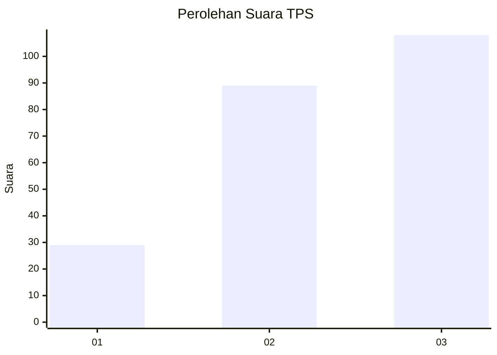
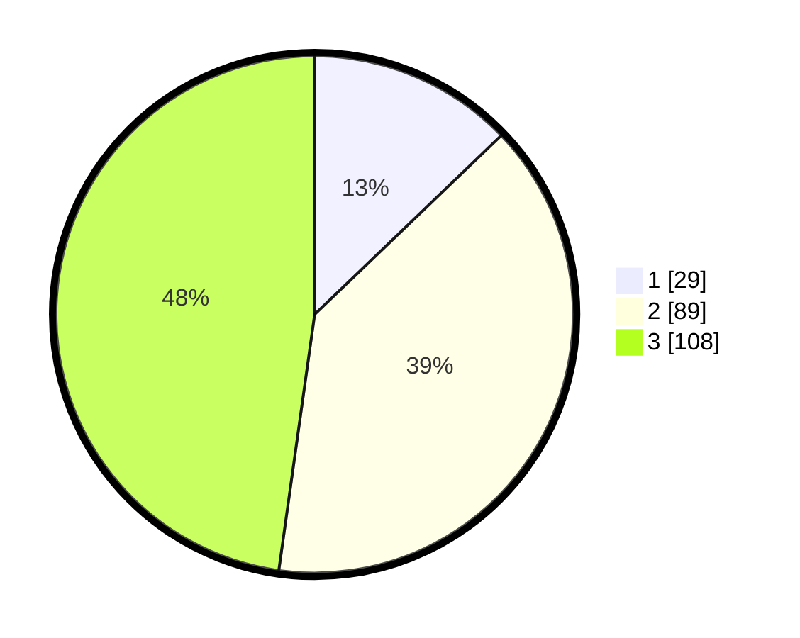

# Hasil

## Grafik

## Tabel

| No. | Nama Paslon    | Suara | Suara (raw) | Persentase |
|:--- |:-------------- | -----:| -----------:| ----------:|
| 1   | ANIES MUHAIMIN | 29    | [29][p-1]   | 12,83      |
| 2   | PRABOWO GIBRAN | 89    | [89][p-2]   | 39,38      |
| 3   | GANJAR MAHFUD  | 108   | [108][p-3]  | 47,79      |

[p-1]: https://github.com/gigit-pemilu/pemilu-2024/blob/main/pilpres/hitung-suara/sub/33-jawa-tengah/sub/10-klaten/sub/02-gantiwarno/sub/2008-sawit/sub/004-tps/sub/paslon-1.txt
[p-2]: https://github.com/gigit-pemilu/pemilu-2024/blob/main/pilpres/hitung-suara/sub/33-jawa-tengah/sub/10-klaten/sub/02-gantiwarno/sub/2008-sawit/sub/004-tps/sub/paslon-2.txt
[p-3]: https://github.com/gigit-pemilu/pemilu-2024/blob/main/pilpres/hitung-suara/sub/33-jawa-tengah/sub/10-klaten/sub/02-gantiwarno/sub/2008-sawit/sub/004-tps/sub/paslon-3.txt

## Foto C Plano

https://sirekap-obj-formc.kpu.go.id/a53f/pemilu/ppwp/33/10/02/20/08/3310022008004-20240214-192913--bda45704-4716-4d12-bf05-9097b5eff4c2.jpg

https://sirekap-obj-formc.kpu.go.id/a53f/pemilu/ppwp/33/10/02/20/08/3310022008004-20240214-192927--63eb5e4c-b1f0-49c7-852c-90670e58546d.jpg

https://sirekap-obj-formc.kpu.go.id/a53f/pemilu/ppwp/33/10/02/20/08/3310022008004-20240214-192934--df23de02-e810-4d8b-948a-96aa9dc6e9d8.jpg

## Metadata

| Key        | Value               |
| ---------- | ------------------- |
| Time Stamp | 2024-02-15 23:29:50 |

