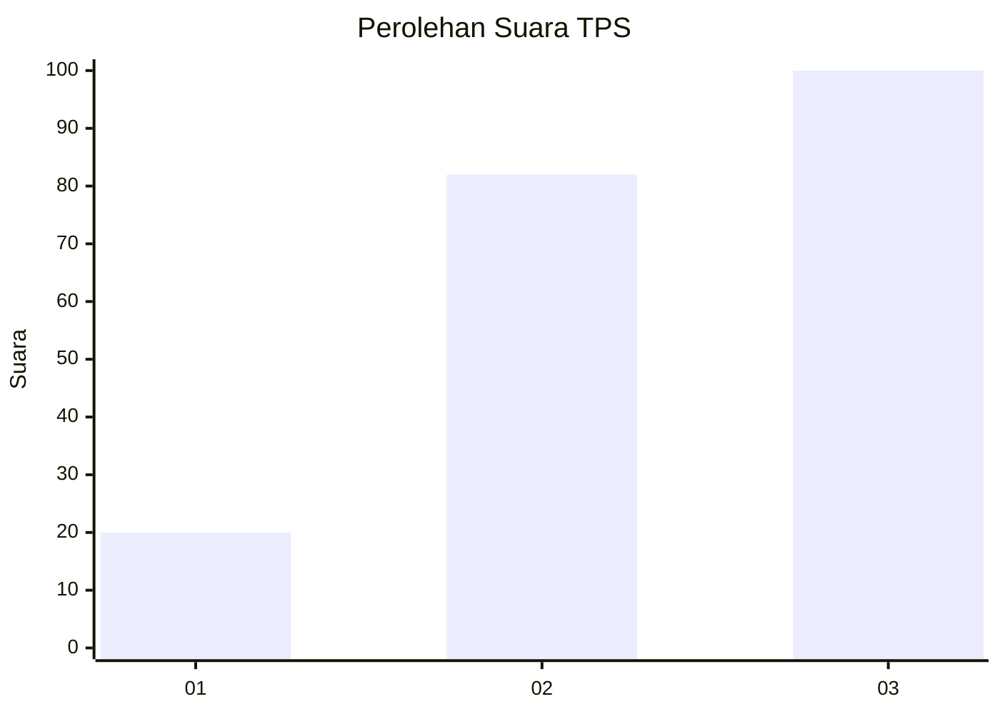
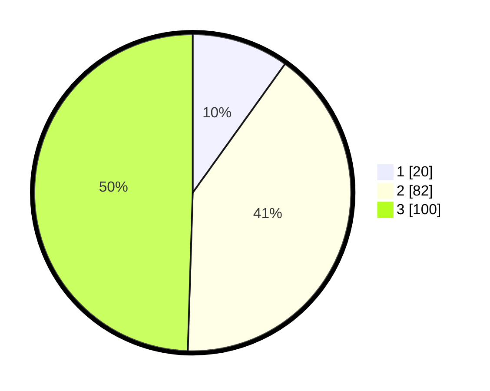

# Hasil

## Grafik

## Tabel

| No. | Nama Paslon    | Suara | Suara (raw) | Persentase |
|:--- |:-------------- | -----:| -----------:| ----------:|
| 1   | ANIES MUHAIMIN | 20    | [20][p-1]   | 9,90       |
| 2   | PRABOWO GIBRAN | 82    | [82][p-2]   | 40,59      |
| 3   | GANJAR MAHFUD  | 100   | [100][p-3]  | 49,50      |

[p-1]: https://github.com/gigit-pemilu/pemilu-2024/blob/main/pilpres/hitung-suara/sub/33-jawa-tengah/sub/10-klaten/sub/02-gantiwarno/sub/2011-baturan/sub/001-tps/sub/paslon-1.txt
[p-2]: https://github.com/gigit-pemilu/pemilu-2024/blob/main/pilpres/hitung-suara/sub/33-jawa-tengah/sub/10-klaten/sub/02-gantiwarno/sub/2011-baturan/sub/001-tps/sub/paslon-2.txt
[p-3]: https://github.com/gigit-pemilu/pemilu-2024/blob/main/pilpres/hitung-suara/sub/33-jawa-tengah/sub/10-klaten/sub/02-gantiwarno/sub/2011-baturan/sub/001-tps/sub/paslon-3.txt

## Foto C Plano

https://sirekap-obj-formc.kpu.go.id/cac4/pemilu/ppwp/33/10/02/20/11/3310022011001-20240214-232950--7cbe4133-2543-4a77-aa74-50bf41c24fad.jpg

https://sirekap-obj-formc.kpu.go.id/cac4/pemilu/ppwp/33/10/02/20/11/3310022011001-20240214-233917--a94e58ff-14e9-4a36-9d48-f9b9efbb43af.jpg

https://sirekap-obj-formc.kpu.go.id/cac4/pemilu/ppwp/33/10/02/20/11/3310022011001-20240214-234414--b73c0da0-4442-431d-b7b7-cd919039748d.jpg

## Metadata

| Key        | Value               |
| ---------- | ------------------- |
| Time Stamp | 2024-02-15 23:29:50 |

