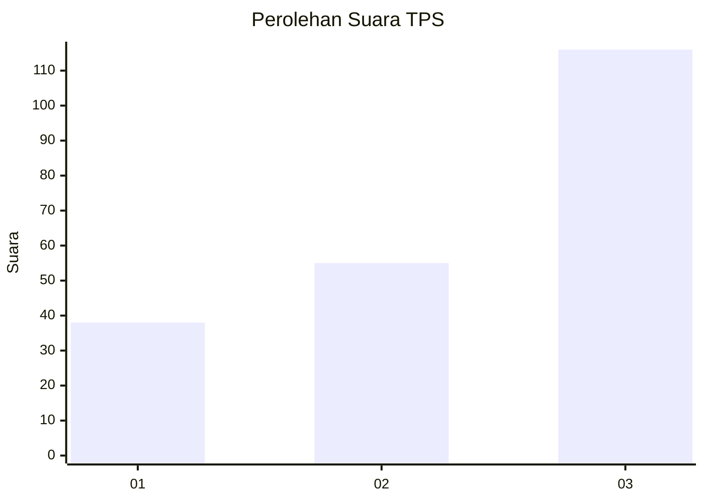
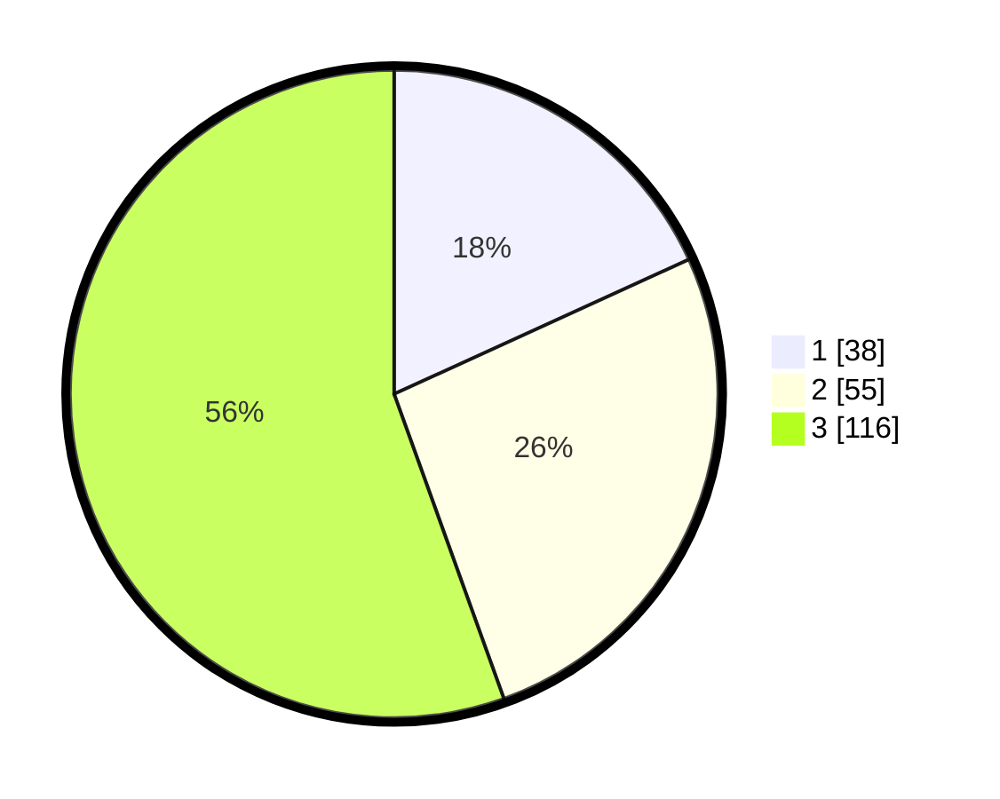

# Hasil

## Grafik

## Tabel

| No. | Nama Paslon    | Suara | Suara (raw) | Persentase |
|:--- |:-------------- | -----:| -----------:| ----------:|
| 1   | ANIES MUHAIMIN | 38    | [38][p-1]   | 18,18      |
| 2   | PRABOWO GIBRAN | 55    | [55][p-2]   | 26,32      |
| 3   | GANJAR MAHFUD  | 116   | [116][p-3]  | 55,50      |

[p-1]: https://github.com/gigit-pemilu/pemilu-2024/blob/main/pilpres/hitung-suara/sub/33-jawa-tengah/sub/10-klaten/sub/02-gantiwarno/sub/2011-baturan/sub/006-tps/sub/paslon-1.txt
[p-2]: https://github.com/gigit-pemilu/pemilu-2024/blob/main/pilpres/hitung-suara/sub/33-jawa-tengah/sub/10-klaten/sub/02-gantiwarno/sub/2011-baturan/sub/006-tps/sub/paslon-2.txt
[p-3]: https://github.com/gigit-pemilu/pemilu-2024/blob/main/pilpres/hitung-suara/sub/33-jawa-tengah/sub/10-klaten/sub/02-gantiwarno/sub/2011-baturan/sub/006-tps/sub/paslon-3.txt

## Foto C Plano

https://sirekap-obj-formc.kpu.go.id/f2de/pemilu/ppwp/33/10/02/20/11/3310022011006-20240215-081202--14b55990-4c73-495e-b2c0-7d72f8381c8e.jpg

https://sirekap-obj-formc.kpu.go.id/f2de/pemilu/ppwp/33/10/02/20/11/3310022011006-20240215-081353--7edc7cc7-f45e-4642-a085-2a359a0a0e38.jpg

https://sirekap-obj-formc.kpu.go.id/f2de/pemilu/ppwp/33/10/02/20/11/3310022011006-20240215-081440--5340a48c-41a7-4058-8871-788defd106d5.jpg

## Metadata

| Key        | Value               |
| ---------- | ------------------- |
| Time Stamp | 2024-02-15 23:29:50 |

