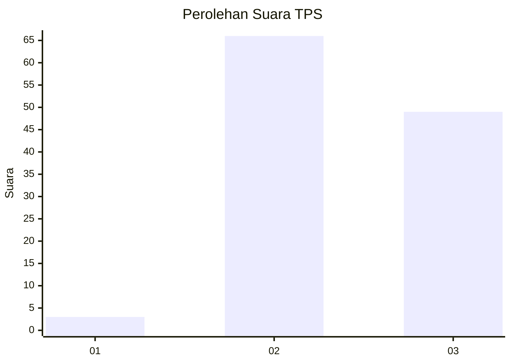
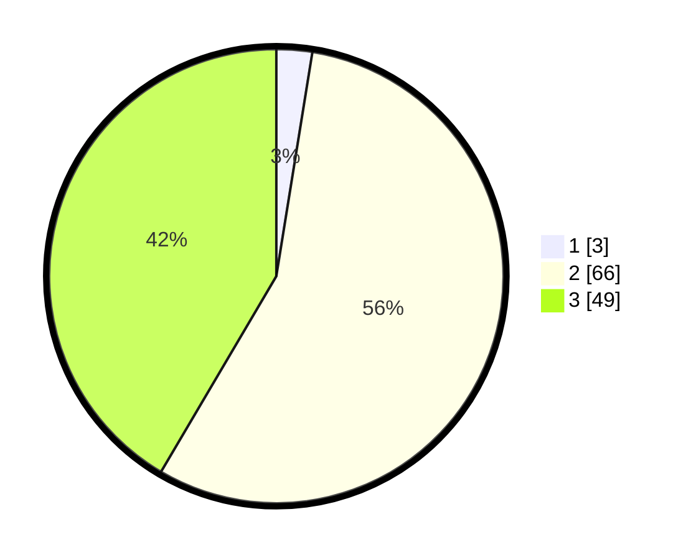

# Hasil

## Grafik

## Tabel

| No. | Nama Paslon    | Suara | Suara (raw) | Persentase |
|:--- |:-------------- | -----:| -----------:| ----------:|
| 1   | ANIES MUHAIMIN | 3     | [3][p-1]    | 2,54       |
| 2   | PRABOWO GIBRAN | 66    | [66][p-2]   | 55,93      |
| 3   | GANJAR MAHFUD  | 49    | [49][p-3]   | 41,53      |

[p-1]: https://github.com/gigit-pemilu/pemilu-2024/blob/main/pilpres/hitung-suara/sub/33-jawa-tengah/sub/10-klaten/sub/02-gantiwarno/sub/2012-mlese/sub/011-tps/sub/paslon-1.txt
[p-2]: https://github.com/gigit-pemilu/pemilu-2024/blob/main/pilpres/hitung-suara/sub/33-jawa-tengah/sub/10-klaten/sub/02-gantiwarno/sub/2012-mlese/sub/011-tps/sub/paslon-2.txt
[p-3]: https://github.com/gigit-pemilu/pemilu-2024/blob/main/pilpres/hitung-suara/sub/33-jawa-tengah/sub/10-klaten/sub/02-gantiwarno/sub/2012-mlese/sub/011-tps/sub/paslon-3.txt

## Foto C Plano

https://sirekap-obj-formc.kpu.go.id/5a92/pemilu/ppwp/33/10/02/20/12/3310022012011-20240214-213824--73e90ff7-2938-4696-9f2e-49ff8c882446.jpg

https://sirekap-obj-formc.kpu.go.id/5a92/pemilu/ppwp/33/10/02/20/12/3310022012011-20240214-213921--ca2f7d0a-0e65-493f-9485-829af7e92929.jpg

https://sirekap-obj-formc.kpu.go.id/5a92/pemilu/ppwp/33/10/02/20/12/3310022012011-20240214-214017--1f4b48c2-2c84-4c77-a30e-1008f4f79429.jpg

## Metadata

| Key        | Value               |
| ---------- | ------------------- |
| Time Stamp | 2024-02-15 23:29:50 |

