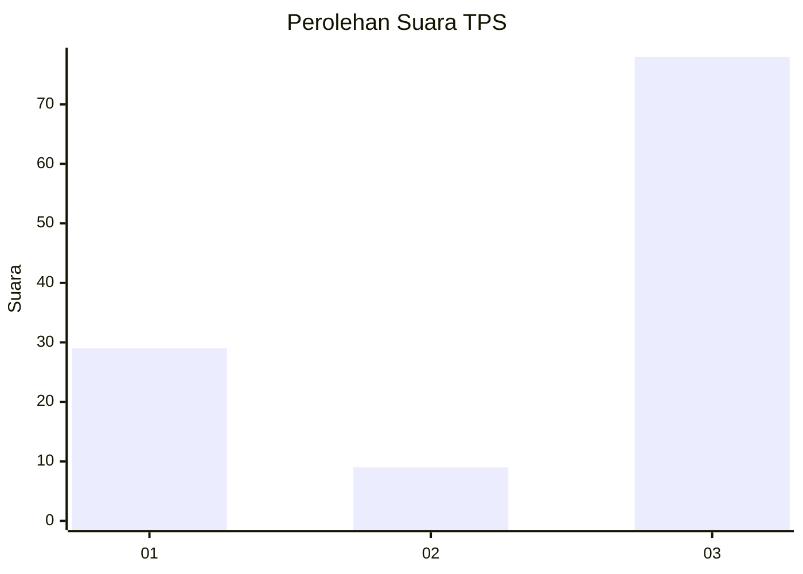
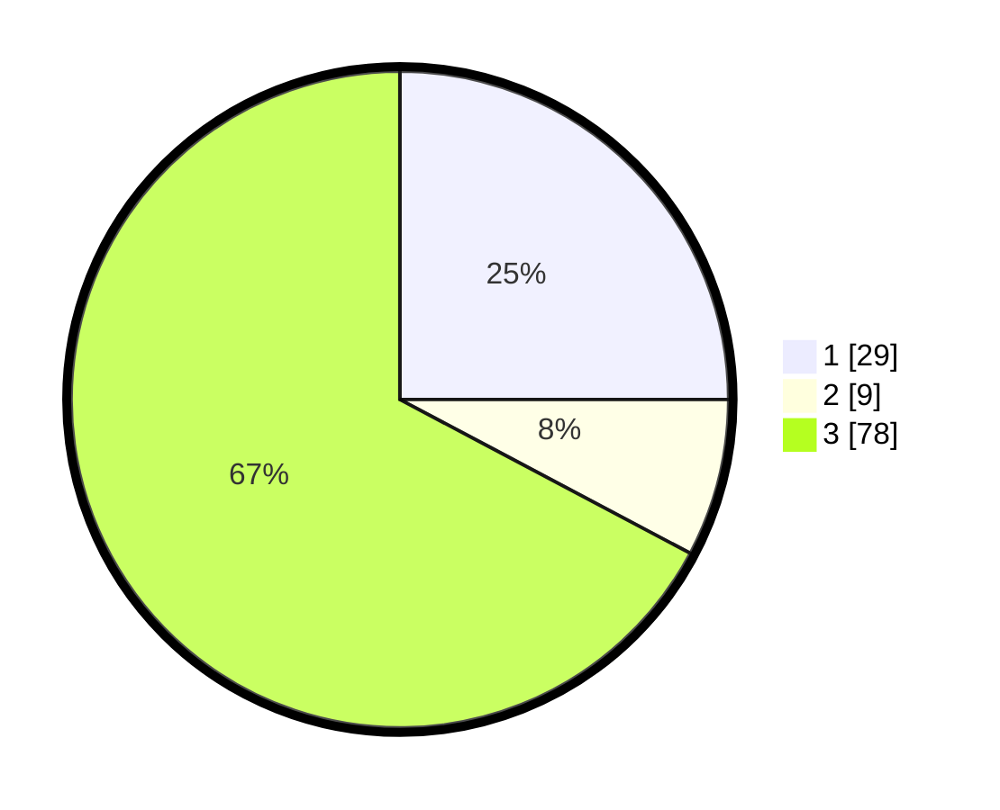

# Hasil

## Grafik

## Tabel

| No. | Nama Paslon    | Suara | Suara (raw) | Persentase |
|:--- |:-------------- | -----:| -----------:| ----------:|
| 1   | ANIES MUHAIMIN | 29    | [29][p-1]   | 25,00      |
| 2   | PRABOWO GIBRAN | 9     | [9][p-2]    | 7,76       |
| 3   | GANJAR MAHFUD  | 78    | [78][p-3]   | 67,24      |

[p-1]: https://github.com/gigit-pemilu/pemilu-2024/blob/main/pilpres/hitung-suara/sub/33-jawa-tengah/sub/10-klaten/sub/02-gantiwarno/sub/2014-jabung/sub/006-tps/sub/paslon-1.txt
[p-2]: https://github.com/gigit-pemilu/pemilu-2024/blob/main/pilpres/hitung-suara/sub/33-jawa-tengah/sub/10-klaten/sub/02-gantiwarno/sub/2014-jabung/sub/006-tps/sub/paslon-2.txt
[p-3]: https://github.com/gigit-pemilu/pemilu-2024/blob/main/pilpres/hitung-suara/sub/33-jawa-tengah/sub/10-klaten/sub/02-gantiwarno/sub/2014-jabung/sub/006-tps/sub/paslon-3.txt

## Foto C Plano

https://sirekap-obj-formc.kpu.go.id/b3be/pemilu/ppwp/33/10/02/20/14/3310022014006-20240214-215645--6d8ce226-4f80-49e3-96b1-b12dedbc9cae.jpg

https://sirekap-obj-formc.kpu.go.id/b3be/pemilu/ppwp/33/10/02/20/14/3310022014006-20240214-215738--dc787613-a09f-4bc0-9fed-517e805210a5.jpg

https://sirekap-obj-formc.kpu.go.id/b3be/pemilu/ppwp/33/10/02/20/14/3310022014006-20240214-215845--c31befa7-1f23-4e0f-9a41-5e56a0bd5368.jpg

## Metadata

| Key        | Value               |
| ---------- | ------------------- |
| Time Stamp | 2024-02-16 00:00:26 |

