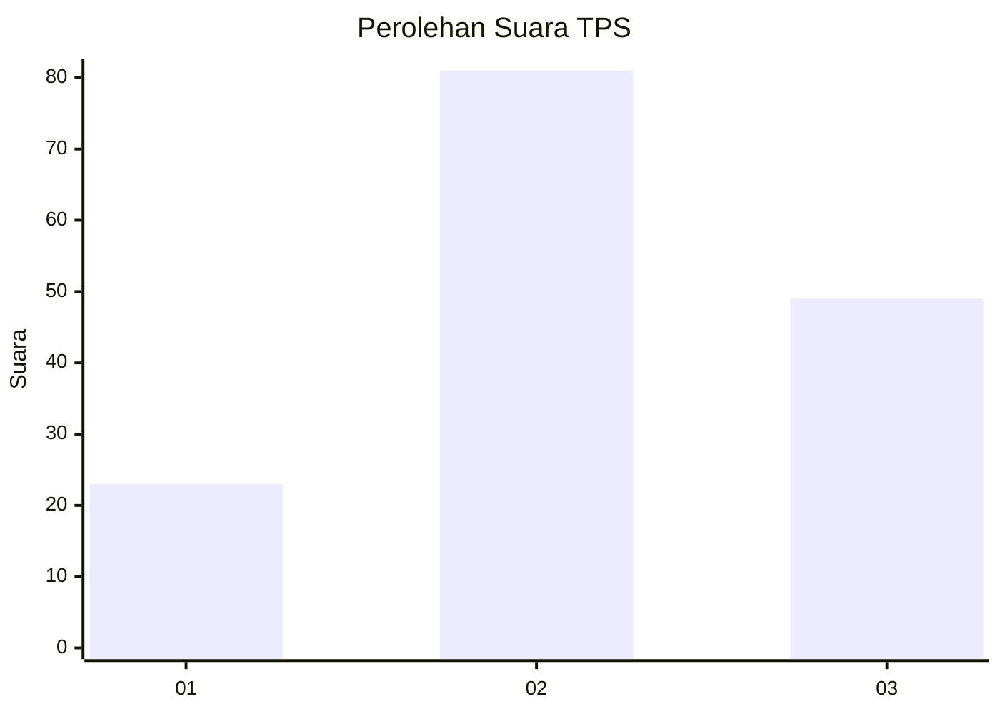
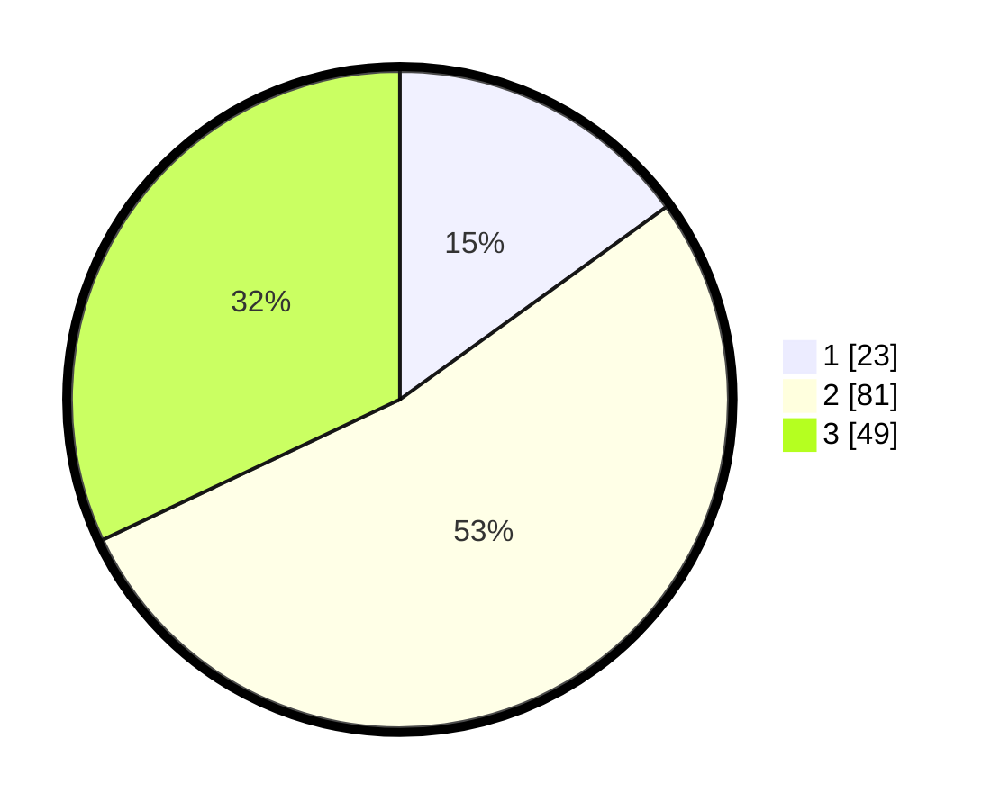

# Hasil

## Grafik

## Tabel

| No. | Nama Paslon    | Suara | Suara (raw) | Persentase |
|:--- |:-------------- | -----:| -----------:| ----------:|
| 1   | ANIES MUHAIMIN | 23    | [23][p-1]   | 15,03      |
| 2   | PRABOWO GIBRAN | 81    | [81][p-2]   | 52,94      |
| 3   | GANJAR MAHFUD  | 49    | [49][p-3]   | 32,03      |

[p-1]: https://github.com/gigit-pemilu/pemilu-2024-33-jawa-tengah/blob/main/pilpres/hitung-suara/sub/33-jawa-tengah/sub/10-klaten/sub/02-gantiwarno/sub/2016-ceporan/sub/008-tps/sub/paslon-1.txt
[p-2]: https://github.com/gigit-pemilu/pemilu-2024-33-jawa-tengah/blob/main/pilpres/hitung-suara/sub/33-jawa-tengah/sub/10-klaten/sub/02-gantiwarno/sub/2016-ceporan/sub/008-tps/sub/paslon-2.txt
[p-3]: https://github.com/gigit-pemilu/pemilu-2024-33-jawa-tengah/blob/main/pilpres/hitung-suara/sub/33-jawa-tengah/sub/10-klaten/sub/02-gantiwarno/sub/2016-ceporan/sub/008-tps/sub/paslon-3.txt

## Foto C Plano

https://sirekap-obj-formc.kpu.go.id/24c3/pemilu/ppwp/33/10/02/20/16/3310022016008-20240214-235732--110ba0d0-ab83-429c-b823-2a5c3a462315.jpg

https://sirekap-obj-formc.kpu.go.id/24c3/pemilu/ppwp/33/10/02/20/16/3310022016008-20240215-001525--5cbac3b2-0f55-4438-b73b-7f162a68a1f0.jpg

https://sirekap-obj-formc.kpu.go.id/24c3/pemilu/ppwp/33/10/02/20/16/3310022016008-20240215-012538--b55d4248-65f6-4452-8d2f-d0223a842313.jpg

## Metadata

| Key        | Value               |
| ---------- | ------------------- |
| Time Stamp | 2024-02-16 00:30:27 |

