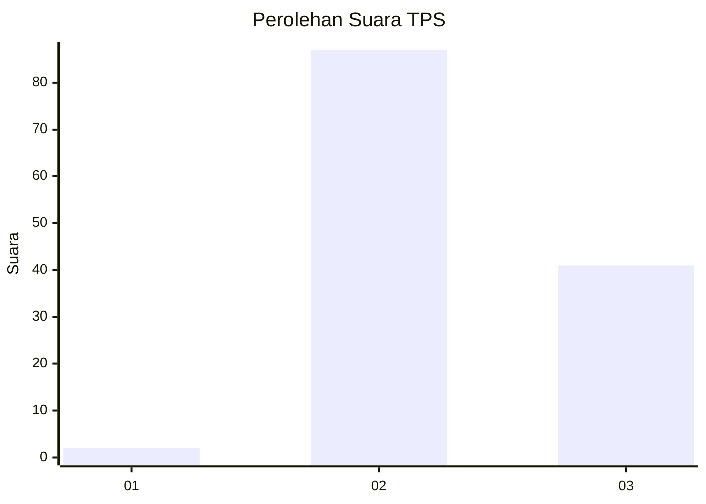
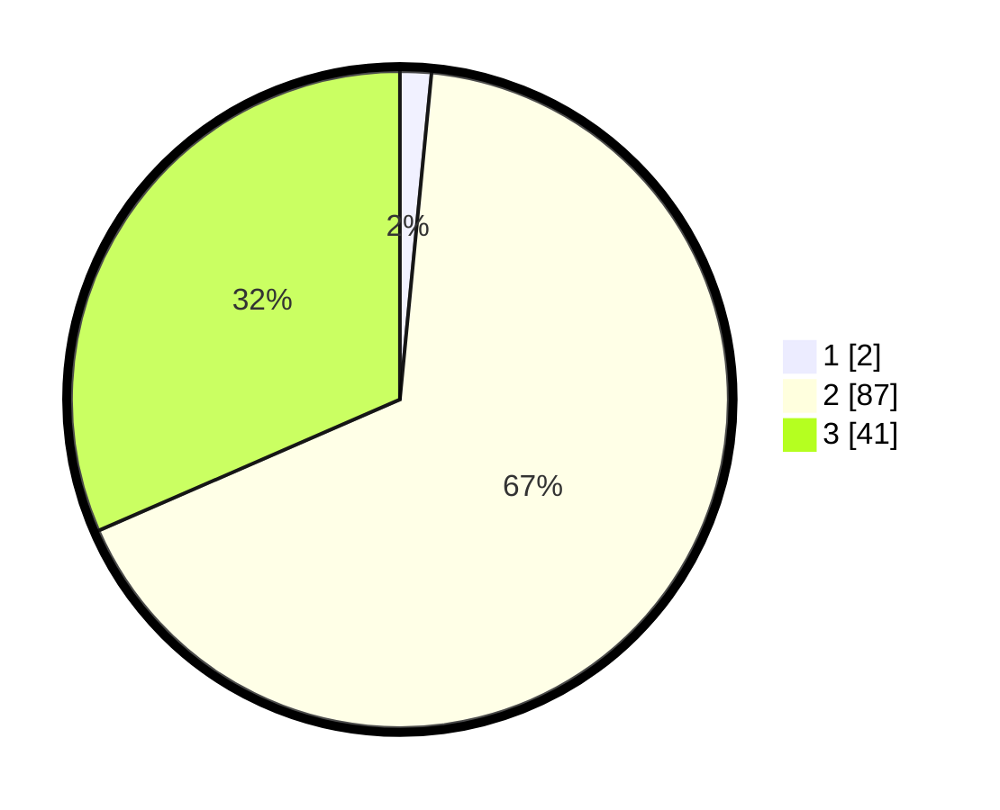

# Hasil

## Grafik

## Tabel

| No. | Nama Paslon    | Suara | Suara (raw) | Persentase |
|:--- |:-------------- | -----:| -----------:| ----------:|
| 1   | ANIES MUHAIMIN | 2     | [2][p-1]    | 1,54       |
| 2   | PRABOWO GIBRAN | 87    | [87][p-2]   | 66,92      |
| 3   | GANJAR MAHFUD  | 41    | [41][p-3]   | 31,54      |

[p-1]: https://github.com/gigit-pemilu/pemilu-2024-33-jawa-tengah/blob/main/pilpres/hitung-suara/sub/33-jawa-tengah/sub/10-klaten/sub/03-wedi/sub/2019-kadibolo/sub/003-tps/sub/paslon-1.txt
[p-2]: https://github.com/gigit-pemilu/pemilu-2024-33-jawa-tengah/blob/main/pilpres/hitung-suara/sub/33-jawa-tengah/sub/10-klaten/sub/03-wedi/sub/2019-kadibolo/sub/003-tps/sub/paslon-2.txt
[p-3]: https://github.com/gigit-pemilu/pemilu-2024-33-jawa-tengah/blob/main/pilpres/hitung-suara/sub/33-jawa-tengah/sub/10-klaten/sub/03-wedi/sub/2019-kadibolo/sub/003-tps/sub/paslon-3.txt

## Foto C Plano

https://sirekap-obj-formc.kpu.go.id/2d81/pemilu/ppwp/33/10/03/20/19/3310032019003-20240214-231118--3bb5b4de-2c23-441d-9770-079a6beaa19f.jpg

https://sirekap-obj-formc.kpu.go.id/2d81/pemilu/ppwp/33/10/03/20/19/3310032019003-20240217-184615--4e218b38-15b7-4da5-a9ea-ce531603911b.jpg

https://sirekap-obj-formc.kpu.go.id/2d81/pemilu/ppwp/33/10/03/20/19/3310032019003-20240217-185026--4e1fc967-9fb4-4876-92ea-c252998a77df.jpg

## Metadata

| Key        | Value               |
| ---------- | ------------------- |
| Time Stamp | 2024-02-19 06:16:00 |

