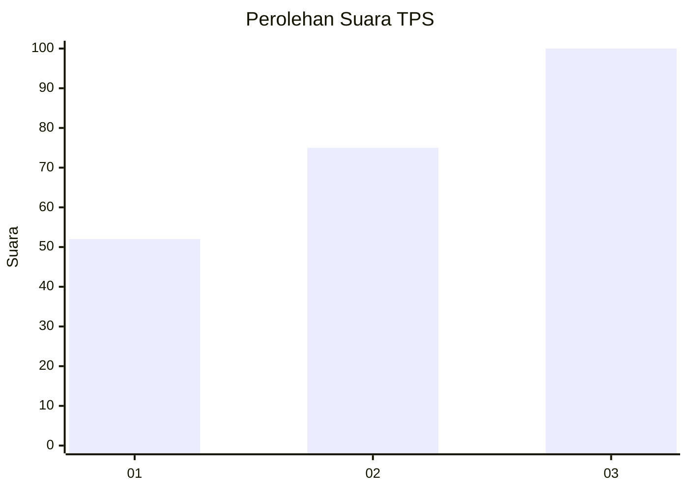
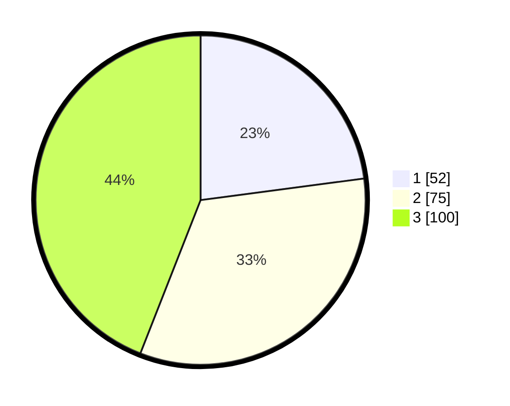

# Hasil

## Grafik

## Tabel

| No. | Nama Paslon    | Suara | Suara (raw) | Persentase |
|:--- |:-------------- | -----:| -----------:| ----------:|
| 1   | ANIES MUHAIMIN | 52    | [52][p-1]   | 22,91      |
| 2   | PRABOWO GIBRAN | 75    | [75][p-2]   | 33,04      |
| 3   | GANJAR MAHFUD  | 100   | [100][p-3]  | 44,05      |

[p-1]: https://github.com/gigit-pemilu/pemilu-2024-33-jawa-tengah/blob/main/pilpres/hitung-suara/sub/33-jawa-tengah/sub/10-klaten/sub/04-bayat/sub/2007-paseban/sub/011-tps/sub/paslon-1.txt
[p-2]: https://github.com/gigit-pemilu/pemilu-2024-33-jawa-tengah/blob/main/pilpres/hitung-suara/sub/33-jawa-tengah/sub/10-klaten/sub/04-bayat/sub/2007-paseban/sub/011-tps/sub/paslon-2.txt
[p-3]: https://github.com/gigit-pemilu/pemilu-2024-33-jawa-tengah/blob/main/pilpres/hitung-suara/sub/33-jawa-tengah/sub/10-klaten/sub/04-bayat/sub/2007-paseban/sub/011-tps/sub/paslon-3.txt

## Foto C Plano

https://sirekap-obj-formc.kpu.go.id/1dc8/pemilu/ppwp/33/10/04/20/07/3310042007011-20240216-221655--604b1e69-831d-4afb-8bf0-6406f4c2495f.jpg

https://sirekap-obj-formc.kpu.go.id/1dc8/pemilu/ppwp/33/10/04/20/07/3310042007011-20240218-123957--04087134-958c-4c2a-bf00-1673f4c58570.jpg

https://sirekap-obj-formc.kpu.go.id/1dc8/pemilu/ppwp/33/10/04/20/07/3310042007011-20240218-124351--c3e11fe0-673a-4396-af8a-510d9c69c478.jpg

## Metadata

| Key        | Value               |
| ---------- | ------------------- |
| Time Stamp | 2024-02-19 06:16:00 |

