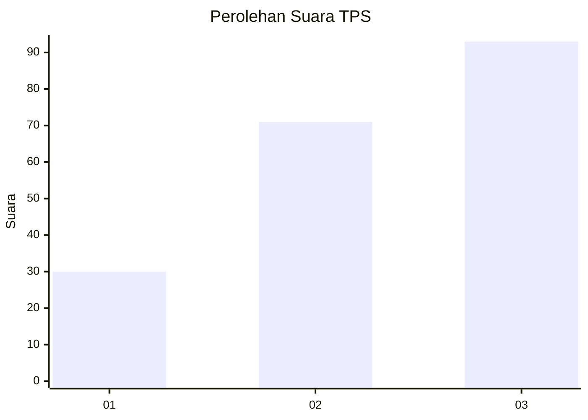
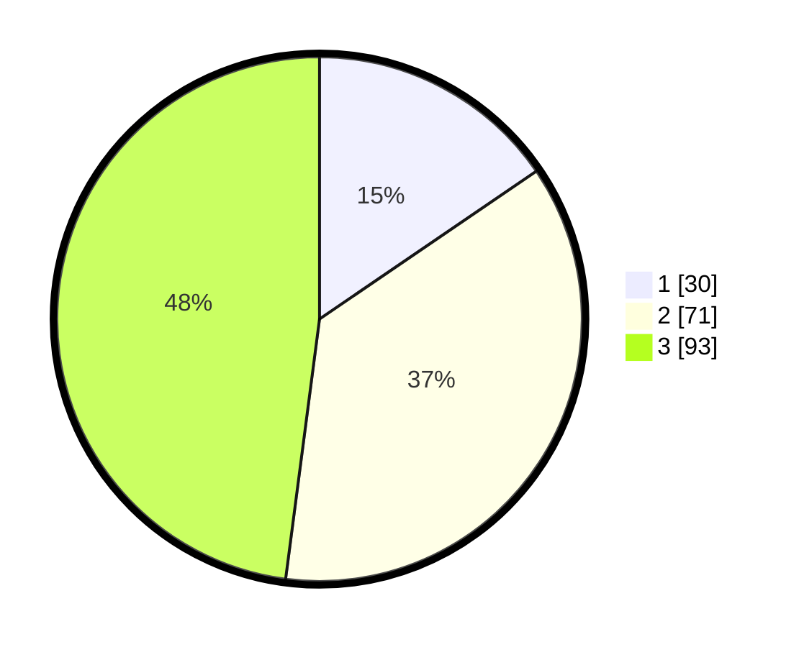

# Hasil

## Grafik

## Tabel

| No. | Nama Paslon    | Suara | Suara (raw) | Persentase |
|:--- |:-------------- | -----:| -----------:| ----------:|
| 1   | ANIES MUHAIMIN | 30    | [30][p-1]   | 15,46      |
| 2   | PRABOWO GIBRAN | 71    | [71][p-2]   | 36,60      |
| 3   | GANJAR MAHFUD  | 93    | [93][p-3]   | 47,94      |

[p-1]: https://github.com/gigit-pemilu/pemilu-2024/blob/main/pilpres/hitung-suara/sub/33-jawa-tengah/sub/10-klaten/sub/05-cawas/sub/2006-kedungampel/sub/003-tps/sub/paslon-1.txt
[p-2]: https://github.com/gigit-pemilu/pemilu-2024/blob/main/pilpres/hitung-suara/sub/33-jawa-tengah/sub/10-klaten/sub/05-cawas/sub/2006-kedungampel/sub/003-tps/sub/paslon-2.txt
[p-3]: https://github.com/gigit-pemilu/pemilu-2024/blob/main/pilpres/hitung-suara/sub/33-jawa-tengah/sub/10-klaten/sub/05-cawas/sub/2006-kedungampel/sub/003-tps/sub/paslon-3.txt

## Foto C Plano

https://sirekap-obj-formc.kpu.go.id/4bc6/pemilu/ppwp/33/10/05/20/06/3310052006003-20240216-144921--d4653148-113c-44cb-a0c7-2be6c61ec82e.jpg

https://sirekap-obj-formc.kpu.go.id/4bc6/pemilu/ppwp/33/10/05/20/06/3310052006003-20240214-155327--e68798d7-97b4-4d02-bdb3-5983fb9ee1c3.jpg

https://sirekap-obj-formc.kpu.go.id/4bc6/pemilu/ppwp/33/10/05/20/06/3310052006003-20240214-155433--77e7c585-51e9-46d8-b930-4ff04207dc78.jpg

## Metadata

| Key        | Value               |
| ---------- | ------------------- |
| Time Stamp | 2024-02-16 16:25:10 |

