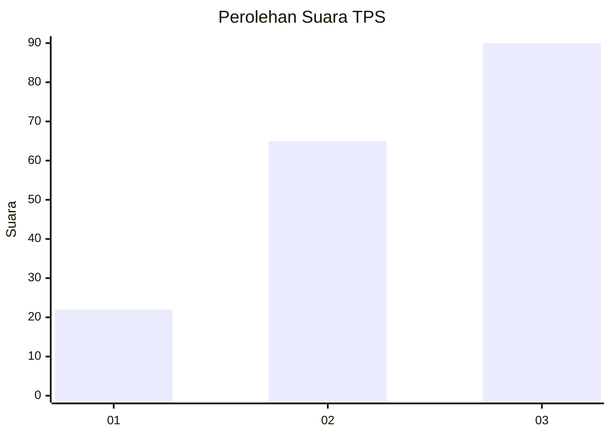
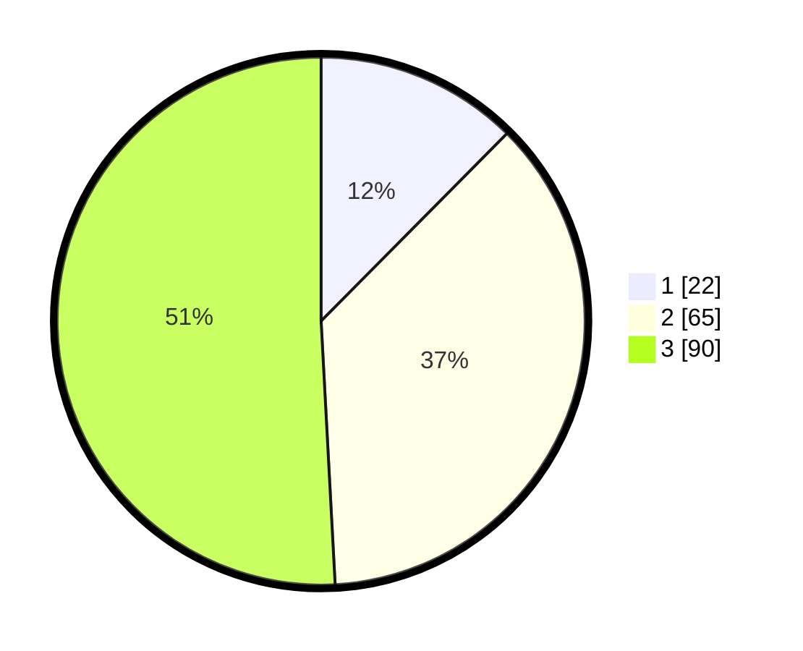

# Hasil

## Grafik

## Tabel

| No. | Nama Paslon    | Suara | Suara (raw) | Persentase |
|:--- |:-------------- | -----:| -----------:| ----------:|
| 1   | ANIES MUHAIMIN | 22    | [22][p-1]   | 12,43      |
| 2   | PRABOWO GIBRAN | 65    | [65][p-2]   | 36,72      |
| 3   | GANJAR MAHFUD  | 90    | [90][p-3]   | 50,85      |

[p-1]: https://github.com/gigit-pemilu/pemilu-2024/blob/main/pilpres/hitung-suara/sub/33-jawa-tengah/sub/10-klaten/sub/06-trucuk/sub/2011-sabranglor/sub/004-tps/sub/paslon-1.txt
[p-2]: https://github.com/gigit-pemilu/pemilu-2024/blob/main/pilpres/hitung-suara/sub/33-jawa-tengah/sub/10-klaten/sub/06-trucuk/sub/2011-sabranglor/sub/004-tps/sub/paslon-2.txt
[p-3]: https://github.com/gigit-pemilu/pemilu-2024/blob/main/pilpres/hitung-suara/sub/33-jawa-tengah/sub/10-klaten/sub/06-trucuk/sub/2011-sabranglor/sub/004-tps/sub/paslon-3.txt

## Foto C Plano

https://sirekap-obj-formc.kpu.go.id/3fea/pemilu/ppwp/33/10/06/20/11/3310062011004-20240214-221540--a2f14c6a-aab6-4063-a88e-2fde56f31b00.jpg

https://sirekap-obj-formc.kpu.go.id/3fea/pemilu/ppwp/33/10/06/20/11/3310062011004-20240214-221556--de1dcacb-1cfb-4a53-9195-0523c19f5d6c.jpg

https://sirekap-obj-formc.kpu.go.id/3fea/pemilu/ppwp/33/10/06/20/11/3310062011004-20240214-221631--e62ed2a0-9dc0-42ad-b37a-17ba2e8670c6.jpg

## Metadata

| Key        | Value               |
| ---------- | ------------------- |
| Time Stamp | 2024-02-15 15:00:29 |

